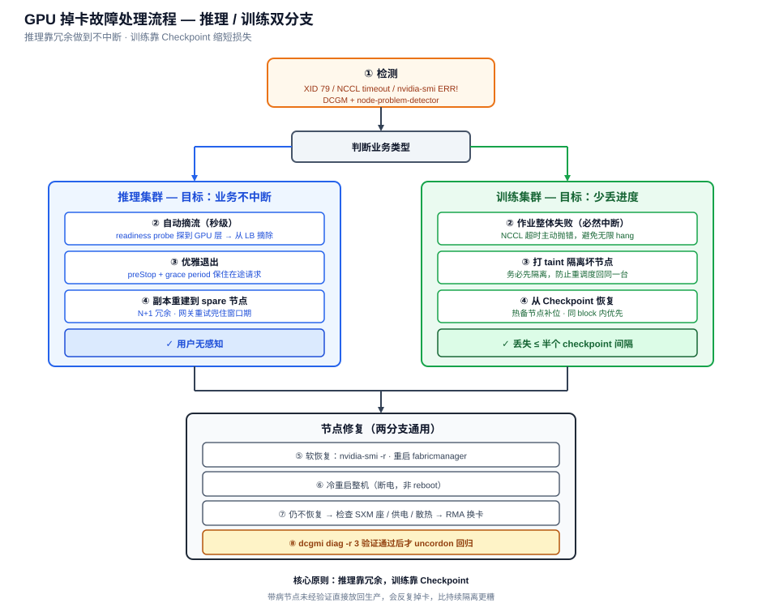

# GPU 集群掉卡故障处理手册

> 推理与训练两类集群的 GPU 掉卡处理 SOP：故障识别、处理流程、业务连续性保障与可直接使用的配置片段。
>
> 撰写人：孟希東

---

## 0. 核心结论

**推理靠冗余，训练靠 Checkpoint。**

两类集群的容错目标根本不同：

| | 推理 | 训练 |
|------|------|------|
| 状态 | 无状态 | 有状态（权重、优化器、梯度） |
| 通信 | 实例间独立 | **全局同步 All-Reduce** |
| 掉 1 卡影响 | 1 个实例 | **整个作业挂掉** |
| 目标 | 业务不中断 | 最小化丢失的训练进度 |
| 能否零中断 | ✅ 可以 | ❌ 必然中断，只能缩短 |
| 关键指标 | 摘流延迟（秒级） | 恢复时间 + 丢失步数 |

原因：NCCL 集合通信是**全员参与**的，少一张卡整个通信组就会 hang 住。所以训练的问题不是“要不要中断”，而是“中断多久、丢多少”。

---

## 1. 处理流程图



---

## 2. 故障识别

### 2.1 掉卡判定

| 现象 | 判断 |
|------|------|
| **XID 79** `GPU has fallen off the bus` | 典型掉卡，最常见 |
| `nvidia-smi` 卡数变少，或显示 `ERR!` | 掉卡 |
| `lspci` 看不到设备 | 硬件层已丢失 |
| XID 48 / 63 / 64 | ECC 显存故障，可能仅需重置 |
| XID 74 | NVLink 错误 |
| XID 13 / 31 | 应用层问题，**不是**掉卡 |

**常见诱因**：SXM/PCIe 接触不良、供电波动、散热超温、显存或 GPU 本体故障。

### 2.2 训练特有现象

| 现象 | 含义 |
|------|------|
| **NCCL timeout / hang** | 最常见表象，作业卡死不退出 |
| 训练 loss 突然 NaN | 可能是显存静默错误 |
| 各 rank step 时间离群 | 慢节点（straggler），卡未掉但性能降级 |

> **hang 比崩溃更麻烦** —— 作业不退出，GPU 全程空转，若无超时检测可能几小时后才被发现，这部分算力全部浪费。

---

## 3. 推理集群处理

### 3.1 SOP

1. **告警 → 自动摘流**（最关键）—— DCGM-exporter + Prometheus 告警触发，立即从负载均衡摘除。**必须自动化，人工介入来不及。**
2. **隔离节点**
3. **尝试软恢复**
4. **冷重启整机**
5. **仍不恢复 → 报修**
6. **验证后回归**

```bash
# 隔离
kubectl cordon <node>
kubectl drain <node> --ignore-daemonsets --delete-emptydir-data
```

### 3.2 业务不中断的七个手段

#### ① 多副本 + 无状态（基础）

推理服务做成 Deployment 多副本跨节点分布：

```yaml
topologySpreadConstraints:
  - maxSkew: 1
    topologyKey: kubernetes.io/hostname
    whenUnsatisfiable: DoNotSchedule
    labelSelector:
      matchLabels:
        app: inference-svc
```

#### ② 冗余容量（N+1 / N+2）

1000 卡集群建议预留 **5% 左右冗余**（约 50 卡 / 6-7 台）作为 spare 池。掉卡后新副本能立刻调度上去，而不是让剩余节点扛超载 —— **超载会引发雪崩，比掉一台严重得多**。

#### ③ 健康检查要探到 GPU 层（最易错点）

默认 liveness probe 只看进程活着，但 **GPU 掉了进程可能还在跑**，健康检查照样通过，流量继续打进来全部报错。

```yaml
readinessProbe:
  exec:
    command: ["/bin/sh", "-c", "nvidia-smi -q -d MEMORY | grep -q Total && curl -sf localhost:8000/health"]
  periodSeconds: 5
  timeoutSeconds: 3
  failureThreshold: 2
```

readiness probe 必须实际验证 GPU：探测显存可分配、跑一次极小推理、或读 DCGM 健康状态。探测间隔 5-10 秒，做到秒级摘流。

#### ④ 自动化故障响应

`node-problem-detector` + DCGM 检测到 XID 79 → 自动打 taint → 调度器自动驱逐并重建到 spare 节点。全程无人工。

#### ⑤ 优雅退出，保住在途请求

```yaml
terminationGracePeriodSeconds: 60
lifecycle:
  preStop:
    exec:
      command: ["sh", "-c", "sleep 15"]   # 先摘流，等在途请求做完
```

推理请求通常几百毫秒到几秒，给足 grace period 就能做到**用户完全无感**。

#### ⑥ 网关层重试

对幂等请求配置失败自动重试到其他实例。即使摘流有几秒延迟，落在这个窗口的请求也能被兜住。

#### ⑦ PDB 防止连锁

```yaml
apiVersion: policy/v1
kind: PodDisruptionBudget
spec:
  minAvailable: 80%
  selector:
    matchLabels:
      app: inference-svc
```

### 3.3 爆炸半径（易被忽略）

多卡张量并行（TP）的影响面完全不同：

| 部署方式 | 掉 1 张卡的影响 |
|------|------|
| 单卡一实例（小模型） | 只挂 1 个实例，影响 1/1000 |
| TP=8 整机一实例（大模型） | **整台机 8 卡全废**，影响 8/1000 |

- 跑 TP=8 大模型时，**实例级冗余必须按“整机”为单位规划**，不能按卡算。
- 模型规模允许时，**把 TP 组拆小**（如 TP=4 跑两个实例）能把爆炸半径减半。
- 若用了 PD 分离（Prefill/Decode）架构，两类节点的冗余要分别核算。

---

## 4. 训练集群处理

### 4.1 SOP

**第 1 步：检测（越快越好）**

必须配置 NCCL 超时主动抛错，而不是无限 hang：

```bash
export NCCL_ASYNC_ERROR_HANDLING=1
export TORCH_NCCL_ASYNC_ERROR_HANDLING=1
export TORCH_NCCL_BLOCKING_WAIT=0
# 超时阈值设几分钟即可，别设太长
```

**第 2 步：作业失败 → 隔离节点**

```bash
kubectl cordon <node>
kubectl taint nodes <node> gpu-fault=true:NoSchedule
```

> **关键坑**：必须在重调度前打上 taint，否则 K8s 可能把作业重新调度回同一台坏机器，陷入反复失败的循环。

**第 3 步：从 Checkpoint 恢复** —— 训练容错的**唯一实质手段**。

**第 4-5 步：节点修复与验证回归**（同 §5）

### 4.2 最小化损失的五个手段

#### ① Checkpoint 策略（最重要）

> 丢失的进度 = checkpoint 间隔 × 平均一半。这是唯一能直接控制损失的旋钮。

| 手段 | 效果 |
|------|------|
| **异步 Checkpoint** | 保存不阻塞训练，间隔可大幅缩短 |
| **分布式 Checkpoint** | 各 rank 并行写，1024 卡下比单点写快一个量级 |
| 内存/本地盘暂存 + 后台落盘 | 进一步降低写入停顿 |
| 缩短间隔到 15-30 分钟 | 最坏丢半个间隔 |

```python
# PyTorch 分布式 Checkpoint
import torch.distributed.checkpoint as dcp
dcp.save(state_dict, checkpoint_id=f"{path}/step_{step}")
```

#### ② 弹性训练（Elastic Training）

```bash
torchrun --nnodes=120:128 --max-restarts=3 ...
```

掉一台后作业**自动缩容继续**，不用等硬件修好。

**代价**：全局 batch size 变化会影响收敛，需相应调整；且不是所有框架/并行策略都支持得好。适合数据并行为主的场景，3D 并行下会复杂很多。

#### ③ 热备节点（Spare Pool）

预留 2-5% 备机（128 台里留 4-6 台）。掉卡后 gang 调度立刻用备机补位重启，**不用等修复** —— 这是千卡规模最实用的一招。

#### ④ 自动重启

```yaml
# PyTorchJob
runPolicy:
  backoffLimit: 5          # 防止无限重启
replicaSpecs:
  Worker:
    restartPolicy: OnFailure
```

全链路自动化后，从掉卡到恢复训练可以压到 **10 分钟以内**。

#### ⑤ 定期健康巡检（预防）

大规模训练最怕**慢节点（straggler）**—— 卡没掉但性能降级，会拖慢整个作业却不报错。

- 作业启动前跑 NCCL all-reduce 基准，剔除异常节点
- 训练中监控各 rank 的 step 时间，发现离群立即告警

### 4.3 与本集群架构相关的两点

**① Gang 调度是双刃剑**

KAI Scheduler 的 gang 调度保证“要么全起要么不起”—— 好处是不会出现半个作业占着卡空等；但也意味着**掉一台就得整体重调度**，所以热备节点必须有，否则大作业可能长时间排不上。

**② Block 划分影响重调度**

128 节点分两个 64 节点 block。掉卡后重调度时，**备机最好在同 block 内**，否则跨 block 通信多走一层 spine，性能会掉。

> 建议：每个 block 各留 2-3 台备机，而不是集中放一处。

---

## 5. 节点修复（两分支通用）

### 5.1 软恢复

约 3-5 成的掉卡能救回来：

```bash
# 确认无进程占用后重置 GPU
nvidia-smi -r -i <gpu_id>

# NVSwitch 机型：重启 fabricmanager
systemctl restart nvidia-fabricmanager
```

### 5.2 冷重启

掉卡有相当比例靠彻底断电冷启动能恢复（残留状态清不掉）。

> **注意是冷重启**，`reboot` 往往无效。

### 5.3 硬件报修

检查 SXM 座接触、供电、散热；走 RMA 换卡。

### 5.4 验证回归

```bash
dcgmi diag -r 3        # 跑完整诊断
kubectl uncordon <node>
kubectl taint nodes <node> gpu-fault-   # 移除 taint
```

> **别跳过验证直接放回生产** —— 带病节点回去会反复掉，比一直隔离更糟。

---

## 6. 小结

**推理集群**做到掉卡不中断，本质是三件事：

1. **探得快** —— GPU 级健康检查，秒级
2. **有地方接** —— 冗余容量 + 多副本
3. **走得体面** —— 优雅退出 + 网关重试

三者缺一，用户就会看到报错。

**训练集群**无法避免中断，只能：

1. **Checkpoint 足够密** —— 异步 + 分布式，间隔 15-30 分钟
2. **备机足够多** —— 2-5%，且按 block 分散
3. **检测足够早** —— NCCL 超时主动抛错，不让作业默默 hang

---

← [返回 README](../README.md) · 相关：[GPU 集群常见问题与故障排查手册](GPU集群常见问题与故障排查手册.md) · [HGX B300 训练集群设计方案](HGX_B300训练集群设计方案_1024GPU.md) · [AIDC 故障全生命周期管理流程](AIDC故障全生命周期管理流程.md)
