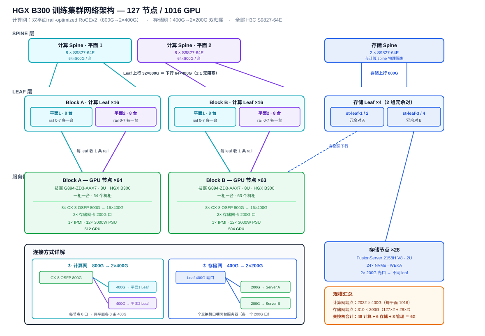

# HGX B300 训练集群现网架构文档 v1.0

> 127 节点 / 1016 卡 NVIDIA HGX B300 训练集群现网架构：技嘉 G894-ZD3-AAX7 风冷节点 + H3C 双平面 RoCEv2 网络 + 原生 Kubernetes 调度。
>
> 撰写人：孟希東 · 版本：v1.0（现网竣工版）

> **文档性质**：本文所述设备**均已上线**，数量为实际台账。可作为运维交接与容量规划依据。

---

## 1. 集群概览

| 项 | 实际配置 |
|------|------|
| GPU 节点 | **127 台** 技嘉 G894-ZD3-AAX7 |
| GPU 总数 | **1016 颗** B300 SXM |
| 存储节点 | **64 台** FusionServer 2158H V8 |
| 交换机 | **76 台**（见 §3.5） |
| 机柜密度 | 每柜 1 台 GPU 服务器 |
| 散热 | 风冷 |
| 计算网 | 双平面 RoCEv2（H3C 以太网） |
| 存储网 | 400G→2×200G 双归属 |
| 光纤 | 计算网**单模 MPO** · 存储网**多模 MPO** |
| 调度 | 原生 Kubernetes（kubeadm） |

拓扑设计参考 NVIDIA HGX AI Factory 企业参考架构的 **2-8-9-800** 配置（2 CPU、8 GPU、每 GPU 9 张网卡 800 Gb/s），交换机采用 H3C。

---

## 2. 计算节点：技嘉 G894-ZD3-AAX7

| 指标 | 规格 |
|------|------|
| 形态 | 8U 机架式 · 447 × 351 × 923 mm |
| GPU | NVIDIA HGX B300 · 8× SXM |
| CPU | 双路 AMD EPYC 9005/9004（cTDP 最高 500W） |
| 内存 | 12 通道 DDR5 RDIMM · 24× DIMM |
| GPU 网络 | **8× OSFP 800 Gb/s**，板载 ConnectX-8 SuperNIC，支持 IB XDR 或 **双 400 Gb/s 以太网** |
| NVLink | 1.8 TB/s GPU-to-GPU |
| 存储网卡 | 2× 200G 光口 |
| 板载 LAN | 2× 10 Gb/s（Intel X710-AT2） |
| 本地存储 | 8× 2.5" Gen5 NVMe 热插拔 + 2× M.2 |
| 扩展 | 4× FHHL PCIe Gen5 x16 |
| 电源 | **12× 3000W 80 PLUS 铛金冗余**（C19） |
| BMC | ASPEED AST2600 |
| 工作温度 | 10°C ~ 30°C |

**关键设计含义**：

1. `dual 400 Gb/s Ethernet` 天然匹配双平面架构 —— ConnectX-8 不支持 800G 以太网口，每个 800G OSFP 口拆为 2×400G 分入两个平面。
2. 12× 3000W ＝ 36 kW 装机容量，按 6+6 冗余可用约 18 kW。
3. 进风上限 30°C —— 机柜气流设计的硬约束（见 §7）。

---

## 3. 网络架构



### 3.0 RoCEv2 术语与原理

**RoCEv2 全称 RDMA over Converged Ethernet version 2**（融合以太网上的远程直接内存访问 · 第二版）。

| 要点 | 说明 |
|------|------|
| **RDMA** | 网卡直接读写对端内存，无需 CPU 参与、无内核态拷贝（zero-copy / kernel bypass） |
| **封装层次** | v1 基于以太网帧（L2，不可路由）；**v2 封装于 UDP/IP（L3），可跨子网路由** |
| **UDP 端口** | 4791（IANA 分配） |
| **网络要求** | UDP 无重传机制，依赖下层**无损网络**（PFC + ECN） |

**本集群选 v2 的原因**：双平面 leaf-spine 拓扑跨子网转发，v1 的二层局限无法支撑；且 v2 可利用 IP 层 ECMP 做多路径负载均衡。

> **运维含义**：RoCEv2 性能上限完全取决于无损网络是否调好 —— 一旦丢包，传统 go-back-N 重传会造成性能断崖式下降。这是 RoCE 与 InfiniBand 最大的工程差异（IB 在链路层天然无损）。

### 3.1 计算网：双平面 rail-optimized

ConnectX-8 不支持 800 Gbps 以太网端口，因此采用多平面设计：每张 800G 网卡拆为 2× 400 Gbps 端口，各自组成一个通信平面，后端网可视为 **2 张并行独立的 400G 网络**。

**单节点连接**：8× OSFP 800G → **16× 400G**（平面 1 八条 + 平面 2 八条）
**全集群端点**：127 × 16 ＝ **2032 个 400G**，每平面 1016

> 采用 128 口机型后，CX-8 拆出的 400G 直接插入 400G 端口，**交换机侧无需二次 breakout**。

### 3.2 计算网交换机推导

以 **H3C LS9867-128DH**（128×400G）为单位：

| 层 | 推导 | 数量 |
|------|------|------|
| Leaf / 平面 | 1016 端点 ÷ 64 下行 ＝ 15.9 → 16 | 16 |
| Leaf 合计 | 16 × 2 平面 | **32 台** |
| Spine / 平面 | 16×64 ＝ 1024 上行 ÷ 128 口 | 8 |
| Spine 合计 | 8 × 2 平面 | **16 台** |
| **计算网合计** | | **48 台** |

**单台 Leaf**：64×400G 下行 + 64×400G 上行 ＝ 25.6 Tb/s 双向，**严格 1:1 无阻塞**。

**Leaf-Spine 链路数 2048 条**（每平面 1024）—— 此数字是布线主干与配线架容量规划的依据。

### 3.3 Rail 映射与 Block 划分

rail-optimized 下，**一台 leaf 服务「一条 rail × 64 个节点」**：

| Block | 节点 | GPU | Leaf |
|------|------|------|------|
| A | 64 台 | 512 | 16（8 rail × 2 平面） |
| B | 63 台 | 504 | 16 |

同号 GPU 跨节点通信走同一 rail 平面，互不争抢；跨 block 通信经 spine 一跳。

> 每平面 Leaf 容量 1024 端点，实用 1016，**余 8 个端口**。

### 3.4 存储网

**连接方式**：交换机侧每个 400G 端口 breakout 为 2×200G，**分别接两台不同服务器**；每台服务器 2 个 200G 口**分接不同 Leaf**（双归属）。

**端口核算**：

```
200G 服务器端口 = 127×2（GPU） + 64×2（存储） = 382
交换机 400G 下行口 = 382 ÷ 2 = 191
```

**单台存储 Leaf（S9825-64D，64 口）**：

| 用途 | 端口数 |
|------|------|
| 上行（到 16 台 spine 各 1 条，full-mesh） | 16 |
| 下行（48 × 2 ＝ 96 个 200G） | 48 |
| **合计** | **64 / 64（满端口）** |

4 台 Leaf 接入容量 ＝ 384 个 200G，实际使用 382，**余 2 个口**。

**带宽校核**：

```
上行容量 = 4 × 16 × 400G = 25.6 Tb/s
存储节点带宽天花板 = 64 × 2 × 200G = 25.6 Tb/s
→ 1:1 无收敛
```

### 3.5 交换机台账

| 层 | 型号 | 数量 | 端口分配 |
|------|------|------|------|
| 计算 Leaf | **H3C LS9867-128DH** | 32 | 64 下 + 64 上 |
| 计算 Spine | **H3C LS9867-128DH** | 16 | 128 全用 |
| 存储 Leaf | **H3C S9825-64D** | 4 | 48 下 + 16 上 |
| 存储 Spine | **H3C S9825-64D** | 16 | 每台 4 条 |
| 带外管理 | S5130S 系列 | 8 | — |
| **合计** | | **76 台** | |

按型号：**LS9867-128DH 48 台**、**S9825-64D 20 台**、管理交换机 8 台。

### 3.6 三张网汇总

| 网络 | 每节点端口 | 上行 | 光纤 |
|------|------|------|------|
| 计算后端（East-West） | 16×400G（8×OSFP breakout） | 双平面 LS9867-128DH | **单模 MPO** |
| 存储/前端（North-South） | 2×200G | S9825-64D（双归属） | **多模 MPO** |
| 带外管理（OOB） | 1× RJ45 | S5130S | 铜缆 |

### 3.7 与 NVIDIA Spectrum-X 方案的差异

采用 H3C 交换机后，**“Spectrum-X” 作为整体方案不成立** —— 该方案依赖 NVIDIA 交换机与网卡的端到端协同，NVIDIA 官方“接近 InfiniBand 性能”的数据**不能直接套用**。

本集群实际组合：**ConnectX-8 网卡 + H3C 交换机 + 标准 RoCEv2**，无损与负载均衡能力由 H3C 侧提供（PFC、ECN、AI ECN、IPCC、iNOF、Agile Buffer；FGLB、ECMP、Flowlet、Spraylink 逐包 AR；DPSH 自愈）。

> 调优需 H3C 技术团队与 NCCL 侧联调，以实测基准替代厂商标称值。

---

## 4. 物理布局与布线

### 4.1 机柜

| 区域 | 内容 | 机柜数 |
|------|------|--------|
| Block A | GPU 节点 ×64（一柜一台） | 64 |
| Block B | GPU 节点 ×63 | 63 |
| 计算网络区 | 32 Leaf + 16 Spine | 6-9 |
| 存储区 | 64× 2158H V8（2U）+ 20 台交换机 | 6-8 |
| 管理区 | K8s master / 登录 / 部署 / 监控 + S5130S | 2-3 |
| **合计** | | **约 145-150** |

### 4.2 为什么不采用 ToR

1. 机房约束每柜仅 1 台 GPU 服务器；
2. **更根本的是 rail-optimized 架构本身** —— 一台 leaf 要收拢 64 个不同机柜的同号 GPU，rail 无法在机柜内闭合。

因此 leaf 集中部署于网络区（EoR / MoR），长距离光缆不可避免。

### 4.3 光纤

| 链路 | 类型 | 数量 |
|------|------|------|
| 服务器 → 计算 Leaf | 800G → 2×400G 分支（**单模 MPO**） | 1016 |
| 计算 Leaf → Spine | 400G（**单模 MPO**） | 2048 |
| 存储 Leaf → 服务器 | 400G → 2×200G 分支（**多模 MPO**） | 191 |
| 存储 Leaf → Spine | 400G（**多模 MPO**） | 64 |
| **合计** | | **≈ 3320 条** |

**存储网多模距离风险【需持续监控】**：200G-SR4 / 400G-SR8 在 OM4 上标称约 100m，而存储网需连接分散在 127 个机柜的 GPU 服务器，block 内走线估计 50-80m，叠加 MPO 插接点损耗后余量紧张。若出现链路误码或不稳定，优先排查长距离链路的光功率预算。

---

## 5. 存储

### 5.1 配置

| 项 | 实际配置 |
|------|------|
| 机型 | FusionServer 2158H V8（2U 单路 AMD EPYC 9005） |
| 台数 | **64 台** |
| 盘 | 24× NVMe / 台 |
| 网卡 | 2× 200G 光口（多模，双归属不同 Leaf） |
| 文件系统 | WEKA（启用 GPUDirect Storage） |

### 5.2 容量与带宽

| 指标 | 数值 |
|------|------|
| 聚合带宽上限 | 64 × 2 × 200G ＝ **25.6 Tb/s ≈ 3.2 TB/s** |
| NVIDIA 参考需求（12.5 Gb/s × GPU） | 1016 × 12.5 ＝ 12.7 Tb/s |
| **余量** | **约 2 倍** |
| 裸容量（按 15.36TB 盘） | 64 × 24 × 15.36TB ≈ **23.6 PB** |

NVIDIA 要求高性能存储需针对**小块随机 I/O** 优化，兼顾高单节点峰值与高聚合性能；深度学习负载以**读为主**。

### 5.3 运维关注点

**① PCIe 通道占用【需核实】**

单路 EPYC 9005 提供 128 条 PCIe Gen5 通道：

```
24× NVMe × 4 lanes = 96
2× 200G 网卡        ≤ 32
                     ────
                     ≈128  ← 接近满载
```

实际机型多采用 PCIe Switch 扩展或盘位降级带宽，**会直接影响单节点实际吞吐**。建议向 xFusion 确认背板拓扑并实测单节点带宽。

**② 双 200G 绑定模式**

需确认为 **LACP active-active（802.3ad）**。若为主备，实际带宽减半至 12.8 Tb/s，仅略高于 12.7 Tb/s 需求，**余量将消失**。

---

## 6. Kubernetes 架构

### 6.1 底座

- OS：Ubuntu Server；运行时：containerd
- kubeadm 部署 **3 节点 Master HA**，etcd 独立 NVMe
- 主 CNI：Cilium 或 Calico（仅承载控制面与 Service 流量）

### 6.2 NVIDIA GPU Operator

统一下发 GPU 驱动、container-toolkit、device-plugin、DCGM-exporter、NFD。训练节点使用**整卡**，不切 MIG。

### 6.3 NVIDIA Network Operator（RoCE 模式）

通过 CRD 管理 RDMA / SR-IOV device plugin、Multus 二级网络、nv-ipam，与 GPU Operator 配合启用 GPUDirect RDMA。

**每个训练 Pod 挂 18 个 VF**：16 个计算网 VF（2 平面 × 8 rail）+ 2 个存储网 VF。

四件套并用：Multus、Network Operator、SR-IOV Device Plugin、Topology Manager。

> 相比 InfiniBand 方案，**不需要** ib-kubernetes、IPoIB CNI、OpenSM partition、UFM。

### 6.4 RoCEv2 无损网络调优（关键环节）

主机侧：PFC / ECN / DCQCN 参数、MTU 9000、ConnectX-8 RoCE 参数与 NCCL 环境变量。

交换机侧（H3C）：AI ECN 门限自适应、PFC 死锁检测、Agile Buffer、负载均衡策略（ECMP / Flowlet / **Spraylink 逐包 AR**）、DPSH 自愈。

> 训练 All-Reduce 场景通常逐包 AR 效果最佳，但需验证与 NCCL 的配合。

### 6.5 调度：NVIDIA KAI Scheduler

作为 secondary scheduler 与 kube-scheduler 并存：

- **Gang 调度**：作业全起或全不起，避免部分 Pod 占卡空等
- **层级公平队列**：团队配额、over-quota 权重与抢占
- **拓扑感知放置**：就近放置降低延迟
- **内置 podgrouper**：自动对接 Kubeflow / Ray / Argo

**本集群特定调优**：拓扑感知需感知 block 划分 —— 中小作业（≤64 节点）优先落在**同一 block 内**，避免跨 block 多走一层 spine。

### 6.6 作业框架与可观测

- Kubeflow Trainer（PyTorchJob）+ MPI Operator，可选 KubeRay
- Topology Manager 做 NUMA 对齐（GPU ↔ ConnectX-8 ↔ CPU）
- **NCCL 需正确识别双平面 16 条链路**，否则 All-Reduce 打不满带宽
- DCGM-exporter + Prometheus + Grafana；定期执行全规模 NCCL all-reduce 基准

---

## 7. 供电与散热

### 7.1 单节点

| 项 | 功耗 |
|------|------|
| 8× B300 SXM | ~11.2 kW |
| 双路 EPYC | ~1.0 kW |
| 内存 / NVMe / 8× CX-8 / 风扇 | ~2-3 kW |
| **峰值** | **~14-16 kW** |

### 7.2 集群总量

| 项 | 功耗 |
|------|------|
| GPU 节点 127 台 | **~2.0 MW** |
| 网络（76 台交换机） | ~70-80 kW |
| 存储（64 台） | ~95 kW |
| 管理 + CPU 服务器 | ~20 kW |
| **IT 合计** | **~2.2-2.4 MW** |
| 含制冷（PUE 1.4） | **~3.2 MW** |

### 7.3 散热要点

一柜一台使单柜功率约 15.5 kW，属标准高密风冷可承受范围。仍需：

- 冷热通道封闭
- 进风温度严格控制在 **30°C 以内**（机型规格上限）
- 盲板封堵，避免热回流

---

## 8. 容量台账（扩容前必读）

| 资源 | 容量 | 已用 | 余量 |
|------|------|------|------|
| 计算 Leaf 端点 / 平面 | 1024 | 1016 | **8** |
| 存储 Leaf 接入口 | 384 | 382 | **2** |
| 存储 Leaf 交换机端口 | 64/台 | 64/台 | **0（已满）** |
| 存储 Spine 端口 | 64/台 | 4/台 | 60/台 |

**关键结论**：

1. **存储 Leaf 端口已满** —— 4 台均 64/64 用尽。新增任何存储节点或 GPU 节点，**必须先增加存储 Leaf**。
2. **计算网仅余 8 个端点/平面** —— 最多再接 1 台 GPU 节点。
3. **存储 Spine 余量充足** —— 每台仅用 4/64 口，后续扩容不受限于此层。

---

## 9. 待持续确认事项

| # | 事项 | 影响 |
|---|------|------|
| 1 | 2158H V8 的 24 盘位 PCIe 拓扑与实测单节点吞吐 | 校验 3.2 TB/s 聚合带宽 |
| 2 | 双 200G 是否为 LACP active-active | 若为主备，存储余量消失 |
| 3 | 存储网多模长距离链路光功率预算 | 潜在误码风险 |
| 4 | H3C 侧 AI ECN / Spraylink 参数整定与 NCCL 联调 | RoCE 性能上限 |
| 5 | 带外管理交换机具体型号核实 | 台账完整性 |
| 6 | 热备节点策略（建议每 block 各留 2-3 台） | 掉卡后恢复时间 |

---

## 变更记录

| 版本 | 变更 |
|------|------|
| v0.1 | 初版：128 节点 / 1024 GPU / Spectrum-X 双平面 RoCE / 原生 K8s |
| v0.2 | 交换机改为 H3C；新增与 Spectrum-X 差异说明；RoCE 调优改为 H3C 实现 |
| v0.3 | 存储方案收敛；文件系统选定 WEKA；新增 §3.0 RoCEv2 术语与原理 |
| **v1.0** | **现网竣工版**：全量对齐实测——127 计算节点 / 1016 GPU / 64 存储节点 / 76 台交换机（LS9867-128DH ×48 + S9825-64D ×20 + 管理 ×8）/ 单模多模选型 / 新增容量台账章节；替换为现网架构图 |

---

← [返回 README](../README.md) · 相关：[GPU 集群掉卡故障处理手册](GPU集群掉卡故障处理手册.md) · [B300/GB300 NVL72 技术全解](B300_GB300_NVL72_技术全解.md) · [AI 集群通信模式](https://github.com/mengxidong-manager/network/blob/main/16-AI集群通信模式.md)
