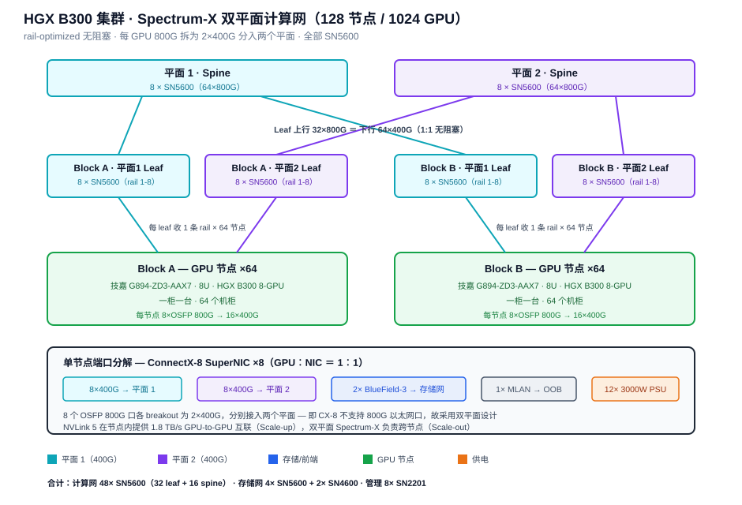
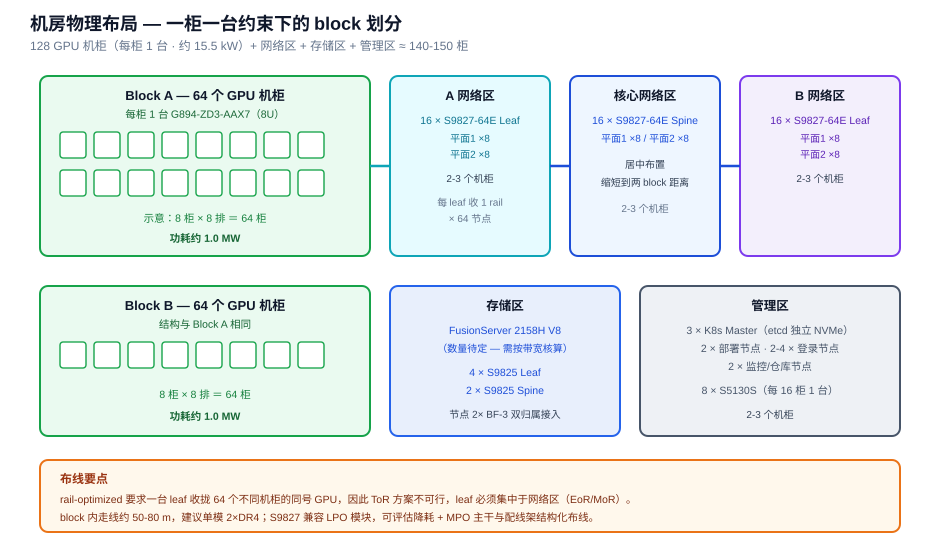

# HGX B300 训练集群设计方案 v0.3

> 1024 卡 NVIDIA HGX B300 训练集群设计：技嘉 G894-ZD3-AAX7 风冷节点 + H3C S9827 双平面 RoCEv2 网络 + 原生 Kubernetes 调度。
>
> 撰写人：孟希東 · 版本：v0.3（持续迭代中）

> **状态说明**：本文为初版设计，标注 **【待定】** 的条目需要现场信息确认后收敛。变更记录见文末。

---

## 1. 设计目标与约束

| 项 | 值 | 来源 |
|------|------|------|
| GPU 节点 | 128 台 | 需求确定 |
| GPU 总数 | 1024 颗 B300 SXM | 需求确定 |
| 机柜密度 | **每柜仅 1 台 GPU 服务器** | 机房现状约束 |
| 散热 | 风冷 | 需求确定 |
| 计算网 | **RoCEv2**（H3C 以太网） | 需求确定 |
| 调度 | 原生 Kubernetes（kubeadm） | 需求确定 |
| 存储服务器 | FusionServer 2158H V8 × **28 台**（24× NVMe + 双 400G） | 沿用现状 + 本版核算 |
| 网络设备 | **H3C S9827 系列** | 需求确定 |

设计基准参考 NVIDIA HGX AI Factory 企业参考架构的 **2-8-9-800** 配置（2 CPU、8 GPU、每 GPU 9 张网卡 800 Gb/s），128 节点为该 RA 的最大设计点。

---

## 2. 计算节点：技嘉 G894-ZD3-AAX7

| 指标 | 规格 |
|------|------|
| 形态 | 8U 机架式 · 447 × 351 × 923 mm |
| GPU | NVIDIA HGX B300 · 8× SXM |
| CPU | 双路 AMD EPYC 9005/9004（cTDP 最高 500W） |
| 内存 | 12 通道 DDR5 RDIMM · 24× DIMM |
| GPU 网络 | **8× OSFP 800 Gb/s**，板载 ConnectX-8 SuperNIC，支持 IB XDR 或 **双 400 Gb/s 以太网** |
| NVLink | 1.8 TB/s GPU-to-GPU |
| DPU | 兼容 BlueField-3（本方案每节点 **2 张**） |
| 板载 LAN | 2× 10 Gb/s（Intel X710-AT2） |
| 存储 | 8× 2.5" Gen5 NVMe 热插拔 + 2× M.2 |
| 扩展 | 4× FHHL PCIe Gen5 x16 |
| 电源 | **12× 3000W 80 PLUS 铛金冗余**（C19 电源线） |
| BMC | ASPEED AST2600 |
| 工作温度 | 10°C ~ 30°C |

**三个关键设计含义**：

1. `dual 400 Gb/s Ethernet` 天然匹配双平面架构 —— ConnectX-8 不支持 800G 以太网口，每个 800G OSFP 口拆为 2×400G 分入两个平面。
2. 12× 3000W ＝ 36 kW 装机容量，按 6+6 冗余可用约 18 kW，匹配单节点实测峰值。
3. 8U 风冷 + 进风上限 30°C —— 决定了机柜与气流设计（见 §7）。

---

## 3. 网络架构：H3C 双平面 RoCEv2



### 3.0 RoCEv2 术语与原理

**RoCEv2 全称 RDMA over Converged Ethernet version 2**（融合以太网上的远程直接内存访问 · 第二版）。

| 要点 | 说明 |
|------|------|
| **RDMA** | 远程直接内存访问 —— 网卡直接读写对端内存，无需 CPU 参与、无内核态拷贝（zero-copy / kernel bypass） |
| **封装层次** | v1 基于以太网帧（Layer 2，不可路由）；**v2 封装于 UDP/IP（Layer 3），可跨子网路由** |
| **UDP 目的端口** | 4791（IANA 分配） |
| **对网络的要求** | UDP 无重传机制，因此依赖下层提供**无损网络**（PFC + ECN） |

**为什么本方案选 v2**：双平面 leaf-spine 拓扑跨子网转发，v1 的二层局限无法支撑；且 v2 可利用 IP 层 ECMP 做多路径负载均衡。

**工程含义**：RoCEv2 的性能上限完全取决于无损网络是否调好 —— 一旦丢包，传统 `go-back-N` 重传会造成性能断崖式下降。这是 §6.4 必须单独列为关键环节的原因，也是 RoCE 方案与 InfiniBand 的最大工程差异（IB 在链路层天然无损，无需此类调优）。

### 3.1 双平面原理

ConnectX-8 不支持 800 Gbps 以太网端口，因此采用多平面设计：每张 800G 网卡拆为 2× 400 Gbps 端口，各自组成一个通信平面，后端网可视为 **2 张并行独立的 400G 网络**。

GPU 计算网（East-West）采用分离隔离的双平面 leaf-spine、rail-optimized 无阻塞结构，用端口 breakout 收敛端口数同时保持冗余。拓扑设计参考 NVIDIA RA，交换机改用 H3C。

- 每节点：8× OSFP 800G → **16× 400G**（平面 1 八条 + 平面 2 八条）
- 全集群：128 × 16 ＝ **2048 个 400G 端点**，每平面 1024

### 3.2 交换机数量推导

以 H3C S9827-64E（2U · 51.2T · 64× 800GE ＝ breakout 后 128× 400G）为单位：

| 层 | 推导 | 数量 |
|------|------|------|
| Leaf / 平面 | 1024 端点 ÷ 64 下行 | 16 台 |
| Leaf 合计 | 16 × 2 平面 | **32 台** |
| Spine / 平面 | 每 leaf 上行 32×800G × 16 台 ÷ 64 口 | 8 台 |
| Spine 合计 | 8 × 2 平面 | **16 台** |
| **计算网合计** | | **48 台 S9827-64E** |

**单台 Leaf 端口分配**：32 个 800G 口 breakout 为 64× 400G 下行 + 32 个 800G 口直连 spine 上行 → 下行 25.6 Tb/s ＝ 上行 25.6 Tb/s，**严格 1:1 无阻塞**。Leaf-Spine 之间走原生 800G，不做 breakout，简化布线。

### 3.3 Rail 映射与 Block 划分

rail-optimized 下，**一台 leaf 服务「一条 rail × 64 个节点」**。128 节点因此自然分为两个 block：

- Block A：节点 1-64，配 16 台 leaf（8 rail × 2 平面）
- Block B：节点 65-128，配 16 台 leaf

同号 GPU 跨节点通信走同一 rail 平面，互不争抢；跨 block 通信需经 spine 一跳。

### 3.4 完整交换机 BOM

| 用途 | 型号 | 数量 | 状态 |
|------|------|------|------|
| 计算网 Leaf | **H3C S9827-64E** | 32 | 已确认 |
| 计算网 Spine | **H3C S9827-64E** | 16 | 已确认 |
| 存储/前端 Leaf | **H3C S9827-64E** | 6 | v0.3 上调 |
| 存储/前端 Spine | **H3C S9827-64E** | 3 | v0.3 上调 |
| 带外管理 | H3C S5130S 系列（48×GE） | 8 | 【待确认】 |
| **合计** | | **65 台** | |

**存储网端口核算**（v0.3）：GPU 节点 128×2 BF-3 ＝ 256 + 存储节点 28×2 ＝ 56，合计 **312 个 400G 端口**。S9827-64E 每台 64 下行 + 64 上行 → 6 台 leaf + 3 台 spine。统一采用 S9827 型号可简化备件与运维。

S9827 系列单 POD 最大支持超 4K 个 800G 端口或 8K 个 400G 端口的组网规模，本方案 2048 个 400G 端点余量充足，**未来翻倍扩容无需改动拓扑**。

### 3.5 三张网汇总

| 网络 | 介质 | 每节点端口 | 上行 |
|------|------|-----------|------|
| 计算后端（East-West） | 400G 以太 RoCEv2 | 16（8×OSFP breakout） | 双平面 S9827-64E leaf |
| 存储/前端（North-South） | BlueField-3 DPU | 2 | S9827-64E leaf（**双归属**，两张 DPU 分接不同 leaf） |
| 带外管理（OOB） | 1G RJ45（MLAN） | 1 | S5130S |

---

### 3.6 与 NVIDIA Spectrum-X 方案的差异（重要）

采用 H3C 交换机后，**“Spectrum-X” 作为整体方案不再成立** —— 该方案依赖 NVIDIA 交换机与 NVIDIA 网卡的端到端协同（自适应路由、Direct Data Placement、性能隔离），NVIDIA 官方“接近 InfiniBand 性能”的测试数据**不能直接套用**于本方案。

本方案实际组合为：**ConnectX-8 网卡 + H3C S9827 交换机 + 标准 RoCEv2**。无损与负载均衡能力由 H3C 侧提供：

| 能力 | H3C S9827 实现 |
|------|------|
| 无损 | PFC、ECN、**AI ECN**（动态调整各队列 ECN 门限）、IPCC、iNOF、Agile Buffer |
| 负载均衡 | **FGLB** 灵活全局负载均衡、ECMP、Flowlet 逐流、**Spraylink 逐包（AR）** |
| 高可用 | **DPSH** 数据面自愈，微秒级流量切换 |
| 缓存 | 整机 ≥165M |
| 系统 | 自研 Comware V9 |

**工程影响**：

1. 调优责任主体转移 —— 需 H3C 技术团队参与 AI ECN / PFC / Spraylink 参数整定，并与 NCCL 侧联调。
2. **建议 POC 阶段即引入 H3C 技术支持**，共同完成 NCCL all-reduce 基准测试，以实测数据替代厂商标称值。
3. S9827-64E 支持 LPO 光模块 + 液冷设计，整机功耗可降低 40%，满足 PUE ≤ 1.14 —— 本方案光模块用量约 2750 根，**LPO 方案值得单独评估其 TCO 收益**。

---

## 4. 物理布局与布线



### 4.1 机柜规划

| 区域 | 内容 | 机柜数 |
|------|------|--------|
| Block A | GPU 节点 ×64（一柜一台） | 64 |
| Block A 网络区 | 16× S9827-64E leaf | 2-3 |
| Block B | GPU 节点 ×64 | 64 |
| Block B 网络区 | 16× S9827-64E leaf | 2-3 |
| 核心网络区 | 16× S9827-64E spine（居中） | 2-3 |
| 存储区 | 28× 2158H V8（2U）+ 9× 存储网交换机 | 3-4 |
| 管理区 | K8s master / 登录 / 部署 / 监控 + S5130S | 2-3 |
| **合计** | | **约 145-150** |

### 4.2 为什么 ToR 不可行

两个原因叠加：

1. 机房约束每柜仅 1 台 GPU 服务器；
2. **更根本的是 rail-optimized 架构本身** —— 一台 leaf 要收拢 64 个不同机柜的同号 GPU，rail 无法在机柜内闭合。

因此 leaf 必须集中部署于网络区（EoR / MoR 布局），长距离光缆不可避免。

### 4.3 光缆清单

| 链路 | 类型 | 数量 |
|------|------|------|
| 服务器 → 计算 Leaf | 800G OSFP → 2×400G 分支线 | 1024 |
| 计算 Leaf → Spine | 800G OSFP 直连 | 1024 |
| 存储网下行（GPU 节点 + 存储节点） | 400G | ~312 |
| 存储网 Leaf → Spine | 400G | ~384 |
| **合计** | | **≈ 2750 根** |

**建议**：

- block 内跨 64 机柜，走线距离预计 **50-80 m**。多模 OM4（400G-SR4）标称 100 m 余量不足，**建议单模 2×DR4**。
- 必须采用 **MPO 主干 + 配线架的结构化布线**；2750 根点对点直连在 128 个机柜间将造成运维灾难。
- 光模块是本方案的隐性大成本项，需单独立项核价。
- **S9827 兼容 LPO 与 ZR 光模块**；LPO 可显著降低功耗，建议与 H3C 一并评估 LPO 方案的可行性与 TCO。

---

## 5. 存储

### 5.1 带宽目标

NVIDIA 企业参考架构的指导值为**每 GPU 约 12.5 Gb/s 存储带宽，随集群规模线性扩展**（例如 16 GPU 集群约需 200 Gb/s 聚合带宽）。本方案直接套用：

```
1024 GPU × 12.5 Gb/s = 12,800 Gb/s = 12.8 Tb/s ≈ 1.6 TB/s
```

NVIDIA 同时要求高性能存储需针对**小块随机 I/O** 优化，兼顾高单节点峰值与高聚合性能；深度学习负载以**读为主**，但需同时支持高效的多线程读写。

### 5.2 存储节点配置

| 项 | 配置 |
|------|------|
| 机型 | FusionServer 2158H V8（2U 单路 AMD EPYC 9005，最高 192 核） |
| 盘 | **24× NVMe**（Gen5） |
| 网卡 | **双 400G**，LACP active-active（802.3ad） |
| 台数 | **28 台**（推荐值，见 §5.3） |

**单节点能力核算**：

| 项 | 数值 |
|------|------|
| 双 400G 理论带宽 | 800 Gb/s ＝ 100 GB/s |
| 实际可达（约 75%） | **~70-80 GB/s** |
| 24× Gen5 NVMe 裸盘读 | ~330 GB/s |

> **网络是瓶颈，盘有大量富余** —— 24 块 Gen5 NVMe 的能力远超双 400G 网卡，本配置下盘不会成为限制。

### 5.3 台数推导

```
1.6 TB/s ÷ 75 GB/s ≈ 21.3 台
```

| 方案 | 台数 | 说明 |
|------|------|------|
| 最小满足 | 24 | 刚好覆盖，无余量 |
| **推荐** | **28** | 约 15% 余量，容忍单节点故障 |
| 宽裕 | 32 | 留扩容余量，容量更充足 |

**采用 28 台**。理由：训练负载的存储压力并不均匀 —— Checkpoint 写入是突发峰值，节点故障或数据重建期间仍需保持性能，按最小值配置会在最关键时刻掉链子。

**容量估算**（按 15.36TB 盘）：28 × 24 × 15.36TB ≈ **10.3 PB 裸容量**，纠删码后可用约 **7-8 PB**。

### 5.4 文件系统选型

NVIDIA 认证生态中的主流方案：VAST Data 是首个通过 DGX SuperPOD 认证的企业级 NAS（其余方案均为并行文件系统）；IBM ESS3200 运行 IBM Storage Scale（原 GPFS）并支持 Magnum IO GPUDirect；NetApp EF600 配 BeeGFS 亦已联合认证。VAST 公布数据显示 GPUDirect 相比“RDMA 先搬入 CPU 内存再拷贝到 GPU 内存”快 3 倍、CPU 消耗降低约 2/3。

**本方案关键约束：需运行在自有的 2158H V8 通用服务器上**，据此筛选：

| 方案 | 适配性 | 说明 |
|------|------|------|
| **WEKA** | ✅ **首选** | 专为商用服务器 + 本地 NVMe 设计，GDS 支持成熟，AI 训练集群主流选择 |
| IBM Storage Scale ECE | ✅ 备选 | 纠删码版可运行于自有服务器，NVIDIA 认证，生态成熟 |
| VAST Data | ⚠️ | 通常配套自有硬件，与沿用 2158H V8 的前提冲突 |
| Lustre / DDN EXAScaler | ⚠️ | HPC 场景强，元数据与小文件随机 I/O 弱于前两者 |
| Ceph | ❌ | 高带宽训练场景性能不足 |

**结论：WEKA 为主选，IBM Storage Scale ECE 为备选。**

> WEKA 为商业授权，成本较高且会独占部分 CPU 核心（单路 192 核 EPYC 核数充足，不构成瓶颈），建议纳入 TCO 统一评估。

启用 **GPUDirect Storage（GDS）**，数据从 NVMe 直达 GPU 显存，绕过 CPU 内存拷贝。

### 5.5 两个必须现场确认的工程风险

**① PCIe 通道可能不足【高优先级】**

单路 EPYC 9005 提供 **128 条 PCIe Gen5 通道**，本配置需求：

```
24× NVMe × 4 lanes  =  96 lanes
2× 400G 网卡 × 16   =  32 lanes
                       ─────────
                       128 lanes  ← 正好占满，无余量
```

启动盘、BMC、管理网口均无通道可用。实际机型多采用 **PCIe Switch** 扩展，或令盘位运行在降级带宽下 —— **这将直接影响实际吞吐**。

**需向 xFusion 确认**：2158H V8 的 24 盘位背板拓扑（直连 CPU 还是经 PCIe Switch）、每盘实际通道数、双 400G 网卡插槽的通道分配。

**② 双 400G 必须配置为 active-active**

“备份 + 负载均衡”需配置为 **LACP active-active（802.3ad）** 才能获得 800 Gb/s；若配置为主备（active-standby），实际仅 400 Gb/s，**台数需翻倍至 48-56 台**。

即使 active-active，单口故障时该节点降至 400G —— 这也是建议保留 15% 余量的原因之一。

---

## 6. Kubernetes 架构

原生 kubeadm 栈，自底向上分层：

### 6.1 底座

- OS：Ubuntu Server；运行时：containerd
- kubeadm 部署 **3 节点 Master HA**，etcd 使用独立 NVMe
- 主 CNI：Cilium 或 Calico（仅承载控制面与 Service 流量）

### 6.2 NVIDIA GPU Operator

统一下发 GPU 驱动、container-toolkit、device-plugin、DCGM-exporter、NFD。训练节点使用**整卡**，不切 MIG。

### 6.3 NVIDIA Network Operator（RoCE 模式）

Network Operator 通过 CRD 管理 RDMA / SR-IOV device plugin、Multus 二级网络、nv-ipam 等组件，与 GPU Operator 配合启用 GPUDirect RDMA。

落地形态：默认 CNI 负责 Pod-to-Service、控制面与镜像拉取；通过 Multus 将启用 RDMA 的 SR-IOV VF 挂入 Pod 作为高速数据面。

**每个训练 Pod 挂 18 个 VF**：16 个计算网 VF（2 平面 × 8 rail）+ 2 个 BlueField-3 存储网 VF。

生产 RDMA 集群通常四件套并用：Multus（多网卡）、Network Operator（主机侧）、SR-IOV Device Plugin（资源调度）、Topology Manager（NUMA 对齐）。

> 相比 InfiniBand 方案，**不需要** ib-kubernetes、IPoIB CNI、OpenSM partition、UFM。

### 6.4 RoCEv2 无损网络调优（IB 方案不存在的必做项）

如 §3.0 所述，RoCEv2 封装于 UDP 之上、无重传机制，性能上限完全取决于无损网络是否调好。

主机侧：

- PFC / ECN / DCQCN 参数整定
- MTU 9000
- ConnectX-8 侧 RoCE 参数与 NCCL 环境变量

交换机侧（H3C S9827）：

- **AI ECN** 门限自适应调优
- PFC 死锁检测、Agile Buffer 配置
- 负载均衡策略选型：ECMP / Flowlet 逐流 / **Spraylink 逐包（AR）** —— 训练 All-Reduce 场景通常逐包 AR 效果最佳，但需验证与 NCCL 的配合
- DPSH 数据面自愈启用

**这是 RoCE 方案成败的关键环节，需预留充分调优与压测周期，并由 H3C 技术团队共同参与。**

### 6.5 调度：NVIDIA KAI Scheduler

作为 secondary scheduler 与 kube-scheduler 并存。核心能力：

- **Gang 调度**：一个作业的所有 Pod 要么一起启动、要么都不启动，避免 8-Pod 作业只调度上 7 个而让 7 张卡空等
- **层级公平队列**：按团队配额，over-quota 权重与优先级抢占
- **拓扑感知放置**：将分布式作业就近放置以降低网络延迟
- **内置 podgrouper**：自动对接 Kubeflow / Ray / Argo / Training Operator

**本方案特定调优**：拓扑感知需感知 block 划分 —— 中小规模作业（≤64 节点）应优先落在**同一 block 内**，避免跨 block 多走一层 spine。

> 资源表达上，DRA 已在 Kubernetes 1.34 GA，NVIDIA 的 k8s-dra-driver 已捐赠 CNCF，可用 DeviceClass 统一描述整卡 / MIG / 共享形态。
>
> 备选调度器：Volcano（偏 HPC / MPI）、Kueue（轻量队列层）。

### 6.6 作业框架与可观测

- 作业层：Kubeflow Trainer（PyTorchJob）+ MPI Operator，可选 KubeRay
- Topology Manager 做 NUMA 对齐（GPU ↔ ConnectX-8 ↔ CPU）
- NCCL 需正确识别双平面 16 条链路，否则 All-Reduce 打不满带宽 —— **需以基准测试反复验证**
- 监控：DCGM-exporter + Prometheus + Grafana
- 定期执行 1024 卡 NCCL all-reduce 基准

---

## 7. 供电与散热

### 7.1 单节点

| 项 | 功耗 |
|------|------|
| 8× B300 SXM | ~11.2 kW |
| 双路 EPYC（500W × 2） | ~1.0 kW |
| 内存 / NVMe / 8× CX-8 / 风扇 | ~2-3 kW |
| **峰值合计** | **~14-16 kW** |

12× 3000W 电源按 6+6 冗余可用 18 kW，留有余量。

### 7.2 集群总量

| 项 | 功耗 |
|------|------|
| GPU 节点 128 台 | **~2.0 MW** |
| 网络（65 台交换机） | ~65-75 kW（若采用 LPO 可降低） |
| 存储（28 台 × ~1.5 kW） | ~42 kW |
| 管理 + CPU 服务器 | ~20 kW |
| **IT 合计** | **~2.1-2.3 MW** |
| 含制冷（PUE 1.4 估算） | **~3 MW** |

### 7.3 散热要点

一柜一台使单柜功率降至 ~15.5 kW，属标准高密风冷机柜可承受范围 —— 这是本约束带来的**有利面**。但仍需：

- 冷热通道封闭
- 进风温度严格控制在 **30°C 以内**（机型规格上限）
- 盲板封堵，避免热回流

---

## 8. 待确认清单

| # | 事项 | 影响 |
|---|------|------|
| 1 | **2158H V8 的 24 盘位 PCIe 拓扑与通道分配** | 决定单节点实际吞吐，可能影响台数 |
| 2 | 机房布局：128 柜的排数 × 每排柜数 | 决定光缆长度与单模/多模选型 |
| 3 | 是否需要独立推理 / 开发节点池 | 影响 MIG 策略与队列设计 |
| 4 | 多租户：是否按团队划分 KAI 层级队列 | 影响调度策略配置 |
| 5 | 单柜实际可用功率上限确认 | 校验 15.5 kW 假设 |
| 6 | H3C 管理网具体型号 | 锁定 BOM |
| 7 | 是否采用 LPO 光模块 | 影响功耗与光模块采购 |
| 8 | 双 400G 确认配置为 LACP active-active | 若为主备，存储台数需翻倍 |
| 9 | WEKA 授权成本评估 / 是否改用 Storage Scale ECE | 影响 TCO 与实施路径 |
| 10 | NVMe 单盘容量选型 | 决定总容量（按 15.36TB 估算 10.3 PB 裸容量） |

---

## 变更记录

| 版本 | 日期 | 变更 |
|------|------|------|
| v0.1 | 2026-07 | 初版：128 节点 / 1024 GPU / B300 风冷 / Spectrum-X 双平面 RoCE / 原生 K8s |
| v0.2 | 2026-07 | 交换机由 NVIDIA Spectrum-X 改为 **H3C S9827 系列**；新增 §3.6 方案差异说明；RoCE 调优章节改为 H3C 实现；新增 LPO 评估项 |
| v0.3 | 2026-07 | **存储方案收敛**：按 12.5 Gb/s/GPU 定 1.6 TB/s 目标，推导 28 台节点；文件系统选定 WEKA（备选 Storage Scale ECE）；新增 PCIe 通道与 LACP 两项风险；存储网交换机上调至 6 leaf + 3 spine，总数 65 台；新增 §3.0 **RoCEv2 术语与原理** |

---

← [返回 README](../README.md) · 相关：[B300/GB300 NVL72 技术全解](B300_GB300_NVL72_技术全解.md) · [s110 集群网络架构（交换机与 CPU 服务器）](s110集群网络架构_交换机与CPU服务器.md) · [GPU 集群常见问题与故障排查手册](GPU集群常见问题与故障排查手册.md)
