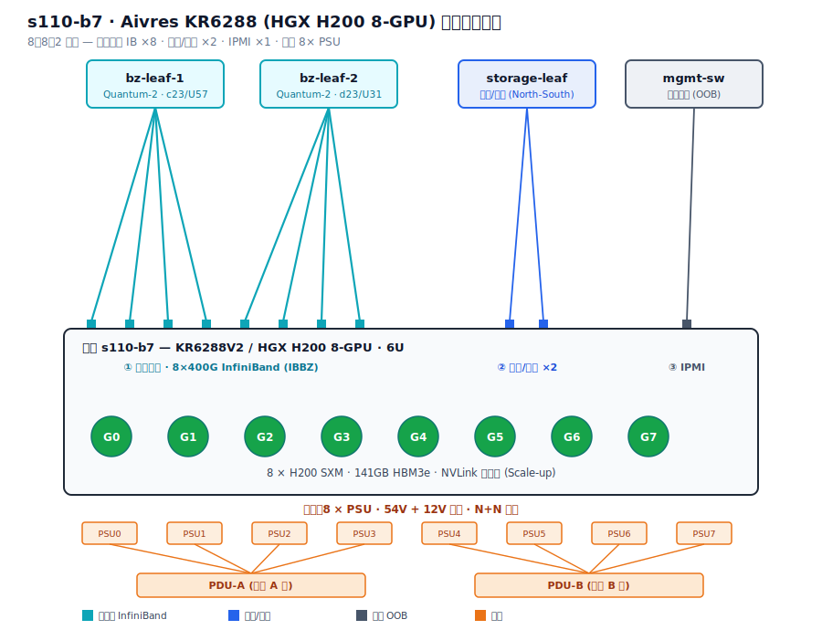

# Aivres KR6288（HGX H200）训练节点网络结构解析 — s110-b7

> 一台 Aivres KR6288V2 / KR6288-X2（NVIDIA HGX H200 8-GPU）训练节点的实拍接线解析：从铭牌、线缆标签到 8︰8︰2 网络架构，还原节点 **s110-b7** 在 InfiniBand 训练集群中的角色。
>
> 撰写人：孟希東

---

## 1. 节点铭牌

| 项 | 值 |
|------|------|
| 厂商 | Aivres Systems Inc.（Assembled in United States） |
| Unit Type | KR6288V2 |
| Model | KR6288-X2-A0-R0-00 |
| S/N | 23CB07925 |
| QID/SN | 23CB07928 |
| RS S/N | RS81-1000-0001 |
| MFG Date | 2024.11 |
| 节点名 | **s110-b7** |

---

## 2. 平台规格

Aivres KR6288-X2 / KR6288V2 是 6U、8-GPU 的 NVIDIA HGX H200 平台（V2 也支持 H100），提供 10 个 PCIe 5.0 x16 插槽，可选配 BlueField-3、CX7 等智能网卡；官方将其集群网络定义为 8︰8︰2 架构，节点间最高 4.0 Tbps 无阻塞带宽。

| 指标 | 规格 |
|------|------|
| 形态 | 6U 机架 |
| GPU | NVIDIA HGX H200 8-GPU（141GB HBM3e/卡，整机约 1.1TB） |
| CPU | 2× Intel Xeon 4th/5th Gen 或 2× AMD EPYC 9004 |
| PCIe | 10× PCIe 5.0 x16（可选 BlueField-3 / CX7 智能网卡） |
| 供电 | 8× PSU（0–7），54V+12V 分离，N+N 冗余，200–240V 16A/路 |
| 集群网络 | 8︰8︰2（GPU︰计算网︰存储网），节点间最高 4.0 Tbps 无阻塞 |

> **型号说明**：KR6288-X2 / KR6288V2 对应 HGX H200/H100 8-GPU 平台。若铭牌看似 B300，请核对 GPU 基板——Blackwell 为不同机型。本节点确认为 **H200**。

---

## 3. 线缆标签命名规则

你们的布线标签是规整的结构化命名，拆开看：

| 标签片段 | 含义 |
|----------|------|
| `s110` | 所属 SU / 机柜单元（pod） |
| `b7` | 本节点 ID（光模块上手写 "B7"） |
| `IBBZ` | InfiniBand 后端（计算网） |
| `bz-leaf-1 / -2` | 后端两台 Leaf 交换机 |
| `c23u57 / d23u31` | 两台 Leaf 的机柜列 / U 位 |
| `IPMI` | 带外 BMC 管理口 |
| `S110-D*-U*-PSU*` | 电源馈电（PDU / Bank） |

实拍标签示例：`s110-b7-IBBZ-p2`、`osadrt-s110-c23u57-bz-leaf-1`、`osadrt-s110-d23u31-bz-leaf-2`、`s110-b7-IPMI`。

---

## 4. 网络结构：8︰8︰2

分三张网 + 一路电源：

**① 计算后端网（East-West · InfiniBand）** — 8× 400G，一卡一 GPU、一 rail，浅蓝 OM3/OM4 多模光纤（`IBBZ`），上行到 `bz-leaf-1 / bz-leaf-2`，约 3.2 Tbps，承载 GPU 间 All-Reduce。

**② 存储 / 前端网（North-South）** — 2× 网卡（通常 BlueField-3 或 CX7），负责存储读写、in-band 管理与集群通信。

**③ 带外管理网（OOB）** — 1× RJ45 IPMI/BMC，与数据网物理隔离，用于远程开关机、监控、装机。

**④ 供电** — 8× PSU，54V+12V 分离、N+N 冗余，双路 PDU 馈电。

---

## 5. 接线速查表

| 位置 | 介质 / 接口 | 标签 | 作用 |
|------|-------------|------|------|
| PCIe 0–3 / 4–7（8 个） | 多模光纤 + 光模块 | `s110-b7-IBBZ-p*` | 后端 IB 计算网，8 轨 |
| 中间 2× OSFP | 多模光纤 | → `bz-leaf-1/2` | 计算网上行 Leaf |
| 右侧 ×2 | 光纤（蓝色 LC） | 前端 / 存储 | North-South 网 |
| 中间 RJ45 | 铜缆 | `s110-b7-IPMI` | 带外管理 |
| 底部 ×8 | 电源线 | `…PSU*` | 冗余供电 |

---

## 6. 配套网络硬件（Hopper 代）

H200 属 Hopper 架构，配套 scale-out 网络通常为：

| 组件 | 型号 | 说明 |
|------|------|------|
| 计算网卡 | ConnectX-7 | NDR 400G InfiniBand，一卡一 GPU |
| 后端交换机 | Quantum-2（QM9700 风冷 / QM9790 液冷） | 64×400G NDR，SHARP 在网计算 |
| 存储 / 前端 | BlueField-3 / CX7 | North-South，可选 |

> 即这是一套 **NDR 400G InfiniBand** 训练集群节点；XDR 800G（ConnectX-8 + Quantum-X800）是 Blackwell 代的组合。

---

## 7. 节点在集群中的角色

s110-b7 的 8 张 GPU 网卡分别接到后端不同 rail（Leaf），跨节点做 All-Reduce 时「同号 GPU 走同一 rail 平面、互不争抢」——即 rail-optimized（轨道优化）胖树。存储网单独 2 口走 North-South，管理网单独带外。计算网使用 InfiniBand（`IBBZ`），追求确定性低延迟，契合 8 卡 HGX 训练节点定位。

---

← [返回 README](../README.md) · 相关：[GPU 集群常见问题与故障排查手册](GPU集群常见问题与故障排查手册.md) · [B300/GB300 NVL72 技术全解](B300_GB300_NVL72_技术全解.md)
