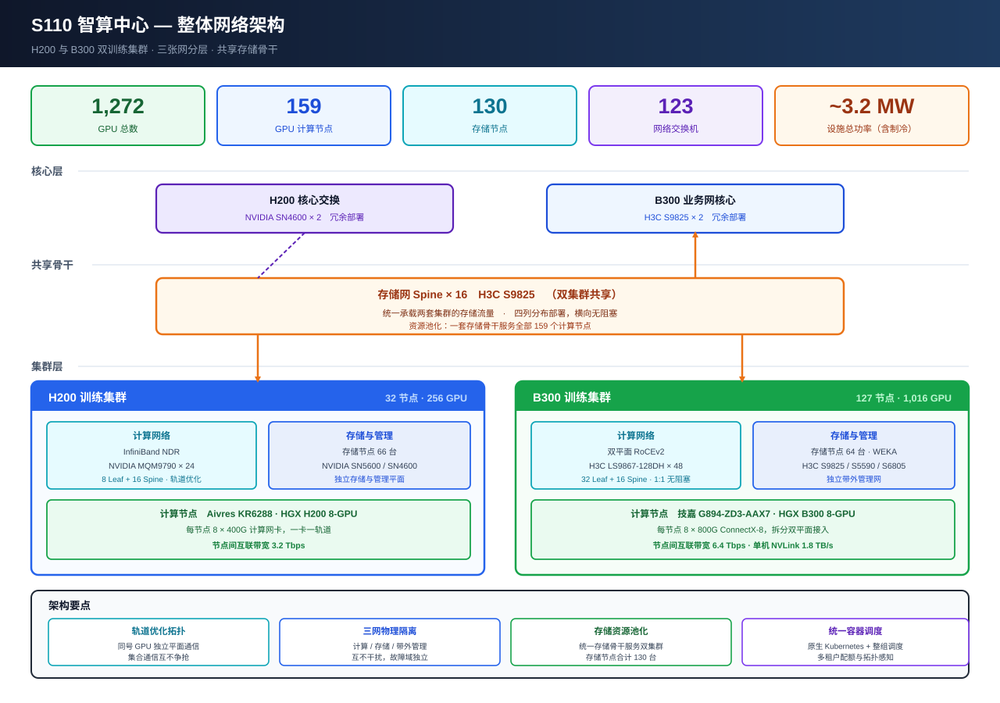

# S110 智算中心整体架构说明

> H200 与 B300 双训练集群的整体架构详细说明：分层结构、三张网设计、Pod 划分、端口与容量推导、存储系统、上层软件架构、供电散热。
>
> 撰写人：孟希東 · 版本：v2.0 · 日期：2026-10
>
> **文档性质**：设备均已上线，数据为实际现网配置。
>
> **文档定位**：本文是**整体架构的详细说明**。设备机柜 U 位台账以 [S110 机房双集群架构说明书](S110机房双集群架构说明书.md) 为权威来源；B300 单集群的 RoCEv2 原理推导与存储选型细节见 [HGX B300 训练集群现网架构文档](HGX_B300训练集群设计方案_1024GPU.md)。

---

## 1. 集群总览

S110 机房内并行运行两套 GPU 训练集群，面向大模型训练与推理负载，通过共享存储骨干实现存储资源池化。

### 1.1 总体规模

| 指标 | 规模 |
|------|------|
| **GPU 总数** | **1,272 颗** |
| GPU 计算节点 | 159 台 |
| 存储节点 | 130 台 |
| 网络交换机 | 123 台（专属 107 + 共享 16） |
| 设备总数 | 412 台 |
| IT 功率 | 约 2.2–2.4 MW |
| 设施总功率（PUE 1.4） | 约 3.2 MW |

### 1.2 两套集群构成

| 项 | H200 集群 | B300 集群 |
|------|-----------|-----------|
| 计算节点 | **32 台** Aivres KR6288 | **127 台** 技嘉 G894-ZD3-AAX7 |
| GPU 平台 | HGX H200 8-GPU | HGX B300 8-GPU |
| GPU 数量 | 256 颗 | 1,016 颗 |
| **Pod 划分** | 单 Pod | **双 Pod（Pod A 64 台 / Pod B 63 台）** |
| 计算网协议 | **InfiniBand NDR** | **双平面 RoCEv2** |
| 计算网设备 | NVIDIA MQM9790 × 24 | H3C LS9867-128DH × 48 |
| 单节点互联带宽 | 3.2 Tbps | 6.4 Tbps |
| 存储节点 | 66 台 | 64 台 |
| 专属交换机 | 36 台 | 71 台 |

### 1.3 两套体系并存的由来

两集群建设时序不同，形成了技术体系上的分叉：

- **H200 集群**采用 NVIDIA 全栈 —— InfiniBand 计算网（MQM9790）+ Spectrum 以太网管理体系（SN5600 / SN4600）
- **B300 集群**采用 H3C 全栈 —— RoCEv2 计算网（LS9867-128DH）+ H3C 以太网存储与管理体系（S9825 / S5590 / S6805）

两者**各有独立的核心层**，仅在**存储网 Spine 层**交汇。这一结构既保证了计算平面的完全隔离，又让存储容量得以池化。

---

## 2. 整体架构



### 2.1 三层结构

架构自上而下分为三层：

**① 核心层** —— 两套集群各配置独立的冗余核心交换，承担南北向流量汇聚与对外互联。

| 集群 | 设备 | 数量 | 位置 |
|------|------|------|------|
| H200 | NVIDIA SN4600 | 2 | C22 列 U10 / D22 列 U10 |
| B300 | H3C S9825 | 2 | C22 列 U17 / D22 列 U17 |

两套核心互不相干，各自承载本集群的管理面、存储面南北向出口。

**② 共享骨干层** —— 16 台 H3C S9825 组成的存储网 Spine，是两套集群唯一的交汇点。

**③ 集群层** —— 两套集群各自保有完整的计算网、存储接入与带外管理体系，在计算平面上完全独立。

### 2.2 三张网物理隔离

全中心采用三张物理独立的网络，互不复用链路与设备：

| 网络 | 流量类型 | 承载内容 | 协议/设备 |
|------|---------|---------|----------|
| **计算网** | East-West | GPU 间集合通信（All-Reduce / All-to-All / All-Gather） | H200：IB NDR；B300：双平面 RoCEv2 |
| **存储网** | North-South | 训练数据读取、Checkpoint 读写 | 以太网 200G/400G，共享 Spine 骨干 |
| **带外管理网** | 管理面 | BMC / IPMI、带外开关机、固件升级、系统部署 | 千兆/万兆以太网 |

**隔离的工程价值**：

1. 计算网独占链路，训练集合通信不与大流量存储读写争抢带宽 —— 这是保障 All-Reduce 稳定性的前提
2. 存储网突发（如全集群同时写 Checkpoint）不会冲击计算网的无损队列
3. 带外管理网与数据面完全分离，数据网异常时仍可远程操作全部节点
4. 三者故障域相互独立，单网故障不扩散

### 2.3 跨集群耦合关系

两集群虽各有核心，但存在两处结构性耦合，需在架构层面明确：

| 耦合点 | 影响范围 |
|------|---------|
| **存储网 Spine × 16** | 同时承接两集群存储流量 |
| **B300 业务网核心（C22/D22 U17）** | 共享存储 Spine 的上行落点，H200 的存储南北向流量亦经此转发 |

即：H200 的存储访问路径最终要穿过 B300 的核心层。这是建设时序造成的结构性依赖。

---

## 3. H200 集群

### 3.1 节点与分布

| 项 | 配置 |
|------|------|
| 机型 | Aivres KR6288 V2 |
| GPU 平台 | NVIDIA HGX H200 · 8× SXM |
| 节点数 | **32 台**（A 列 20 台 + B 列 12 台） |
| GPU 总数 | 256 颗 |
| 计算网卡 | 8 × 400G（每 GPU 一张，一卡一轨道） |
| 节点间互联带宽 | **3.2 Tbps** |

### 3.2 计算网：InfiniBand NDR

| 层 | 设备 | 数量 | 位置 |
|------|------|------|------|
| Leaf | NVIDIA MQM9790 | 8 | — |
| Spine | NVIDIA MQM9790（与 Leaf 同型号） | 16 | B01 / B02 / A01 / A02 列各 4 台 |

**单台 Leaf 端口分配**：16 口下行接计算节点网卡 + 16 口 800G 上行 Spine。

**下行容量校验**：

```
下行能力 = 8 台 × 16 口 × 2（800G 拆 2×400G）= 256 条 400G
节点需求 = 32 节点 × 8 张网卡              = 256 条
→ 完全匹配
```

**上行分布**：8 台 Leaf × 16 条 800G = 128 条，均摊到 16 台 Spine，**每台 Spine 承接 8 条**。

**无阻塞性**：单台 Leaf 下行 16 口与上行 16 口对等，收敛比 1:1。

**协议特性**：InfiniBand 在链路层通过 credit-based 流控天然实现无损，无需 PFC/ECN 调优，具备确定性低时延，适合对通信延迟敏感的训练任务。

### 3.3 存储 Server 网络

| 项 | 内容 |
|------|------|
| 存储 Server | **66 台** Xfusion |
| 分布 | B15–B21 每列 8 台（56 台）+ C23 列 5 台 + C21 列 5 台 |
| 存储 Leaf | **4 台** H3C S9825 |
| Leaf 位置 | C21 列 U25 / U30，C23 列 U25 / U30 |
| 上行 | 共享存储 Spine × 16（G23 / G22 / F23 / F22） |

存储 Server 经本层 Leaf 汇聚后上行共享骨干，与 B300 的存储 Server 直连 Spine 的方式不同 —— H200 侧保留了 Leaf 一跳。

### 3.4 计算节点存储网与管理网（NVIDIA 独立体系）

H200 的计算节点存储访问与带外管理走一套**独立的 NVIDIA Spectrum 以太网体系**，与 §3.2 的 IB 计算网、§3.3 的 H3C 存储网三者相互独立：

| 层 | 设备 | 数量 | 位置 |
|------|------|------|------|
| 计算节点存储 Leaf | NVIDIA SN5600 | 2 | C23 列 U37、D23 列 U37 |
| 管理 Server Leaf | NVIDIA SN5600 | 2 | D21 列 U37、C21 列 U37 |
| Spine | NVIDIA SN5600 | 2 | C22 列 U37、D22 列 U37 |
| Core | NVIDIA SN4600 | 2 | C22 列 U10、D22 列 U10 |

两组 Leaf（计算节点存储、管理 Server）**共用同一对 Spine**，再上行至 Core。这是一套完整的三层以太网结构，独立于共享存储骨干之外。

### 3.5 交换机台账

| 用途 | 型号 | 数量 |
|------|------|------|
| 计算网 Leaf | NVIDIA MQM9790 | 8 |
| 计算网 Spine | NVIDIA MQM9790 | 16 |
| 存储 Leaf | H3C S9825 | 4 |
| 计算节点存储 Leaf | NVIDIA SN5600 | 2 |
| 管理 Server Leaf | NVIDIA SN5600 | 2 |
| 存储/管理 Spine | NVIDIA SN5600 | 2 |
| 核心 | NVIDIA SN4600 | 2 |
| **小计** | | **36 台** |

---

## 4. B300 集群

### 4.1 节点规格

| 指标 | 规格 |
|------|------|
| 机型 | 技嘉 G894-ZD3-AAX7（8U 风冷） |
| GPU | NVIDIA HGX B300 · 8× SXM |
| CPU | 双路 AMD EPYC 9005/9004（cTDP 最高 500W） |
| 内存 | 12 通道 DDR5 RDIMM · 24 DIMM 槽 |
| NVLink | 节点内 GPU-to-GPU **1.8 TB/s** |
| 计算网卡 | **8 × OSFP 800 Gb/s** 板载 ConnectX-8 SuperNIC |
| 存储网卡 | 2 × 200G 光口 |
| 板载 LAN | 2 × 10 GbE（Intel X710-AT2） |
| 本地存储 | 8 × 2.5" Gen5 NVMe + 2 × M.2 |
| 电源 | 12 × 3000W 钛金冗余（C19） |
| BMC | ASPEED AST2600 |
| 进风温度上限 | **30°C** |

**节点数**：127 台，一柜一台，共 **1,016 颗** B300 SXM。

### 4.2 双 Pod 划分

B300 集群在架构上划分为**两个 Pod**，每个 Pod 是一个 rail 完整闭合的通信域：

| Pod | 节点 | GPU | 计算网 Leaf | 机柜列 |
|------|------|------|------------|-------|
| **Pod A** | 64 台 | 512 | 16（8 rail × 2 平面） | H01 / H02 / I01 / I02 |
| **Pod B** | 63 台 | 504 | 16（8 rail × 2 平面） | O01 / O02 / P01 / P02 |
| **合计** | **127 台** | **1,016** | **32** | 8 列各 4 台 |

**Pod 划分的技术依据**：

在 rail-optimized 拓扑下，**一台 Leaf 服务「一条 rail × 64 个节点」**。LS9867-128DH 的 64 口下行能力决定了一个 rail 域的节点上限就是 64 台 —— 这正是 Pod 的物理边界。127 台节点因此必然切分为 64 + 63 两个 Pod。

**Pod 的通信含义**：

| 通信范围 | 路径 | 跳数 |
|---------|------|------|
| 节点内 8 卡 | NVLink | 0 跳（交换机） |
| 同 Pod 同 rail | Leaf 内交换 | 1 跳 |
| 跨 Pod 同 rail | Leaf → Spine → Leaf | 3 跳 |

**调度意义**：中小规模作业（≤ 64 节点）应优先落在**同一 Pod 内**，使跨节点集合通信在 Leaf 层完成，不上 Spine。超过 64 节点的作业必然跨 Pod，需经 Spine 一层转发。这一约束需在上层调度器的拓扑配置中显式表达（见 §8.4）。

### 4.3 计算网：双平面 RoCEv2

**为什么是双平面** —— ConnectX-8 SuperNIC 不支持 800 Gbps 以太网端口（800G 仅在 InfiniBand XDR 模式下成立）。以太网模式下每个 OSFP 800G 口拆分为 **2 × 400 Gbps**，两条 400G 分别接入两个相互独立的通信平面。后端网因此可视为**两张并行独立的 400G 网络**。

| 项 | 数值 |
|------|------|
| 单节点 OSFP 口 | 8 |
| 单节点 400G 端点 | **16**（平面 1 八条 + 平面 2 八条） |
| 全集群 400G 端点 | 127 × 16 = **2,032** |
| 单平面端点 | **1,016** |
| 单节点互联带宽 | **6.4 Tbps** |

**交换机规模推导**（以 LS9867-128DH，128 × 400G 为单位）：

| 层 | 推导 | 单平面 | 合计 |
|------|------|-------|------|
| Leaf | 1,016 端点 ÷ 64 口下行 = 15.9 → 16 | 16 | **32 台** |
| Spine | 16 × 64 = 1,024 条上行 ÷ 128 口 = 8 | 8 | **16 台** |
| | | | **48 台** |

**单台 Leaf 配置**：64 × 400G 下行 + 64 × 400G 上行 = 25.6 Tb/s 双向，**严格 1:1 无阻塞**。

**Leaf–Spine 链路总数**：2,048 条（每平面 1,024）—— 这是布线主干与配线架容量规划的基准数字。

**双平面的可靠性价值**：两个平面在交换机、链路、光模块上完全独立，单一平面异常时另一平面仍可维持通信，训练作业可降速运行而不必中断。

**无需二次 breakout**：采用 128 口 400G 机型后，网卡侧拆出的 400G 链路直接插入交换机 400G 端口，交换机侧无需再做 breakout，简化了布线结构与故障定位层次。

**RoCEv2 的工程要点**：RoCEv2 封装于 UDP/IP（端口 4791），可跨子网路由，能利用 IP 层 ECMP 做多路径负载均衡 —— 这是双平面 Leaf-Spine 拓扑的必要条件（RoCEv1 基于二层帧，不可路由）。代价是 UDP 无重传机制，性能完全取决于下层无损网络（PFC + ECN）是否调好。

**H3C 侧无损与负载均衡能力**：PFC、ECN、AI ECN 门限自适应、IPCC、iNOF、Agile Buffer；FGLB、ECMP、Flowlet、Spraylink 逐包 AR；DPSH 链路自愈。

### 4.4 Rail 映射

rail-optimized 的核心规则：**节点的第 i 号 GPU 固定接入第 i 组交换机**。

| 要素 | 映射 |
|------|------|
| GPU 编号 | 0–7（对应 8 条 rail） |
| 平面编号 | 1–2（每张 800G 卡拆出的两条 400G） |
| Leaf 归属 | （Pod，rail，平面）→ 唯一一台 Leaf |
| Leaf 服务范围 | 1 条 rail × 该 Pod 内全部节点（≤ 64 台） |

因此 8 rail × 2 平面 × 2 Pod = 32 台 Leaf，与台账一致。

**效果**：同号 GPU 之间的跨节点通信在各自独立的轨道平面内完成，不同轨道互不争抢带宽，也无需经过 Spine。对于千卡规模的同步训练，这是保障扩展效率的关键结构。

**端口余量**：每平面 Leaf 容量 1,024 端点，实用 1,016，**余 8 个端点** —— 即最多再接 1 台 GPU 节点。

### 4.5 存储网

**连接方式**：交换机侧每个 400G 端口 breakout 为 2 × 200G，两条分别接**两台不同的服务器**；每台服务器的 2 个 200G 口**分接不同 Leaf**，形成双归属。

**两类接入路径**：

| 来源 | 路径 |
|------|------|
| **计算节点**（127 台 × 2 口） | → 计算节点存储 Leaf × 8（H3C S9825）→ 共享存储 Spine × 16 |
| **存储 Server**（64 台 × 2 口） | → **直接接入共享存储 Spine × 16**（不经 Leaf） |

存储 Server 直连 Spine 是有意为之的扁平化设计，减少一跳转发延迟。其代价是扩容时需直接核算 Spine 的可用端口，而非 Leaf。

**计算节点存储 Leaf（8 台 H3C S9825）位置**：B22U34、B23U34、C20U36、C19U36、N01U36、M01U36、K01U36、J01U36。

### 4.6 带外管理（IPMI）

| 层 | 设备 | 数量 | 位置 |
|------|------|------|------|
| 计算节点 IPMI 接入 | H3C S5590 | **9** | — |
| IPMI Spine | H3C S6805 | 2 | C22 列 U40、D22 列 U40 |
| 管理 Server Leaf | H3C S9825 | 2 | C19 列 U31、C20 列 U31 |

**上行路径**：IPMI 接入交换机 → IPMI Spine → B300 业务网核心（C22/D22 U17）。

**计算网设备自身的管理接入**：计算网 Leaf 与 Spine 均通过 2 × 10GE 接入 IPMI Spine，实现网络设备的带外可达。

### 4.7 交换机台账

| 用途 | 型号 | 数量 |
|------|------|------|
| 计算网 Leaf | H3C LS9867-128DH | 32 |
| 计算网 Spine | H3C LS9867-128DH | 16 |
| 计算节点存储 Leaf | H3C S9825 | 8 |
| 管理 Server Leaf | H3C S9825 | 2 |
| 计算节点 IPMI | H3C S5590 | 9 |
| IPMI Spine | H3C S6805 | 2 |
| 业务网核心 | H3C S9825 | 2 |
| **小计** | | **71 台** |

---

## 5. 共享存储骨干

### 5.1 构成

| 项 | 内容 |
|------|------|
| 设备 | **H3C S9825 × 16** |
| 分布 | G23 / G22 / F23 / F22 列各 4 台 |
| 性质 | **两套集群唯一的共享层** |

### 5.2 承接的下游

| 来源 | 接入内容 |
|------|---------|
| H200 | 存储 Leaf × 4（C21 / C23 列 U25、U30） |
| B300 | 存储 Server × 64（直连，不经 Leaf） |
| B300 | 计算节点存储 Leaf × 8 |
| B300 | 管理 Server Leaf × 2 |

### 5.3 上行

通过 2 × 10GE 接入 **B300 业务网核心**（C22 列 U17 / D22 列 U17，H3C S9825）。

### 5.4 资源池化的价值

统一的存储骨干让 159 个计算节点共享同一套存储资源池：

- 避免按集群切分存储造成的容量与带宽碎片
- 两集群可共享同一份训练数据集，无需跨集群复制
- 四列分布部署，横向扩展能力充足
- 存储节点与计算节点均采用双上行接入，链路级冗余

---

## 6. 光纤与布线

### 6.1 光纤类型

| 网络 | 类型 | 原因 |
|------|------|------|
| 计算网 | **单模 MPO** | Leaf 集中部署于网络区，与分散的 127 个机柜距离较远 |
| 存储网 | **多模 MPO** | 成本优化，距离在可控范围内 |
| 带外管理网 | 铜缆 | 低速率、短距离 |

### 6.2 链路数量（B300 集群）

| 链路 | 类型 | 数量 |
|------|------|------|
| 服务器 → 计算 Leaf | 800G → 2 × 400G 分支（单模 MPO） | 1,016 |
| 计算 Leaf → Spine | 400G（单模 MPO） | 2,048 |
| 存储网下行 | 400G → 2 × 200G 分支（多模 MPO） | 按实际端口数 |

### 6.3 为什么不采用 ToR

两个层面的原因：

1. **机房约束** —— 每柜仅能安装 1 台 GPU 服务器，柜内无法形成足够的接入密度
2. **更根本的是 rail-optimized 架构本身** —— 一台 Leaf 要收拢 64 个不同机柜的同号 GPU，rail 在机柜内无法闭合

因此 Leaf 集中部署于网络区（EoR / MoR），长距离光缆不可避免。这也是计算网选用单模光纤的直接原因。

---

## 7. 存储系统

### 7.1 B300 集群存储配置

| 项 | 配置 |
|------|------|
| 机型 | FusionServer 2158H V8（2U 单路 AMD EPYC 9005） |
| 台数 | **64 台** |
| 单节点盘位 | 24 × NVMe |
| 单节点网卡 | 2 × 200G 光口（多模，直连共享存储 Spine） |
| 文件系统 | **WEKA**（启用 GPUDirect Storage） |

### 7.2 带宽与容量核算

| 指标 | 数值 |
|------|------|
| 聚合带宽上限 | 64 × 2 × 200G = **25.6 Tb/s ≈ 3.2 TB/s** |
| NVIDIA 参考需求（12.5 Gb/s × GPU） | 1,016 × 12.5 = **12.7 Tb/s** |
| **余量** | **约 2 倍** |
| 裸容量（按 15.36 TB 盘） | 64 × 24 × 15.36 TB ≈ **23.6 PB** |

约 2 倍的带宽余量用于应对 Checkpoint 集中写入等突发场景 —— 千卡作业的 Checkpoint 写入是典型的全集群同时发起的大流量事件。

### 7.3 GPUDirect Storage

GPUDirect Storage 使数据从 NVMe 经网卡直达 GPU 显存，绕过 CPU 内存的中转拷贝：

- 消除 CPU 内存带宽成为数据加载瓶颈的可能
- 降低 CPU 占用，释放算力给数据预处理
- 对深度学习以读为主、小块随机 I/O 的访问模式尤为有效

### 7.4 H200 集群存储

存储节点 66 台 Xfusion，经 4 台 H3C S9825 存储 Leaf 汇聚后上行至共享存储骨干。

---

## 8. 上层软件架构

集群采用 **NVIDIA Base Command Manager（BCM）** 作为集群管理与调度底座，构建面向 HPC/AI 的作业式训练平台。

### 8.1 整体分层

| 层次 | 组件 | 作用 |
|------|------|------|
| 集群管理 | **NVIDIA Base Command Manager** | 节点生命周期、镜像化部署、配置管理、监控告警 |
| 作业调度 | **Slurm** | 作业队列、资源分配、公平共享、抢占 |
| 容器运行时 | **Pyxis + Enroot** | 无 root 容器执行，直接运行 NGC 镜像 |
| 软件栈 | CUDA / NCCL / HPC-X / OpenMPI | 通过 environment modules 多版本并存 |
| 监控 | BCM 内置监控 + DCGM + Prometheus + Grafana | 节点、GPU、网络全链路指标 |

### 8.2 BCM 集群管理

| 能力 | 说明 |
|------|------|
| **Head Node HA** | 主备头节点双机热备，配置与元数据实时同步 |
| **镜像化节点部署** | 计算节点通过 PXE 从头节点拉取软件镜像启动，配置完全一致、可整体回滚 |
| **节点分类（Category）** | 按角色划分节点类别（H200 计算、B300 计算、存储、管理），各类别独立维护镜像与配置 |
| **统一管理界面** | cmsh 命令行 + Base View 图形界面，覆盖全部节点与设备 |
| **健康检查** | 内置周期性健康检查框架，可自定义检查项并自动隔离异常节点 |
| **监控与告警** | 采集节点硬件、GPU、网络、作业指标，支持阈值告警与历史趋势 |

镜像化部署是大规模集群一致性的基础 —— 159 个计算节点的驱动版本、内核参数、NCCL 配置通过统一镜像下发，消除了逐机配置带来的漂移。

### 8.3 Slurm 作业调度

| 配置项 | 本集群设定 |
|--------|----------|
| GPU 资源 | `gres/gpu`，每节点 8 卡，整卡分配不切分 |
| 资源隔离 | cgroup 约束 CPU / 内存 / GPU 设备可见性 |
| 分区（Partition） | 按集群与 Pod 划分，便于作业定向投递 |
| 独占策略 | 训练作业默认整节点独占（`--exclusive`），避免干扰 |
| 公平共享 | Fairshare + 多级账户，按团队分配资源权重 |
| 抢占 | 高优先级作业可抢占低优先级，被抢占作业从 Checkpoint 续跑 |
| Prolog / Epilog | 作业前后执行 GPU 健康检查与环境清理，异常节点自动置 drain |

**节点健康联动**：Prolog 阶段检查 GPU 可见性、ECC 状态、NVLink 链路、网卡 link up；任一不通过即标记节点 drain 并将作业重调度到健康节点。这是掉卡场景下避免作业反复失败的关键机制。

### 8.4 拓扑感知调度

Slurm 通过 `topology.conf` 描述网络层级，使调度器理解 Pod 与 Leaf 的归属关系：

| 层级 | 对应物理结构 |
|------|------------|
| 叶子层 | 单台计算网 Leaf 覆盖的节点集合 |
| 中间层 | Pod（Pod A 64 节点 / Pod B 63 节点） |
| 根层 | 跨 Pod（经 Spine） |

**调度策略**：

1. **≤ 64 节点作业**优先分配在**同一 Pod 内**，使集合通信在 Leaf 层闭合，不上 Spine
2. **> 64 节点作业**必然跨 Pod，调度器选择使跨 Pod 边界最小的节点组合
3. 避免产生跨 Pod 的碎片化分配 —— 两个 32 节点作业各占半个 Pod，会使后续 64 节点作业无法在单 Pod 内满足

这项配置直接决定大规模作业的实际通信效率，是 Pod 划分在软件侧的必要映射。

### 8.5 容器化执行

| 组件 | 作用 |
|------|------|
| **Enroot** | 将容器镜像展开为非特权沙箱，无需 Docker daemon，无 root 权限需求 |
| **Pyxis** | Slurm SPANK 插件，使 `srun --container-image=...` 直接启动容器化作业 |
| **NGC 镜像** | 直接使用 NVIDIA 官方 PyTorch / NeMo 镜像，驱动与库版本已验证匹配 |

相比完整的容器编排平台，这套组合更贴合 HPC 作业模型：容器只是作业的执行环境封装，调度、资源分配、网络仍由 Slurm 与主机栈直接管理，RDMA 设备与 NVLink 拓扑对容器内进程完全透明，无需额外的网络插件链路。

### 8.6 通信库与无损网络调优

**NCCL 侧（B300 集群，RoCEv2）**：

| 要点 | 说明 |
|------|------|
| 网卡识别 | 必须让 NCCL 正确识别**双平面 16 条链路**，否则 All-Reduce 打不满带宽 |
| GID 与 ToS | 配置 RoCEv2 对应的 GID index 与流量类别，确保走无损队列 |
| MTU | 9000（Jumbo Frame） |
| NUMA 对齐 | GPU ↔ ConnectX-8 ↔ CPU 亲和性绑定，避免跨 NUMA 访存 |

**主机侧**：PFC / ECN / DCQCN 参数整定、ConnectX-8 RoCE 参数。

**交换机侧（H3C）**：AI ECN 门限自适应、PFC 死锁检测、Agile Buffer、负载均衡策略（ECMP / Flowlet / Spraylink 逐包 AR）、DPSH 自愈。

> 训练 All-Reduce 场景通常逐包 AR 效果最佳，需与 NCCL 侧联调验证。

**H200 集群（InfiniBand）**：链路层天然无损，无需 PFC/ECN 调优，重点在 Subnet Manager 配置与 rail 亲和性。

### 8.7 基准与可观测

| 项 | 内容 |
|------|------|
| 通信基准 | 定期执行全规模 NCCL all-reduce / all-to-all 基准，建立性能基线 |
| GPU 指标 | DCGM-exporter 采集利用率、显存、温度、功耗、ECC、NVLink 带宽 |
| 网络指标 | 交换机端口流量、PFC 触发次数、ECN 标记率、丢包计数 |
| 作业指标 | Slurm 作业队列深度、等待时长、节点利用率 |
| 聚合展示 | Prometheus + Grafana 统一面板 |

PFC 触发次数与 ECN 标记率是 RoCEv2 集群最关键的两项网络指标 —— 它们直接反映无损网络的工作状态，异常升高往往先于训练性能下降出现。

---

## 9. 供电与散热

### 9.1 单节点功耗（B300）

| 项 | 功耗 |
|------|------|
| 8 × B300 SXM | ~11.2 kW |
| 双路 EPYC | ~1.0 kW |
| 内存 / NVMe / 8 × CX-8 / 风扇 | ~2–3 kW |
| **峰值** | **~14–16 kW** |

单节点配置 12 × 3000W 钛金电源 = 36 kW 装机容量，按 6+6 冗余可用约 18 kW，对 ~15.5 kW 的实际峰值留有余量。

### 9.2 全中心功耗

| 项 | 功耗 |
|------|------|
| B300 GPU 节点 127 台 | ~2.0 MW |
| H200 GPU 节点 32 台 | 计入下方合计 |
| 网络设备（123 台） | ~80–90 kW |
| 存储节点（130 台） | ~95 kW |
| 管理与 CPU 服务器 | ~20 kW |
| **IT 合计** | **~2.2–2.4 MW** |
| **含制冷（PUE 1.4）** | **~3.2 MW** |

### 9.3 散热方案

| 项 | 配置 |
|------|------|
| 机柜密度 | 每柜 1 台 GPU 服务器 |
| 单柜功率 | 约 15.5 kW |
| 散热方式 | 风冷 |
| 气流组织 | 冷热通道封闭 + 盲板封堵 |
| 进风温度 | 严格控制在 **30°C 以内**（机型规格上限） |

**一柜一台的设计取舍**：这一密度将单柜功率控制在标准高密风冷机柜的承受范围内，在满足散热要求的同时避免了液冷改造的设施投入。代价是机柜占用数量多、布线距离长 —— 这也是计算网必须采用单模光纤并集中部署 Leaf 的根源。

---

## 10. 能力指标汇总

| 维度 | H200 集群 | B300 集群 |
|------|-----------|-----------|
| GPU 规模 | 256 颗 | 1,016 颗 |
| 计算节点 | 32 台 | 127 台 |
| Pod 划分 | 单 Pod | **2 个 Pod（64 + 63）** |
| 节点内互联 | NVLink | NVLink 1.8 TB/s |
| 单节点互联带宽 | **3.2 Tbps** | **6.4 Tbps** |
| 计算网协议 | InfiniBand NDR | RoCEv2（双平面） |
| 计算网收敛比 | 1:1 无阻塞 | 1:1 严格无阻塞 |
| 计算网交换机 | 24 台（8 + 16） | 48 台（32 + 16） |
| 计算网端口余量 | 0 | 8 端点 / 平面 |
| 存储节点 | 66 台 | 64 台 |
| 存储聚合带宽 | — | 3.2 TB/s |
| 存储裸容量 | — | 23.6 PB |
| 文件系统 | — | WEKA + GPUDirect Storage |
| 计算网光纤 | — | 单模 MPO |
| 存储网光纤 | 多模 MPO | 多模 MPO |
| 调度平台 | BCM + Slurm | BCM + Slurm |

---

## 11. 架构特点

**轨道优化拓扑** —— 两套集群计算网均采用 rail-optimized 设计，同号 GPU 在独立轨道平面内完成集合通信，不同轨道互不争抢带宽。这是千卡规模同步训练扩展效率的结构性保障。

**双 Pod 结构** —— B300 集群按 Leaf 的 64 口下行能力切分为两个 rail 完整闭合的 Pod。中小作业在 Pod 内闭合通信，大作业跨 Pod 经 Spine 一跳，拓扑层级清晰且可被调度器精确表达。

**严格无阻塞** —— B300 计算网单台 Leaf 下行 64 口与上行 64 口对等，收敛比 1:1；H200 计算网同样为 16 下行 + 16 上行对等。千卡规模同步训练不受网络带宽制约。

**双平面冗余** —— B300 每张 800G 网卡拆分接入两个物理独立平面，单一平面异常不致中断训练，作业可降速运行，提升大规模长周期任务的稳定性。

**三网物理隔离** —— 计算、存储、带外管理三张网在设备与链路上完全分离，故障域相互独立；带外网保证数据面异常时仍可远程操作全部节点。

**存储资源池化** —— 16 台共享存储 Spine 同时服务两套集群，159 个计算节点共享同一套存储资源池，避免按集群切分造成的容量与带宽碎片，两集群可共用同一份数据集。

**统一管理底座** —— BCM 提供镜像化节点部署与统一监控，消除 159 个节点的配置漂移；Slurm 提供作业队列、公平共享与拓扑感知调度，支撑多团队并发使用。

---

← [返回 README](../README.md) · 相关：[**S110 机房双集群架构说明书（台账权威来源）**](S110机房双集群架构说明书.md) · [HGX B300 训练集群现网架构文档](HGX_B300训练集群设计方案_1024GPU.md) · [GPU 集群掉卡故障处理手册](GPU集群掉卡故障处理手册.md)
