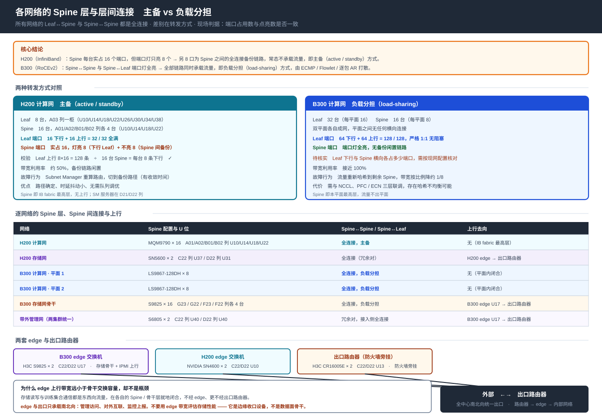
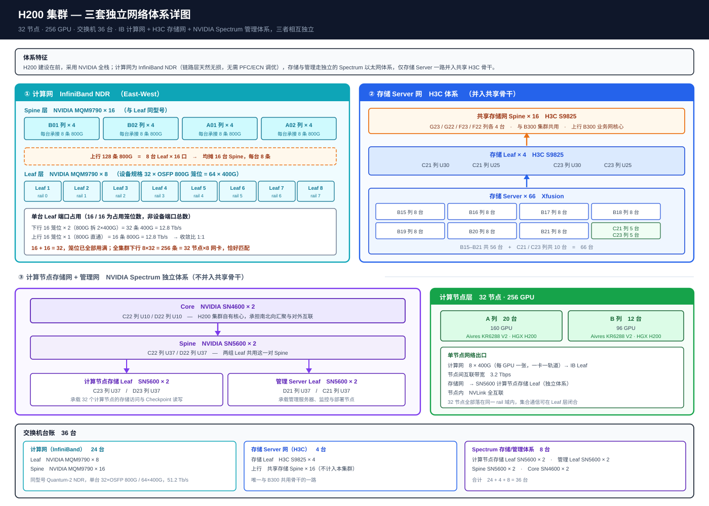
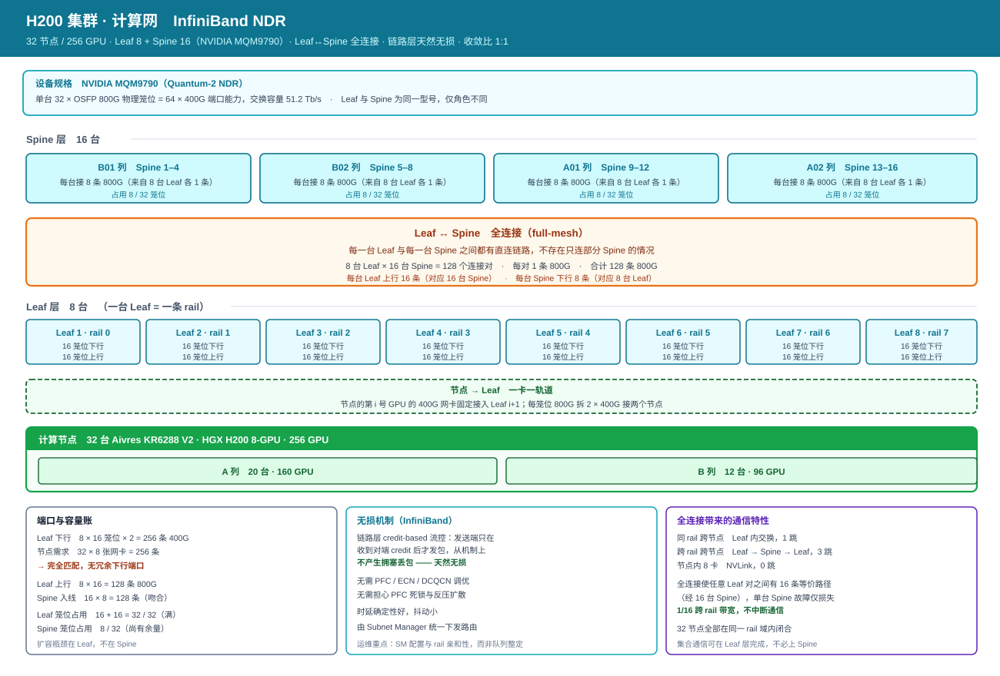
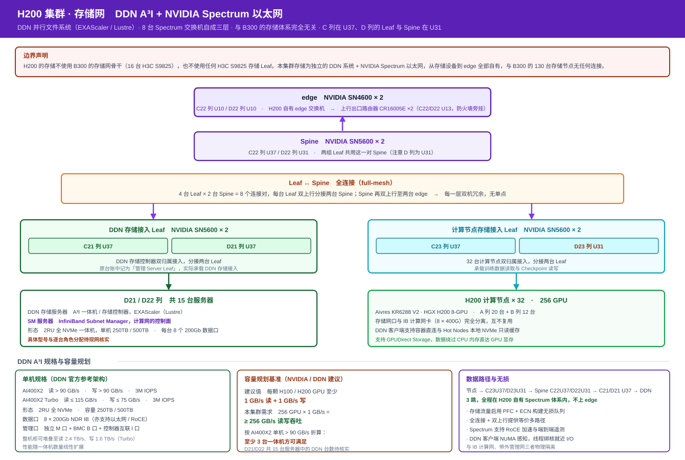
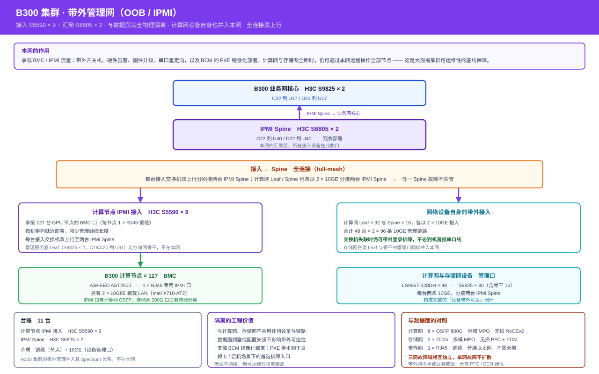
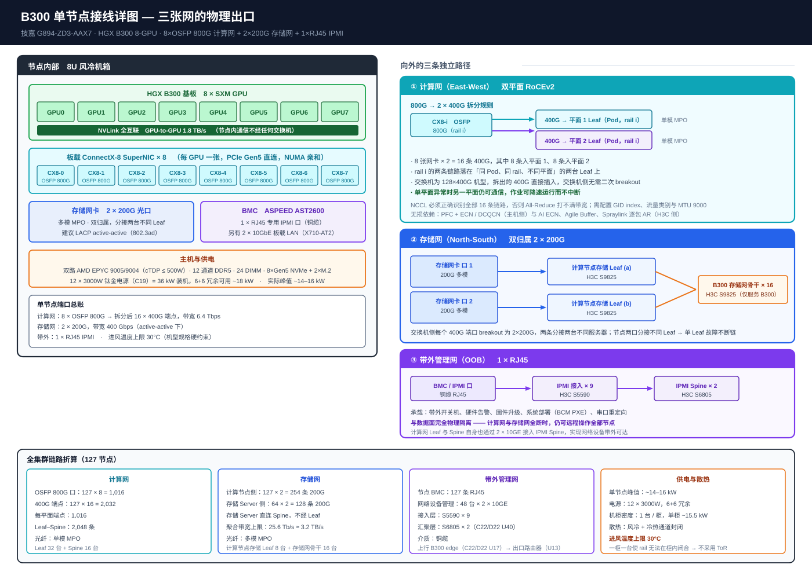
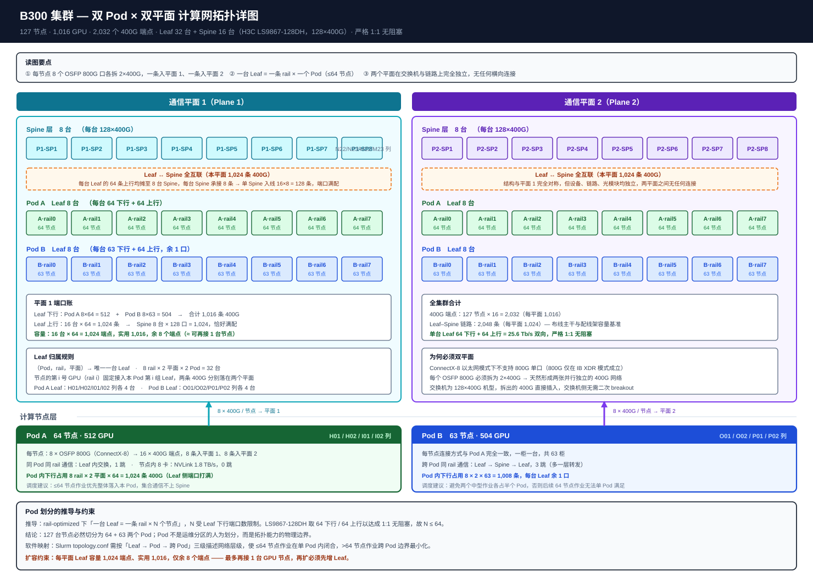
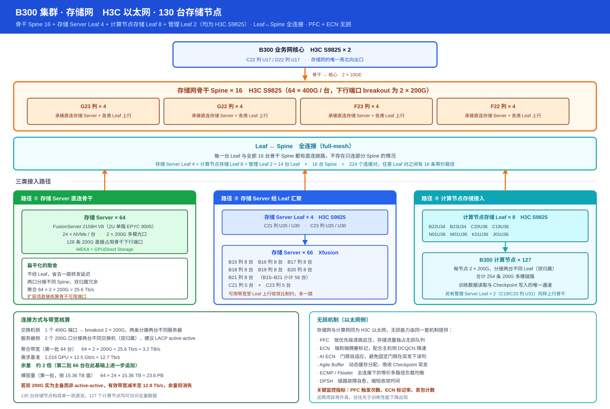
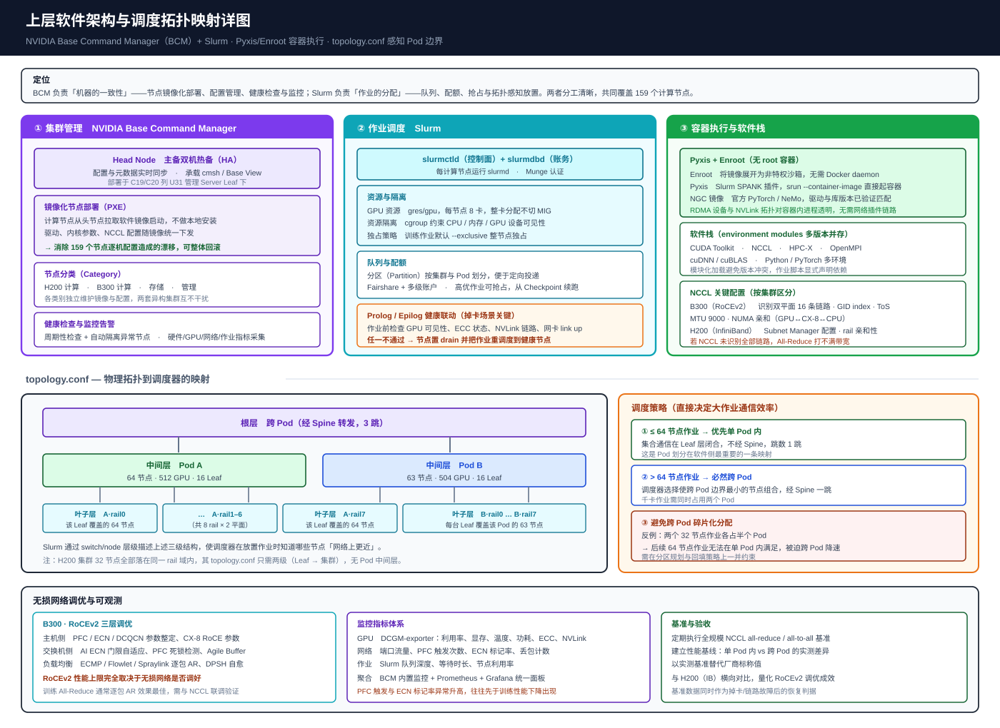

# S110 智算中心整体架构说明

> H200 与 B300 双训练集群的整体架构详细说明：分层结构、三张网设计、双 Pod 划分、端口与容量推导、130 台存储节点与存储网骨干、全连接的两种转发方式（主备 / 负载分担）、无损机制、H200 的 DDN 存储、统一的 IPMI 网络与出口路由器、BCM + Slurm 软件栈、供电散热。配套 10 张拓扑图（按每集群每网络单独绘制）。
>
> 撰写人：孟希東 · 版本：v5.0 · 日期：2026-10
>
> **文档性质**：设备均已上线，数据为实际现网配置。
>
> **文档定位**：本文是**整体架构的详细说明**。设备机柜 U 位台账以 [S110 机房双集群架构说明书](S110机房双集群架构说明书.md) 为权威来源；B300 单集群的 RoCEv2 原理推导与存储选型细节见 [HGX B300 训练集群现网架构文档](HGX_B300训练集群设计方案_1024GPU.md)。

---

## 1. 集群总览

S110 机房内并行运行两套 GPU 训练集群，面向大模型训练与推理负载。两套集群的**计算网与存储网各自完全闭合**：B300 的 130 台存储节点（WEKA）+ 16 台 S9825 存储网骨干；H200 则使用 **DDN 存储系统**，经自有的 NVIDIA Spectrum 以太网接入，与 B300 的存储无任何连接。两集群的**带外管理（IPMI）则是同一张网**，并最终与各存储网核心一同汇聚到机房出口路由器。

### 1.1 总体规模

| 指标 | 规模 |
|------|------|
| **GPU 总数** | **1,272 颗** |
| GPU 计算节点 | 159 台 |
| 存储节点 | 130 台（**全部归属 B300 集群**） |
| 网络交换机 | 123 台（H200 **33** + B300 **74** + 存储网骨干 16） |
| 出口路由器 | 2 台（H3C CR16005E，C22 列 U13 / D22 列 U13） |
| 设备总数 | 414 台 |
| IT 功率（估算） | 约 2.6 MW |
| 设施总功率（PUE 1.4，估算） | 约 3.7 MW |

### 1.2 两套集群构成

| 项 | H200 集群 | B300 集群 |
|------|-----------|-----------|
| 计算节点 | **32 台** Aivres KR6288 | **127 台** 技嘉 G894-ZD3-AAX7 |
| GPU 平台 | HGX H200 8-GPU | HGX B300 8-GPU |
| GPU 数量 | 256 颗 | 1,016 颗 |
| **Pod 划分** | 单 Pod | **双 Pod（Pod A 64 台 / Pod B 63 台）** |
| 计算网协议 | **InfiniBand NDR** | **双平面 RoCEv2** |
| 计算网设备 | NVIDIA MQM9790 × 24 | H3C LS9867-128DH × 48 |
| 单节点互联带宽 | 3.2 Tbps | 6.4 Tbps |
| 存储系统 | **DDN A³I**（EXAScaler / Lustre） | **130 台**存储节点 + WEKA |
| 节点带外管理 | 自有接入交换机 S5590 × 1（C22 列 U33） | 自有接入交换机 S5590 × 8 |
| IPMI 核心 | 共用全机房 IPMI 核心（C22/D22 U17） | 共用全机房 IPMI 核心（C22/D22 U17） |
| 专属交换机 | **33 台** | **74 台** |

### 1.3 两套体系并存的由来

两集群建设时序不同，形成了技术体系上的分叉：

- **H200 集群**采用 NVIDIA 全栈 —— InfiniBand 计算网（MQM9790）+ Spectrum 以太网管理体系（SN5600 / SN4600）
- **B300 集群**采用 H3C 全栈 —— RoCEv2 计算网（LS9867-128DH）+ H3C 以太网存储与管理体系（S9825 / S5590 / S6805）

两者在**计算与存储**两个平面上各自闭合：

- **B300** 的 130 台存储节点（WEKA）+ 16 台 S9825 存储网骨干，全部归属 B300
- **H200** 不配置存储 Server，存储为独立的 **DDN 系统 + NVIDIA Spectrum 以太网**，与 B300 的存储体系无任何连接，也不使用 H3C S9825 存储 Leaf

**带外管理平面则是统一的**：两集群各有自己的 IPMI 接入交换机（H200 一台 @C22 列 U33，B300 八台），但共用同一对**全机房 IPMI 核心**（C22/D22 U17）—— 即两集群的 IPMI 属于同一张网络（详见 §2.3 与 §3.4）。

再往上，**全机房 IPMI 核心、H200 存储网核心、B300 存储网核心三者一同上行汇聚到机房出口路由器**（C22/D22 U13，H3C CR16005E × 2）—— 这是全中心南北向流量的统一出口（详见 §2.1）。

---

## 2. 整体架构


### 2.0 拓扑图索引

本文配套 **10 张拓扑图**（带外管理图在 §3.4 与 §4.6 两处引用），除总体图外，**按「每集群 × 每网络」单独绘制**，全部内嵌在对应章节中：

| # | 图 | 范围 | 所在章节 |
|---|------|------|---------|
| 1 | [整体网络架构](images/s110-overview-arch.svg) | 全中心 | §2 |
| 2 | [H200 集群三套网络体系汇总](images/h200-three-networks.svg) | H200 汇总 | §3 |
| 3 | [**H200 · 计算网**（InfiniBand NDR）](images/h200-compute-ib.svg) | H200 计算网 | §3.2 |
| 4 | [**H200 · 存储网**（DDN A³I + Spectrum）](images/h200-storage-mgmt.svg) | H200 存储网 | §3.3 |
| 5 | [B300 单节点接线](images/b300-node-wiring.svg) | B300 节点级 | §4.1 |
| 6 | [**B300 · 计算网**（双 Pod × 双平面 RoCEv2）](images/b300-pod-compute.svg) | B300 计算网 | §4.3 |
| 7 | [**B300 · 存储网**（130 台存储节点）](images/b300-storage-network.svg) | B300 存储网 | §4.5 |
| 8 | [**全机房带外管理网**（OOB / IPMI，两集群统一）](images/b300-oob-network.svg) | H200 + B300 带外网 | §3.4、§4.6 |
| 9 | [**各网络 Spine 层与层间连接汇总**](images/s110-spine-layers.svg) | 主备 vs 负载分担 | §2.4 |
| 10 | [软件架构与调度拓扑映射](images/s110-software-stack.svg) | 软件栈 | §8 |

### 2.1 四层结构

架构自上而下分为四层：

**① 出口路由器层** —— 全中心南北向的统一出口。

| 设备 | 数量 | 位置 |
|------|------|------|
| **H3C CR16005E** | **2** | **C22 列 U13 / D22 列 U13** |

**② 核心层** —— 三类核心，全部上行汇聚至出口路由器。

| 核心 | 设备 | 数量 | 位置 | 承载 |
|------|------|------|------|------|
| **全机房 IPMI 核心** | H3C S9825 | 2 | **C22 列 U17 / D22 列 U17** | 两集群的 IPMI 网络（统一一张网） |
| **H200 存储网核心** | NVIDIA SN4600 | 2 | C22 列 U10 / D22 列 U10 | H200 自有 Spectrum 存储体系的北向出口 |
| **B300 存储网核心** | H3C S9825 | 2 | C22 列 U17 / D22 列 U17 | B300 存储网骨干的北向出口 |

> **关于 C22/D22 U17 这一对 S9825**：现网中它既是全机房 IPMI 核心，也承担 B300 存储网骨干的北向汇聚。两种角色是否由同一对物理设备承担，需按现网配置核实；本文按「同一对设备、两种角色」记述。

**三类核心的汇聚关系**：

```
全机房 IPMI 核心（C22/D22 U17）─┐
H200 存储网核心（C22/D22 U10）─┼─→ 出口路由器 H3C CR16005E × 2（C22/D22 U13）
B300 存储网核心（C22/D22 U17）─┘
```

**③ 存储网骨干层** —— 16 台 H3C S9825 组成的存储网 Spine，汇聚 B300 集群全部 130 台存储节点与 127 个计算节点的存储接入，上行 B300 存储网核心。

**④ 集群层** —— 两套集群各自保有完整的计算网与存储接入体系，在计算与存储平面上完全独立；带外管理则并入统一的 IPMI 网络。

### 2.2 三张网物理隔离

全中心采用三张物理独立的网络，互不复用链路与设备：

| 网络 | 流量类型 | 承载内容 | 协议/设备 |
|------|---------|---------|----------|
| **计算网** | East-West | GPU 间集合通信（All-Reduce / All-to-All / All-Gather） | H200：IB NDR；B300：双平面 RoCEv2 |
| **存储网** | North-South | 训练数据读取、Checkpoint 读写 | H200：DDN + Spectrum；B300：WEKA + S9825 骨干 × 16 |
| **带外管理网** | 管理面 | BMC / IPMI、带外开关机、固件升级、系统部署 | 千兆/万兆以太网，**两集群统一一张网** |

**隔离的工程价值**：

1. 计算网独占链路，训练集合通信不与大流量存储读写争抢带宽 —— 这是保障 All-Reduce 稳定性的前提
2. 存储网突发（如全集群同时写 Checkpoint）不会冲击计算网的无损队列
3. 带外管理网与数据面完全分离，数据网异常时仍可远程操作全部节点（两集群共用这一张网）
4. 三者故障域相互独立，单网故障不扩散

### 2.3 两集群的边界

两套集群在网络上各自闭合，边界清晰：

| 层次 | H200 集群 | B300 集群 |
|------|-----------|-----------|
| 核心 | NVIDIA SN4600 × 2 | H3C S9825 × 2 |
| 计算网 | IB NDR，MQM9790 × 24 | 双平面 RoCEv2，LS9867-128DH × 48 |
| 存储系统 | **DDN A³I**（EXAScaler / Lustre） | 130 台存储节点（WEKA） |
| 存储网 | 自有 Spectrum 体系（SN5600 × 6 + SN4600 × 2） | S9825 骨干 16 + Leaf 14 |
| IPMI 接入 | **自有** S5590 × 1（C22 列 U33） | S5590 × 8 |
| IPMI 核心 | **共用**全机房 IPMI 核心（C22/D22 U17） | **共用**全机房 IPMI 核心（C22/D22 U17） |
| 北向出口 | **共用**出口路由器（C22/D22 U13） | **共用**出口路由器（C22/D22 U13） |

**计算与存储平面完全独立**：B300 的存储网骨干（16 台 S9825）及其全部下游设备与 130 台存储节点均归属 B300，上行落在 B300 存储网核心（C22/D22 U17）。**H200 的存储是完全独立的 DDN 系统 + Spectrum 以太网**（见 §3.3），不接入 B300 的存储网骨干，也不使用任何 H3C S9825 存储 Leaf。

#### 跨集群的交汇：统一的 IPMI 网络与共同的出口路由器

两集群在**计算网与存储网上没有任何连接**，交汇只发生在管理与出口两处：

| 交汇处 | 内容 | 影响范围 |
|--------|------|---------|
| **全机房 IPMI 核心** | H3C S9825 × 2（C22/D22 U17）—— 两集群的 IPMI 接入交换机全部上行至此，构成**同一张带外管理网** | 该层故障 → **两套集群同时失管** |
| **出口路由器** | H3C CR16005E × 2（C22/D22 U13）—— IPMI 核心、H200 存储网核心、B300 存储网核心三者在此收口 | 该层故障 → 两集群**南北向中断**，但东西向（训练与存储）不受影响 |

**各自的接入层仍是独立的**：

| 项 | 内容 |
|------|------|
| H200 的 IPMI 接入 | **H3C S5590 × 1，位于 C22 列 U33，归属 H200 集群台账** |
| 承接 | H200 全部 **32 台节点的 BMC / IPMI 接口**（每节点 1 × RJ45 铜缆） |
| 上行 | 全机房 IPMI 核心（C22/D22 U17）→ 出口路由器（C22/D22 U13） |
| B300 的 IPMI 接入 | H3C S5590 × 8，承接 127 台 B300 节点的 BMC |

**运维含义**：C22 列 U33 这台交换机是 H200 带外管理的**单点** —— 它失联则 32 台 H200 节点全部失管；而 IPMI 核心（U17）与出口路由器（U13）的变更需标注「影响范围：双集群」。

除此之外，两集群共用的是同一个机房的空间、供电与制冷，以及同一套 BCM + Slurm 管理底座（见 §8）。

### 2.4 Spine 层与层间连接



#### 2.4.1 核心原则：全连接，但分两种转发方式

本中心所有网络的 **Leaf 与 Spine 之间均为全连接（full-mesh）**，且 **Spine 与 Spine 之间也是全连接**。两集群的差别不在连接关系，而在**这些链路如何转发流量**：

| 集群 | 转发方式 | 现场判据（端口指示灯） | 协议背景 |
|------|---------|---------------------|---------|
| **H200**（InfiniBand NDR） | **主备（active / standby）** | Spine 每台**占用 16 个端口，但灯只亮 8 个** —— 另一半为备用链路，常态不承载流量 | IB 由 Subnet Manager 统一计算路由，可将一组链路置为备份路径 |
| **B300**（双平面 RoCEv2） | **负载分担（load-sharing）** | Spine↔Spine、Spine↔Leaf **端口灯全亮** —— 全部链路同时承载流量 | 以太网侧用 ECMP / Flowlet / 逐包 AR 在多条链路上打散 |

> **判读依据**：端口灯亮表示链路 up 且在转发；占用数与点亮数不一致，意味着存在已配置但处于备份状态的链路。这是从现网观测得出的结论，具体的主备分组与优先级需在交换机配置中核实。

**两种方式的工程取舍**：

| 维度 | 主备（H200） | 负载分担（B300） |
|------|-------------|----------------|
| 带宽利用率 | 约 50%，备份链路闲置 | 接近 100% |
| 故障切换 | 切到备份链路，切换期间有收敛时间 | 流量重新哈希到剩余链路，按比例降带宽 |
| 流量可预测性 | 高，路径确定 | 取决于哈希/喷洒策略，存在不均衡可能 |
| 调优复杂度 | 低，由 SM 统一管理 | 高，需与 NCCL、PFC/ECN 联调 |
| 适用场景 | 时延确定性优先 | 吞吐优先的大规模集合通信 |

#### 2.4.2 逐网络的 Spine 层、Spine 间连接与上行

| 网络 | Spine 配置 | Spine↔Spine | Spine↔Leaf | 上行去向 |
|------|-----------|-------------|-----------|---------|
| H200 计算网 | MQM9790 × 16（A01/A02/B01/B02 列 U10/U14/U18/U22） | **全连接，主备** | **全连接，主备** | 无（IB fabric 最高层） |
| H200 存储网 | SN5600 × 2（C22 列 U37 / D22 列 **U31**） | 全连接（冗余对） | 全连接 | H200 存储网核心 SN4600 × 2 → 出口路由器 |
| B300 计算网 · 平面 1 | LS9867-128DH × 8 | **全连接，负载分担** | **全连接，负载分担** | 无（平面内闭合） |
| B300 计算网 · 平面 2 | LS9867-128DH × 8 | **全连接，负载分担** | **全连接，负载分担** | 无（平面内闭合） |
| B300 存储网骨干 | S9825 × 16（G23/G22/F23/F22） | 全连接 | 全连接 | B300 存储网核心（C22/D22 U17）→ 出口路由器 |
| 带外管理网（两集群统一） | S6805 × 2（C22/D22 U40） | 冗余对 | 全连接 | 全机房 IPMI 核心（C22/D22 U17）→ 出口路由器 |

**两个平面之间始终无任何连接** —— 这是 B300 双平面设计的前提，与平面内是否负载分担无关。

#### 2.4.3 H200 计算网的端口账（主备方式的直接证据）

| 项 | 数值 |
|------|------|
| Leaf | 8 台，每台 **32 个端口全满**（16 下行 + 16 上行） |
| Leaf 上行总链路 | 8 × 16 = **128 条** |
| Spine | 16 台，每台**占用 16 个端口** |
| Spine 侧校验 | 128 条 Leaf 上行 ÷ 16 台 Spine = **每台 Spine 下行 8 条** |
| Spine 端口分配 | 下行 Leaf **8 个**（灯亮）+ Spine 间互联 **8 个**（主备，常态不亮） |

> 这组数字自洽：Leaf 侧 128 条上行正好对应 Spine 侧每台 8 条下行，而 Spine 每台实占 16 口 —— 多出的 8 口正是 Spine 之间的全连接链路，处于备份状态，因此灯不亮。

#### 2.4.4 上行带宽落差的含义

存储网骨干 16 台 S9825 承载约 **25.6 Tb/s** 的存储数据流量，但上行核心只有 **2 × 10GE = 20 Gbps** —— 相差三个数量级。

**这不是设计缺陷，而是流量方向的体现**：

- 存储读写属**东西向**流量（计算节点 ↔ 存储节点），在骨干层就地闭合，**不经过核心，更不经过出口路由器**
- 核心与出口路由器只承载真正的**南北向**流量：管理访问、对外互联、监控上报
- H200 存储网同理 —— 节点与 DDN 之间的数据走 Leaf → Spine → Leaf，不上 Core

> **推论**：不要用核心或出口路由器的带宽去评估存储性能。评估存储性能应看骨干下行端口数与 Leaf 上行收敛比。

#### 2.4.5 Spine 层扩容能力对照

| 网络 | Spine 端口占用 | 扩容结论 |
|------|--------------|---------|
| H200 计算网 | 每台 16 / 32（8 下行 + 8 横向），**物理空余 16 个笼位** | Spine 侧有余量，但**瓶颈在 Leaf**（32/32 已满）—— 扩容须整台加 Leaf |
| B300 计算网（每平面） | **端口全亮，无空闲** | 需按现网端口分配核实 Leaf 下行与 Spine 横向各占多少；再扩须同时增 Leaf 与 Spine，或引入第三层 Super-Spine |
| B300 存储网骨干 | 下行被两类设备占用 | 64 台直连存储（128 条 200G）+ 14 台 Leaf 上行 —— 扩容须分别核算骨干端口与 Leaf 端口两本账 |

---

## 3. H200 集群



### 3.1 节点与分布

| 项 | 配置 |
|------|------|
| 机型 | Aivres KR6288 V2 |
| GPU 平台 | NVIDIA HGX H200 · 8× SXM |
| 节点数 | **32 台**（A 列 20 台 + B 列 12 台） |
| GPU 总数 | 256 颗 |
| 计算网卡 | 8 × 400G（每 GPU 一张，一卡一轨道） |
| 节点间互联带宽 | **3.2 Tbps** |

### 3.2 计算网：InfiniBand NDR



| 层 | 设备 | 数量 | 位置 |
|------|------|------|------|
| Leaf | NVIDIA MQM9790 | 8 | **A03 列一柜 8 台：U10、U14、U18、U22、U26、U30、U34、U38** |
| Spine | NVIDIA MQM9790（与 Leaf 同型号） | 16 | **A01 / A02 / B01 / B02 列各 4 台，每柜 U10、U14、U18、U22** |

> **物理布局特征**：8 台 Leaf 全部集中在 **A03 一个机柜**内，每台占 4U、间隔 4U 排布；16 台 Spine 分散在 A01/A02/B01/B02 四个机柜，同样是 4U 间隔。Leaf 集中于单柜意味着该柜是 H200 计算网的**单一物理故障域**（配电、散热需按此评估）。

**设备规格（MQM9790）**：Quantum-2 NDR 交换机，**32 × OSFP 800G 物理笼位 = 64 × 400G 端口能力**，交换容量 51.2 Tb/s。

**单台 Leaf 的端口占用**（**32 个端口全满**；以下 16 / 16 为实际占用笼位数）：

| 用途 | 占用笼位 | 折算速率 | 带宽 |
|------|---------|---------|------|
| 下行接计算节点网卡 | 16 个 OSFP | 每笼拆 2 × 400G = 32 条 | 12.8 Tb/s |
| 上行 Spine | 16 个 OSFP | 每笼 1 条 800G = 16 条 | 12.8 Tb/s |
| **合计** | **32 个（笼位全部用满）** | | **25.6 Tb/s 双向** |

**下行容量校验**：

```
下行能力 = 8 台 × 16 个笼位 × 2（800G 拆 2×400G）= 256 条 400G
节点需求 = 32 节点 × 8 张网卡                    = 256 条
→ 完全匹配
```

**Leaf ↔ Spine 全连接（full-mesh）**　每一台 Leaf 与每一台 Spine 之间都有直连链路，**不存在只连部分 Spine 的情况**：

| 项 | 数值 |
|------|------|
| 连接对 | 8 台 Leaf × 16 台 Spine = **128 个** |
| 每对链路数 | 1 条 800G |
| 链路总数 | **128 条 800G** |
| 每台 Leaf 上行 | 16 条（对应 16 台 Spine，一台一条） |
| 每台 Spine 下行 | 8 条（对应 8 台 Leaf，一台一条，**灯亮**） |
| 每台 Spine 横向 | 8 个端口用于 **Spine 之间的全连接**（主备，常态**灯不亮**） |
| Spine 端口占用 | **16 / 32** |

**Spine 之间同样是全连接，但采用主备方式** —— Spine 每台实占 16 口而只亮 8 个灯，多出的 8 口即横向备份链路（推导见 §2.4.3）。Spine 即 IB fabric 的最高层，**无上行**。

**全连接 + 主备的含义**：任意两台 Leaf 之间经 16 台 Spine 有 16 条路径，但主备方式下**同一时刻只有一组路径承载流量**，另一组待命。单台 Spine 故障时由 Subnet Manager 重算路由并切到备份路径 —— 带宽不按比例平滑下降，而是经一次收敛后恢复；换来的是路径确定、时延抖动小。

**无阻塞性**：下行 12.8 Tb/s 与上行 12.8 Tb/s 对等，收敛比 1:1。

**无损机制**：InfiniBand 在**链路层**通过 credit-based 流控实现无损 —— 发送端只在收到对端 credit 后才发包，从机制上不产生拥塞丢包：

| 对比项 | InfiniBand（H200） | RoCEv2（B300） |
|--------|-------------------|----------------|
| 无损实现层 | 链路层 credit 流控 | PFC + ECN（需配置） |
| 是否需调优 | 不需 | 需三层联调（主机/交换机/NCCL） |
| 死锁风险 | 无 | 存在 PFC 死锁可能，需检测 |
| 时延确定性 | 高，抖动小 | 取决于队列整定 |

> **扩容含义**：16 + 16 已把 MQM9790 的 32 个 OSFP 笼位全部用满，单台 Leaf 既无空余下行笼位、也无空余上行笼位。新增 H200 节点必须整台扩 Leaf，无法在现有 Leaf 上插口 —— 而 A03 机柜已装 8 台、每台 4U，扩 Leaf 还需评估该柜的 U 位与配电余量。Spine 侧每台尚有 16 个空笼位，不是瓶颈。

### 3.3 存储网：DDN A³I + NVIDIA Spectrum



**边界声明**：H200 的存储**不使用** B300 的存储网骨干（16 台 H3C S9825），**也不使用任何 H3C S9825 存储 Leaf**。本集群存储为独立的 **DDN 存储系统 + NVIDIA Spectrum 以太网**，从存储设备到 Core 全部自有，与 B300 的 130 台存储节点无任何连接。

#### 3.3.1 网络分层

| 层 | 设备 | 数量 | 位置 | 承载 |
|------|------|------|------|------|
| **DDN 存储接入 Leaf** | NVIDIA SN5600 | 2 | **C21 列 U37、D21 列 U37** | DDN 存储控制器双归属接入 |
| 计算节点存储接入 Leaf | NVIDIA SN5600 | 2 | C23 列 U37、**D23 列 U31** | 32 台计算节点双归属接入 |
| Spine | NVIDIA SN5600 | 2 | C22 列 U37、**D22 列 U31** | 两组 Leaf 共用 |
| Core | NVIDIA SN4600 | 2 | C22 列 U10、D22 列 U10 | 南北向出口，上行机房出口路由器 |

> **U 位不对称**：C 列一侧的存储网设备都在 U37，D 列一侧的计算节点存储 Leaf 与 Spine 在 **U31**（非 U37）。巡检与布线表需按此区分，不可按 C 列的 U 位类推 D 列。

> C21/D21 列 U37 这一对交换机在早期台账中记为「管理 Server Leaf」，实际承载的是 **DDN 存储接入**。

#### 3.3.2 数据路径与连接

```
计算节点 → C23U37 / D23U31 Leaf → Spine（C22U37 / D22U31）→ C21/D21 U37 Leaf → DDN
                      3 跳，全程在 H200 自有 Spectrum 体系内
```

**Leaf ↔ Spine 全连接**：4 台 Leaf × 2 台 Spine = 8 个连接对，每台 Leaf 双上行分接两台 Spine。

两台 Spine 之间互为冗余对；Spine 再双上行至两台 Core（2 × 2 = 4 条），Core 再上行机房出口路由器（C22/D22 U13）。**每一层双机冗余，任一台设备故障不中断任何下游**。

**Core 的作用边界**：存储读写是东西向，在 Spine 层就地闭合，**不经过 Core，更不经过出口路由器**；Core 只承载南北向的管理访问与对外互联。

**无损保障**：存储流量启用 PFC + ECN 构建无损队列；全连接 + 双上行提供等价多路径；Spectrum 支持 RoCE 加速与端到端遥测。

#### 3.3.3 DDN 存储系统

| 项 | 内容 |
|------|------|
| 产品线 | **DDN A³I**（Accelerated, Any-Scale AI） |
| 文件系统 | **DDN EXAScaler**，基于 Lustre 的并行文件系统 |
| 形态 | 2RU 全 NVMe 一体机 |
| 单机容量 | 250 TB / 500 TB 可选（亦有混合 HDD 配置） |
| 数据口 | 每台 **8 个 200Gb NDR 口**，支持 InfiniBand / 以太网 / RoCE |
| 管理口 | 独立管理口（M）+ BMC 口（B）+ 控制器互联口（I） |
| 型号与台数 | 待现网核实后填入 |

**单机性能（DDN 官方参考架构）**：

| 型号 | 读 | 写 | IOPS |
|------|------|------|------|
| AI400X2 | > 90 GB/s | > 90 GB/s | 3M |
| AI400X2 Turbo | ≤ 115 GB/s | ≤ 75 GB/s | 3M |

整机柜堆叠可达读 2.4 TB/s、写 1.6 TB/s（Turbo）；性能随一体机数量**线性扩展**。

#### 3.3.4 容量规划基准

NVIDIA / DDN 对 H100 / H200 集群的建议值是**每颗 GPU 至少 1 GB/s 读 + 1 GB/s 写**：

```
本集群需求 = 256 GPU × 1 GB/s = ≥ 256 GB/s 读写吞吐
按 AI400X2 单机 > 90 GB/s 折算 → 至少 3 台一体机方可满足
```

实际台数需按现网核实后填入。

#### 3.3.5 客户端侧能力

| 能力 | 说明 |
|------|------|
| **GPUDirect Storage** | 数据从 NVMe 经网卡直达 GPU 显存，绕过 CPU 内存中转拷贝 |
| **Hot Nodes** | 利用计算节点本地 NVMe 做只读缓存，训练迭代中自动缓存热数据 |
| **容器客户端** | 容器内进程与 DDN 并行文件系统直连，无需经宿主机转发 |
| **NUMA 感知** | 线程绑核，使 I/O 活动就近于对应的 CPU / 网卡 |

### 3.4 带外管理（IPMI）



H200 集群**有自己的 IPMI 接入交换机**，但与 B300 **共用同一张带外管理网**：

| 项 | 内容 |
|------|------|
| 设备 | **H3C S5590 × 1，归属 H200 集群台账** |
| **位置** | **C22 列 U33** |
| 承接 | H200 全部 **32 台节点的 BMC / IPMI 接口**（每节点 1 × RJ45 铜缆） |
| 上行 | **全机房 IPMI 核心（C22 列 U17 / D22 列 U17，H3C S9825 × 2）** |
| 再上行 | 机房出口路由器（C22/D22 U13，H3C CR16005E × 2） |
| 台账归属 | **计入 H200 的 33 台**（本表 §3.5 已含） |

**两集群的 IPMI 是同一张网络**：H200 的这台接入交换机与 B300 的 8 台接入交换机，全部上行到同一对全机房 IPMI 核心。运维上的含义：

| 层次 | 故障影响 |
|------|---------|
| **C22 列 U33**（H200 IPMI 接入） | H200 的 **32 台节点全部失管**；是 H200 带外管理的单点，备件优先级按此评定 |
| **C22/D22 U17**（全机房 IPMI 核心） | **两套集群同时失管** —— 变更与告警需标注「影响范围：双集群」 |
| **C22/D22 U13**（出口路由器） | 带外网的南北向中断（远程接入不可达），机房内本地访问仍可用 |

### 3.5 交换机台账

| 用途 | 型号 | 数量 |
|------|------|------|
| 计算网 Leaf | NVIDIA MQM9790 | 8 |
| 计算网 Spine | NVIDIA MQM9790 | 16 |
| 计算节点存储 Leaf | NVIDIA SN5600 | 2 |
| **DDN 存储接入 Leaf** | NVIDIA SN5600 | 2 |
| 存储网 Spine | NVIDIA SN5600 | 2 |
| 存储网核心 | NVIDIA SN4600 | 2 |
| **IPMI 接入** | **H3C S5590** | **1** |
| **小计** | | **33 台** |

> **台账说明**
> ① 除 1 台 H3C S5590（IPMI 接入）外，其余 32 台均为 NVIDIA 设备。
> ② 原先计入 H200 的 4 台 S9825 存储 Leaf（C21/C23 列）实际服务 B300 的存储 Server，已改归 B300 台账（见 §4.7）。
> ③ **承载 H200 节点 BMC 的 S5590（C22 列 U33）归属 H200**，已计入本表；B300 的 IPMI 接入相应为 8 台（见 §4.7）。
> ④ 全机房 IPMI 核心（C22/D22 U17）与出口路由器（C22/D22 U13）为两集群共用，不计入任一集群的专属台账。

---

## 4. B300 集群

### 4.1 节点规格

| 指标 | 规格 |
|------|------|
| 机型 | 技嘉 G894-ZD3-AAX7（8U 风冷） |
| GPU | NVIDIA HGX B300 · 8× SXM |
| CPU | 双路 AMD EPYC 9005/9004（cTDP 最高 500W） |
| 内存 | 12 通道 DDR5 RDIMM · 24 DIMM 槽 |
| NVLink | 节点内 GPU-to-GPU **1.8 TB/s** |
| 计算网卡 | **8 × OSFP 800 Gb/s** 板载 ConnectX-8 SuperNIC |
| 存储网卡 | 2 × 200G 光口 |
| 板载 LAN | 2 × 10 GbE（Intel X710-AT2） |
| 本地存储 | 8 × 2.5" Gen5 NVMe + 2 × M.2 |
| 电源 | 12 × 3000W 钛金冗余（C19） |
| BMC | ASPEED AST2600 |
| 进风温度上限 | **30°C** |

**节点数**：127 台，一柜一台，共 **1,016 颗** B300 SXM。



### 4.2 双 Pod 划分

B300 集群在架构上划分为**两个 Pod**，每个 Pod 是一个 rail 完整闭合的通信域：

| Pod | 节点 | GPU | 计算网 Leaf | 机柜列 |
|------|------|------|------------|-------|
| **Pod A** | 64 台 | 512 | 16（8 rail × 2 平面） | H01 / H02 / I01 / I02 |
| **Pod B** | 63 台 | 504 | 16（8 rail × 2 平面） | O01 / O02 / P01 / P02 |
| **合计** | **127 台** | **1,016** | **32** | 8 列各 4 台 |

**Pod 划分的技术依据**：

在 rail-optimized 拓扑下，**一台 Leaf 服务「一条 rail × 64 个节点」**。LS9867-128DH 的 64 口下行能力决定了一个 rail 域的节点上限就是 64 台 —— 这正是 Pod 的物理边界。127 台节点因此必然切分为 64 + 63 两个 Pod。

**Pod 的通信含义**：

| 通信范围 | 路径 | 跳数 |
|---------|------|------|
| 节点内 8 卡 | NVLink | 0 跳（交换机） |
| 同 Pod 同 rail | Leaf 内交换 | 1 跳 |
| 跨 Pod 同 rail | Leaf → Spine → Leaf | 3 跳 |

**调度意义**：中小规模作业（≤ 64 节点）应优先落在**同一 Pod 内**，使跨节点集合通信在 Leaf 层完成，不上 Spine。超过 64 节点的作业必然跨 Pod，需经 Spine 一层转发。这一约束需在上层调度器的拓扑配置中显式表达（见 §8.4）。

### 4.3 计算网：双平面 RoCEv2



**为什么是双平面** —— ConnectX-8 SuperNIC 不支持 800 Gbps 以太网端口（800G 仅在 InfiniBand XDR 模式下成立）。以太网模式下每个 OSFP 800G 口拆分为 **2 × 400 Gbps**，两条 400G 分别接入两个相互独立的通信平面。后端网因此可视为**两张并行独立的 400G 网络**。

| 项 | 数值 |
|------|------|
| 单节点 OSFP 口 | 8 |
| 单节点 400G 端点 | **16**（平面 1 八条 + 平面 2 八条） |
| 全集群 400G 端点 | 127 × 16 = **2,032** |
| 单平面端点 | **1,016** |
| 单节点互联带宽 | **6.4 Tbps** |

**交换机规模推导**（以 LS9867-128DH，128 × 400G 为单位）：

| 层 | 推导 | 单平面 | 合计 |
|------|------|-------|------|
| Leaf | 1,016 端点 ÷ 64 口下行 = 15.9 → 16 | 16 | **32 台** |
| Spine | 16 × 64 = 1,024 条上行 ÷ 128 口 = 8 | 8 | **16 台** |
| | | | **48 台** |

**单台 Leaf 配置**：64 × 400G 下行 + 64 × 400G 上行 = 25.6 Tb/s 双向，**严格 1:1 无阻塞**。

**Leaf ↔ Spine 全连接（full-mesh，按平面独立成网）**　在**每一个平面内**，每一台 Leaf 与每一台 Spine 都有直连链路：

| 项 | 单平面 | 双平面合计 |
|------|-------|---------|
| Leaf / Spine 数量 | 16 / 8 | 32 / 16 |
| 连接对 | 16 × 8 = **128 个** | 256 个 |
| 每对链路数 | **8 条 400G** | — |
| 链路总数 | 128 × 8 = **1,024 条** | **2,048 条** |
| 每台 Leaf 上行 | 64 条（8 台 Spine × 8 条） | — |
| 每台 Spine 入线 | 128 条（16 台 Leaf × 8 条） | — |
| Spine 端口占用 | **端口灯全亮，无空闲** | — |

两个平面各自全连接，**但平面之间无任何横向连接** —— 这是双平面设计的前提，与平面内的转发方式无关。2,048 条是布线主干与配线架容量规划的基准数字。

**Spine 之间也是全连接，且与 Spine↔Leaf 一样采用负载分担** —— 现网 Spine 的 Spine↔Spine 与 Spine↔Leaf **端口灯全亮**，即全部链路同时承载流量，没有备份闲置链路（与 H200 的主备方式形成对照，见 §2.4.1）。

> **端口账的待核实项**：Spine 为 128 × 400G。若按「16 台 Leaf × 8 条」计，Leaf 下行已占满 128 口，则 Spine 横向链路必然占用其中一部分 —— 实际的「Leaf 下行 : Spine 横向」端口分配需按现网配置核实。本文保留 16 × 8 = 128 的推导作为上限，并标注此项待核实。

**负载分担的价值**：同平面内任意两台 Leaf 之间有多条等价路径（按 8 台 Spine 计最多 64 条），ECMP / Flowlet / 逐包 AR 可在其上打散流量；单台 Spine 故障时流量重新哈希到剩余 Spine，带宽按比例下降约 1/8，**无需等待主备切换收敛**。

**双平面的可靠性价值**：两个平面在交换机、链路、光模块上完全独立，单一平面异常时另一平面仍可维持通信，训练作业可降速运行而不必中断。

**无需二次 breakout**：采用 128 口 400G 机型后，网卡侧拆出的 400G 链路直接插入交换机 400G 端口，交换机侧无需再做 breakout，简化了布线结构与故障定位层次。

**RoCEv2 的工程要点**：RoCEv2 封装于 UDP/IP（端口 4791），可跨子网路由，能利用 IP 层 ECMP 做多路径负载均衡 —— 这是双平面 Leaf-Spine 拓扑的必要条件（RoCEv1 基于二层帧，不可路由）。代价是 UDP 无重传机制，性能完全取决于下层无损网络（PFC + ECN）是否调好。

**无损网络的三层构建**（全路径统一启用：网卡 — Leaf — Spine）：

| 层次 | 机制 | 作用 |
|------|------|------|
| 主机侧 | PFC / ECN / DCQCN、ConnectX-8 RoCE 参数、MTU 9000 | 发送速率响应拥塞标记 |
| 交换机侧（基础） | PFC 逐跳反压、ECN 标记、PFC 死锁检测 | 保证不丢包 |
| 交换机侧（增强） | AI ECN 门限自适应、Agile Buffer、IPCC、iNOF | 应对突发，减少误判与排队 |
| 负载均衡 | ECMP、Flowlet、FGLB、**Spraylink 逐包 AR** | 在全连接的 64 条等价路径上打散 |
| 故障收敛 | DPSH 链路自愈 | 缩短链路故障后的收敛时间 |

> **与 InfiniBand 的根本差异**：IB 在链路层天然无损；RoCEv2 的无损是**配置出来的**。一旦丢包，传统 go-back-N 重传会造成性能断崖式下降，因此 PFC 触发次数与 ECN 标记率是本集群最关键的两项网络指标。

### 4.4 Rail 映射

rail-optimized 的核心规则：**节点的第 i 号 GPU 固定接入第 i 组交换机**。

| 要素 | 映射 |
|------|------|
| GPU 编号 | 0–7（对应 8 条 rail） |
| 平面编号 | 1–2（每张 800G 卡拆出的两条 400G） |
| Leaf 归属 | （Pod，rail，平面）→ 唯一一台 Leaf |
| Leaf 服务范围 | 1 条 rail × 该 Pod 内全部节点（≤ 64 台） |

因此 8 rail × 2 平面 × 2 Pod = 32 台 Leaf，与台账一致。

**效果**：同号 GPU 之间的跨节点通信在各自独立的轨道平面内完成，不同轨道互不争抢带宽，也无需经过 Spine。对于千卡规模的同步训练，这是保障扩展效率的关键结构。

**端口余量**：每平面 Leaf 容量 1,024 端点，实用 1,016，**余 8 个端点** —— 即最多再接 1 台 GPU 节点。

### 4.5 存储网



**全中心 130 台存储节点全部归属本集群**，分两批、两种接入方式。

**连接方式**：交换机侧每个 400G 端口 breakout 为 2 × 200G，两条分别接**两台不同的服务器**；每台服务器的 2 个 200G 口**分接不同交换机**，形成双归属。

**三类接入路径**：

| # | 来源 | 路径 |
|---|------|------|
| ① | **存储 Server × 64**（FusionServer 2158H V8） | → **直接接入存储网骨干 × 16**（不经 Leaf） |
| ② | **存储 Server × 66**（Xfusion） | → 存储 Server Leaf × 4（H3C S9825）→ 存储网骨干 × 16 |
| ③ | **计算节点 × 127**（每节点 2 × 200G） | → 计算节点存储 Leaf × 8（H3C S9825）→ 存储网骨干 × 16 |

**存储节点分布**：

| 批次 | 台数 | 接入方式 | 机柜分布 |
|------|------|---------|---------|
| FusionServer 2158H V8 | 64 | 直连骨干 | — |
| Xfusion | 66 | 经存储 Server Leaf × 4 | B15–B21 每列 8 台（56）+ C21 列 5 台 + C23 列 5 台 |
| **合计** | **130** | | |

**存储 Server Leaf × 4（H3C S9825）位置**：C21 列 U25 / U30，C23 列 U25 / U30。

**计算节点存储 Leaf × 8（H3C S9825）位置**：B22U34、B23U34、C20U36、C19U36、N01U36、M01U36、K01U36、J01U36。

> **两种接入方式并存的含义**：64 台直连骨干是扁平化设计，省去一跳转发延迟，代价是直接占用骨干下行端口；66 台经 Leaf 汇聚则节省骨干端口，代价是多一跳。扩容评估需分别核算骨干端口与 Leaf 端口两本账。

### 4.6 带外管理（IPMI）


本节描述的 IPMI 网络**由两集群共用**：B300 的 8 台接入交换机与 H200 的 1 台接入交换机（C22 列 U33，归属 H200 台账）全部上行到同一对全机房 IPMI 核心。

| 层 | 设备 | 数量 | 位置 | 归属 |
|------|------|------|------|------|
| IPMI 接入（B300 节点） | H3C S5590 | **8** | 位置未逐台记录 | B300 |
| IPMI 接入（H200 节点） | H3C S5590 | 1 | **C22 列 U33** | **H200**（见 §3.4） |
| IPMI Spine | H3C S6805 | 2 | C22 列 U40、D22 列 U40 | B300 |
| **全机房 IPMI 核心** | **H3C S9825** | **2** | **C22 列 U17、D22 列 U17** | **两集群共用** |
| 管理 Server Leaf | H3C S9825 | 2 | C19 列 U31、C20 列 U31 | B300 |

**上行路径**：

```
节点 BMC → IPMI 接入（S5590）→ IPMI Spine（S6805 ×2，C22/D22 U40）
        → 全机房 IPMI 核心（S9825 ×2，C22/D22 U17）
        → 出口路由器（CR16005E ×2，C22/D22 U13）
```

**覆盖范围**：9 台接入交换机中，**8 台承接 B300 的 127 台节点，1 台承接 H200 的 32 台节点** —— 两集群的带外管理因此是**同一张网**（见 §2.3、§3.4）。

**计算网设备自身的管理接入**：计算网 Leaf × 32 与 Spine × 16 均通过 2 × 10GE 分接两台 IPMI Spine，合计 48 台 × 2 = **96 条 10GE 管理链路**；存储网各类 Leaf 与骨干的管理口同样并入本网。交换机失联时仍可带外登录排障。

**接入 ↔ Spine 全连接**：每台接入交换机与每台设备管理口均双上行分别接两台 IPMI Spine，**任一 Spine 故障不失管**。两台 IPMI Spine 互为冗余对。

**无损要求**：本网不承载业务数据，为普通以太网，无需 PFC / ECN 调优。

### 4.7 交换机台账

| 用途 | 型号 | 数量 |
|------|------|------|
| 计算网 Leaf | H3C LS9867-128DH | 32 |
| 计算网 Spine | H3C LS9867-128DH | 16 |
| **存储 Server Leaf** | **H3C S9825** | **4** |
| 计算节点存储 Leaf | H3C S9825 | 8 |
| 管理 Server Leaf | H3C S9825 | 2 |
| 计算节点 IPMI | H3C S5590 | **8** |
| IPMI Spine | H3C S6805 | 2 |
| 存储网核心 / 全机房 IPMI 核心 | H3C S9825 | 2 |
| **小计** | | **74 台** |

> **归属调整**：承接 H200 节点 BMC 的 S5590（C22 列 U33）已改归 H200 台账，故本集群 IPMI 接入由 9 台改为 **8 台**，小计由 75 台改为 **74 台**。C22/D22 U17 的 S9825 虽为两集群共用的 IPMI 核心，仍按原台账计入本集群。

另有**存储网骨干 S9825 × 16**（见 §5）作为骨干层单列，以及**出口路由器 H3C CR16005E × 2**（C22/D22 U13，见 §2.1）不计入任一集群。

---

## 5. 存储网骨干

### 5.1 构成

| 项 | 内容 |
|------|------|
| 设备 | **H3C S9825 × 16** |
| 分布 | G23 / G22 / F23 / F22 列各 4 台 |
| 归属 | **B300 集群**（全部下游设备与节点均属 B300） |
| 单台端口 | 64 × 400G，下行端口 breakout 为 2 × 200G |

### 5.2 承接的下游

| 来源 | 接入内容 | 链路 |
|------|---------|------|
| 存储 Server（直连） | 64 台 FusionServer 2158H V8 | 128 条 200G |
| 存储 Server Leaf | 4 台 S9825（汇聚 66 台 Xfusion） | 按 Leaf 上行数 |
| 计算节点存储 Leaf | 8 台 S9825（汇聚 127 个计算节点） | 按 Leaf 上行数 |
| 管理 Server Leaf | 2 台 S9825 | 按 Leaf 上行数 |

### 5.3 Leaf ↔ Spine 全连接

每一台 Leaf（存储 Server Leaf 4 + 计算节点存储 Leaf 8 + 管理 Server Leaf 2）都与**全部 16 台骨干 Spine** 有直连链路：

| 项 | 数值 |
|------|------|
| Leaf 总数 | 4 + 8 + 2 = **14 台** |
| Spine 总数 | **16 台** |
| 连接对 | 14 × 16 = **224 个** |
| 等价路径 | 任意 Leaf 对之间 **16 条**（经 16 台 Spine） |

**16 台骨干 Spine 之间同样全连接**，并与 Leaf 侧一致采用负载分担（见 §2.4）。单台骨干 Spine 故障仅损失 1/16 的存储网带宽，不中断任何访问；直连骨干的 64 台存储 Server 两口分接不同 Spine，同样不失联。

**无损**：全路径（存储网卡 — Leaf — Spine）统一启用 PFC + ECN，配合 AI ECN 与 Agile Buffer 吸收 Checkpoint 突发；全连接为 ECMP / Flowlet 提供路径基础。

### 5.4 上行

通过 2 × 10GE 接入 **B300 存储网核心**（C22 列 U17 / D22 列 U17，H3C S9825 —— 同一对设备亦为全机房 IPMI 核心），再由核心上行**机房出口路由器**（C22/D22 U13，H3C CR16005E × 2）。

> **注意带宽落差**：骨干承载约 25.6 Tb/s 存储数据，但上行核心仅 2 × 10GE = 20 Gbps。这是因为**存储读写属东西向流量，在骨干层就地闭合，不经核心**；核心只承载管理访问、对外互联与监控上报。不要用核心或出口路由器的带宽去评估存储性能（详见 §2.4.4）。

### 5.5 统一骨干的价值

16 台骨干把 130 台存储节点与 127 个计算节点汇聚到同一层：

- 130 台存储节点构成单一资源池，不按批次或接入方式切分容量
- 任一计算节点可访问全部存储节点，训练数据集无需分区存放
- 四列分布部署，横向扩展能力充足
- 存储节点与计算节点均采用双上行接入，链路级冗余

---

## 6. 光纤与布线

### 6.1 光纤类型

| 网络 | 类型 | 原因 |
|------|------|------|
| 计算网 | **单模 MPO** | Leaf 集中部署于网络区，与分散的 127 个机柜距离较远 |
| 存储网（B300） | **多模 MPO** | 成本优化，距离在可控范围内 |
| 带外管理网 | 铜缆 | 低速率、短距离 |

### 6.2 链路数量（B300 集群）

| 链路 | 类型 | 数量 |
|------|------|------|
| 服务器 → 计算 Leaf | 800G → 2 × 400G 分支（单模 MPO） | 1,016 |
| 计算 Leaf → Spine | 400G（单模 MPO） | 2,048 |
| 存储网下行 | 400G → 2 × 200G 分支（多模 MPO） | 按实际端口数 |

### 6.3 为什么不采用 ToR

两个层面的原因：

1. **机房约束** —— 每柜仅能安装 1 台 GPU 服务器，柜内无法形成足够的接入密度
2. **更根本的是 rail-optimized 架构本身** —— 一台 Leaf 要收拢 64 个不同机柜的同号 GPU，rail 在机柜内无法闭合

因此 Leaf 集中部署于网络区（EoR / MoR），长距离光缆不可避免。这也是计算网选用单模光纤的直接原因。

---

## 7. 存储系统

全中心 **130 台存储节点全部归属 B300 集群**，分两批。

### 7.1 配置

| 批次 | 台数 | 机型 | 盘位 | 网卡 | 接入 |
|------|------|------|------|------|------|
| 第一批 | **64** | FusionServer 2158H V8（2U 单路 EPYC 9005） | 24 × NVMe | 2 × 200G 多模 | 直连存储网骨干 |
| 第二批 | **66** | Xfusion | — | 2 × 200G 多模 | 经存储 Server Leaf × 4 |
| **合计** | **130** | | | | |

文件系统：**WEKA**（启用 GPUDirect Storage）。

### 7.2 带宽与容量核算

以配置已全量明确的第一批 64 台为基准：

| 指标 | 数值 |
|------|------|
| 聚合带宽上限 | 64 × 2 × 200G = **25.6 Tb/s ≈ 3.2 TB/s** |
| NVIDIA 参考需求（12.5 Gb/s × GPU） | 1,016 × 12.5 = **12.7 Tb/s** |
| **余量** | **约 2 倍** |
| 裸容量（按 15.36 TB 盘） | 64 × 24 × 15.36 TB ≈ **23.6 PB** |

**第二批 66 台在此基础上进一步追加容量与带宽**：其 2 × 200G 双归属接入提供额外 132 条 200G 的接入能力（折算 26.4 Tb/s 端口容量），实际可用带宽还受存储 Server Leaf × 4 的上行收敛比制约 —— 这是与第一批直连骨干最大的差别。

约 2 倍的带宽余量用于应对 Checkpoint 集中写入等突发场景 —— 千卡作业的 Checkpoint 写入是典型的全集群同时发起的大流量事件。

### 7.3 两种接入方式的性能差异

| 维度 | 直连骨干（64 台） | 经 Leaf（66 台） |
|------|----------------|---------------|
| 转发跳数 | 存储 → 骨干 → 计算 Leaf（3 跳） | 存储 → Leaf → 骨干 → 计算 Leaf（4 跳） |
| 带宽约束 | 骨干下行端口 | 骨干端口 + Leaf 上行收敛比 |
| 扩容核算 | 直接看骨干可用端口 | 先看 Leaf 下行，再看骨干 |
| 适用场景 | 延迟敏感的热数据 | 容量型、带宽要求稍低的数据 |

### 7.4 GPUDirect Storage

GPUDirect Storage 使数据从 NVMe 经网卡直达 GPU 显存，绕过 CPU 内存的中转拷贝：

- 消除 CPU 内存带宽成为数据加载瓶颈的可能
- 降低 CPU 占用，释放算力给数据预处理
- 对深度学习以读为主、小块随机 I/O 的访问模式尤为有效

---

## 8. 上层软件架构



集群采用 **NVIDIA Base Command Manager（BCM）** 作为集群管理与调度底座，构建面向 HPC/AI 的作业式训练平台。

### 8.1 整体分层

| 层次 | 组件 | 作用 |
|------|------|------|
| 集群管理 | **NVIDIA Base Command Manager** | 节点生命周期、镜像化部署、配置管理、监控告警 |
| 作业调度 | **Slurm** | 作业队列、资源分配、公平共享、抢占 |
| 容器运行时 | **Pyxis + Enroot** | 无 root 容器执行，直接运行 NGC 镜像 |
| 软件栈 | CUDA / NCCL / HPC-X / OpenMPI | 通过 environment modules 多版本并存 |
| 监控 | BCM 内置监控 + DCGM + Prometheus + Grafana | 节点、GPU、网络全链路指标 |

### 8.2 BCM 集群管理

| 能力 | 说明 |
|------|------|
| **Head Node HA** | 主备头节点双机热备，配置与元数据实时同步 |
| **镜像化节点部署** | 计算节点通过 PXE 从头节点拉取软件镜像启动，配置完全一致、可整体回滚 |
| **节点分类（Category）** | 按角色划分节点类别（H200 计算、B300 计算、存储、管理），各类别独立维护镜像与配置 |
| **统一管理界面** | cmsh 命令行 + Base View 图形界面，覆盖全部节点与设备 |
| **健康检查** | 内置周期性健康检查框架，可自定义检查项并自动隔离异常节点 |
| **监控与告警** | 采集节点硬件、GPU、网络、作业指标，支持阈值告警与历史趋势 |

镜像化部署是大规模集群一致性的基础 —— 159 个计算节点的驱动版本、内核参数、NCCL 配置通过统一镜像下发，消除了逐机配置带来的漂移。

### 8.3 Slurm 作业调度

| 配置项 | 本集群设定 |
|--------|----------|
| GPU 资源 | `gres/gpu`，每节点 8 卡，整卡分配不切分 |
| 资源隔离 | cgroup 约束 CPU / 内存 / GPU 设备可见性 |
| 分区（Partition） | 按集群与 Pod 划分，便于作业定向投递 |
| 独占策略 | 训练作业默认整节点独占（`--exclusive`），避免干扰 |
| 公平共享 | Fairshare + 多级账户，按团队分配资源权重 |
| 抢占 | 高优先级作业可抢占低优先级，被抢占作业从 Checkpoint 续跑 |
| Prolog / Epilog | 作业前后执行 GPU 健康检查与环境清理，异常节点自动置 drain |

**节点健康联动**：Prolog 阶段检查 GPU 可见性、ECC 状态、NVLink 链路、网卡 link up；任一不通过即标记节点 drain 并将作业重调度到健康节点。这是掉卡场景下避免作业反复失败的关键机制。

### 8.4 拓扑感知调度

Slurm 通过 `topology.conf` 描述网络层级，使调度器理解 Pod 与 Leaf 的归属关系：

| 层级 | 对应物理结构 |
|------|------------|
| 叶子层 | 单台计算网 Leaf 覆盖的节点集合 |
| 中间层 | Pod（Pod A 64 节点 / Pod B 63 节点） |
| 根层 | 跨 Pod（经 Spine） |

**调度策略**：

1. **≤ 64 节点作业**优先分配在**同一 Pod 内**，使集合通信在 Leaf 层闭合，不上 Spine
2. **> 64 节点作业**必然跨 Pod，调度器选择使跨 Pod 边界最小的节点组合
3. 避免产生跨 Pod 的碎片化分配 —— 两个 32 节点作业各占半个 Pod，会使后续 64 节点作业无法在单 Pod 内满足

这项配置直接决定大规模作业的实际通信效率，是 Pod 划分在软件侧的必要映射。

### 8.5 容器化执行

| 组件 | 作用 |
|------|------|
| **Enroot** | 将容器镜像展开为非特权沙箱，无需 Docker daemon，无 root 权限需求 |
| **Pyxis** | Slurm SPANK 插件，使 `srun --container-image=...` 直接启动容器化作业 |
| **NGC 镜像** | 直接使用 NVIDIA 官方 PyTorch / NeMo 镜像，驱动与库版本已验证匹配 |

相比完整的容器编排平台，这套组合更贴合 HPC 作业模型：容器只是作业的执行环境封装，调度、资源分配、网络仍由 Slurm 与主机栈直接管理，RDMA 设备与 NVLink 拓扑对容器内进程完全透明，无需额外的网络插件链路。

### 8.6 通信库与无损网络调优

**NCCL 侧（B300 集群，RoCEv2）**：

| 要点 | 说明 |
|------|------|
| 网卡识别 | 必须让 NCCL 正确识别**双平面 16 条链路**，否则 All-Reduce 打不满带宽 |
| GID 与 ToS | 配置 RoCEv2 对应的 GID index 与流量类别，确保走无损队列 |
| MTU | 9000（Jumbo Frame） |
| NUMA 对齐 | GPU ↔ ConnectX-8 ↔ CPU 亲和性绑定，避免跨 NUMA 访存 |

**主机侧**：PFC / ECN / DCQCN 参数整定、ConnectX-8 RoCE 参数。

**交换机侧（H3C）**：AI ECN 门限自适应、PFC 死锁检测、Agile Buffer、负载均衡策略（ECMP / Flowlet / Spraylink 逐包 AR）、DPSH 自愈。

> 训练 All-Reduce 场景通常逐包 AR 效果最佳，需与 NCCL 侧联调验证。

**H200 集群（InfiniBand）**：链路层天然无损，无需 PFC/ECN 调优，重点在 Subnet Manager 配置与 rail 亲和性。

### 8.7 基准与可观测

| 项 | 内容 |
|------|------|
| 通信基准 | 定期执行全规模 NCCL all-reduce / all-to-all 基准，建立性能基线 |
| GPU 指标 | DCGM-exporter 采集利用率、显存、温度、功耗、ECC、NVLink 带宽 |
| 网络指标 | 交换机端口流量、PFC 触发次数、ECN 标记率、丢包计数 |
| 作业指标 | Slurm 作业队列深度、等待时长、节点利用率 |
| 聚合展示 | Prometheus + Grafana 统一面板 |

PFC 触发次数与 ECN 标记率是 RoCEv2 集群最关键的两项网络指标 —— 它们直接反映无损网络的工作状态，异常升高往往先于训练性能下降出现。

---

## 9. 供电与散热

### 9.1 单节点功耗（B300）

| 项 | 功耗 |
|------|------|
| 8 × B300 SXM | ~11.2 kW |
| 双路 EPYC | ~1.0 kW |
| 内存 / NVMe / 8 × CX-8 / 风扇 | ~2–3 kW |
| **峰值** | **~14–16 kW** |

单节点配置 12 × 3000W 钛金电源 = 36 kW 装机容量，按 6+6 冗余可用约 18 kW，对 ~15.5 kW 的实际峰值留有余量。

### 9.2 全中心功耗

| 项 | 台数 | 单台估算 | 小计 |
|------|------|---------|------|
| B300 GPU 节点 | 127 | ~15.5 kW | **~2.0 MW** |
| H200 GPU 节点 | 32 | ~10.5 kW | **~0.34 MW** |
| 存储节点 | 130 | ~1.5 kW | ~0.19 MW |
| 网络设备 | 123 | — | ~80–90 kW |
| 出口路由器 | 2 | — | ~6–8 kW |
| 管理与 CPU 服务器 | — | — | ~20 kW |
| **IT 合计** | | | **~2.6 MW** |
| **含制冷（PUE 1.4）** | | | **~3.7 MW** |

> 单台功耗为按机型配置的工程估算值，其中 B300 节点按实际峰值上限取，整体偏保守。实际训练负载下平均功率低于峰值。

### 9.3 散热方案

| 项 | 配置 |
|------|------|
| 机柜密度 | 每柜 1 台 GPU 服务器 |
| 单柜功率 | 约 15.5 kW |
| 散热方式 | 风冷 |
| 气流组织 | 冷热通道封闭 + 盲板封堵 |
| 进风温度 | 严格控制在 **30°C 以内**（机型规格上限） |

**一柜一台的设计取舍**：这一密度将单柜功率控制在标准高密风冷机柜的承受范围内，在满足散热要求的同时避免了液冷改造的设施投入。代价是机柜占用数量多、布线距离长 —— 这也是计算网必须采用单模光纤并集中部署 Leaf 的根源。

---

## 10. 能力指标汇总

| 维度 | H200 集群 | B300 集群 |
|------|-----------|-----------|
| GPU 规模 | 256 颗 | 1,016 颗 |
| 计算节点 | 32 台 | 127 台 |
| Pod 划分 | 单 Pod | **2 个 Pod（64 + 63）** |
| 节点内互联 | NVLink | NVLink 1.8 TB/s |
| 单节点互联带宽 | **3.2 Tbps** | **6.4 Tbps** |
| 计算网协议 | InfiniBand NDR | RoCEv2（双平面） |
| 计算网收敛比 | 1:1 无阻塞 | 1:1 严格无阻塞 |
| 计算网交换机 | 24 台（8 + 16） | 48 台（32 + 16） |
| 专属交换机合计 | **33 台** | **74 台** |
| 计算网端口余量 | Leaf 0（32/32 满）；Spine 每台余 16 笼位 | 8 端点 / 平面 |
| 存储系统 | **DDN A³I**（型号与台数待补） | **130 台**存储节点（64 直连 + 66 经 Leaf） |
| 存储网设备 | NVIDIA SN5600 × 6 + SN4600 × 2 | H3C S9825（骨干 16 + Leaf 14） |
| 存储聚合带宽 | 需求基准 ≥ 256 GB/s（256 GPU × 1 GB/s） | ≥ 3.2 TB/s（第一批 64 台基准） |
| 存储裸容量 | 单机 250TB / 500TB × 台数（待补） | ≥ 23.6 PB（第一批 64 台基准） |
| 文件系统 | **DDN EXAScaler**（Lustre）+ GPUDirect Storage | WEKA + GPUDirect Storage |
| 计算网光纤 | — | 单模 MPO |
| 存储网光纤 | 按 Spectrum 以太网布线 | 多模 MPO |
| 计算网 Spine 转发方式 | **主备**（端口灯亮 8 / 占用 16） | **负载分担**（端口灯全亮） |
| Spine↔Spine | 全连接，主备 | 全连接，负载分担 |
| 节点带外管理 | 自有 S5590 × 1（C22 列 U33） | 自有 S5590 × 8 |
| IPMI 核心 | 共用全机房 IPMI 核心（C22/D22 U17） | 共用全机房 IPMI 核心（C22/D22 U17） |
| 北向出口 | 共用出口路由器 CR16005E × 2（C22/D22 U13） | 共用出口路由器 CR16005E × 2（C22/D22 U13） |
| 调度平台 | BCM + Slurm | BCM + Slurm |

---

## 11. 架构特点

**轨道优化拓扑** —— 两套集群计算网均采用 rail-optimized 设计，同号 GPU 在独立轨道平面内完成集合通信，不同轨道互不争抢带宽。这是千卡规模同步训练扩展效率的结构性保障。

**双 Pod 结构** —— B300 集群按 Leaf 的 64 口下行能力切分为两个 rail 完整闭合的 Pod。中小作业在 Pod 内闭合通信，大作业跨 Pod 经 Spine 一跳，拓扑层级清晰且可被调度器精确表达。

**处处全连接，但转发方式分两种** —— 所有网络的 Leaf↔Spine 与 Spine↔Spine 均为 full-mesh；差别在于 **H200 采用主备（active/standby）、B300 采用负载分担（load-sharing）**，现场判据是 Spine 端口占用数与点亮数是否一致（H200 占 16 亮 8，B300 全亮）。主备换来路径确定与低抖动，负载分担换来接近 100% 的带宽利用率（见 §2.4.1）。

**严格无阻塞** —— B300 计算网单台 Leaf 下行 64 口与上行 64 口对等，收敛比 1:1；H200 计算网同样为 16 下行 + 16 上行对等。千卡规模同步训练不受网络带宽制约。

**双平面冗余** —— B300 每张 800G 网卡拆分接入两个物理独立平面，单一平面异常不致中断训练，作业可降速运行，提升大规模长周期任务的稳定性。

**三网物理隔离** —— 计算、存储、带外管理三张网在设备与链路上完全分离，故障域相互独立；带外网保证数据面异常时仍可远程操作全部节点。

**两套独立的存储体系** —— H200 使用 DDN A³I（EXAScaler / Lustre）经自有 Spectrum 以太网接入；B300 使用 130 台存储节点 + WEKA 经 S9825 骨干接入。两者无任何连接，故障域完全分离。

**存储资源池化** —— B300 集群的 130 台存储节点通过 16 台 S9825 骨干汇聚为单一资源池，不按批次或接入方式切分容量，127 个计算节点均可访问全量数据，训练数据集无需分区存放。

**数据面各自闭合，管理面与出口统一** —— 两套集群在**计算与存储**平面上互不相干：130 台存储节点与存储网骨干全部归 B300，H200 依靠自有 DDN + Spectrum 体系。交汇只发生在两处：**全机房 IPMI 核心**（C22/D22 U17，两集群的带外管理是同一张网）与**出口路由器**（C22/D22 U13，三类核心在此收口）。这两层的变更需标注「影响范围：双集群」。

**统一的南北向出口** —— 全机房 IPMI 核心、H200 存储网核心、B300 存储网核心三者一同汇聚到出口路由器 H3C CR16005E × 2（C22/D22 U13）。东西向的训练与存储流量在各自的 Spine / 骨干层就地闭合，不经由核心与出口 —— 这是核心上行带宽远小于骨干交换容量却不构成瓶颈的原因（见 §2.4.4）。

**统一管理底座** —— BCM 提供镜像化节点部署与统一监控，消除 159 个节点的配置漂移；Slurm 提供作业队列、公平共享与拓扑感知调度，支撑多团队并发使用。
