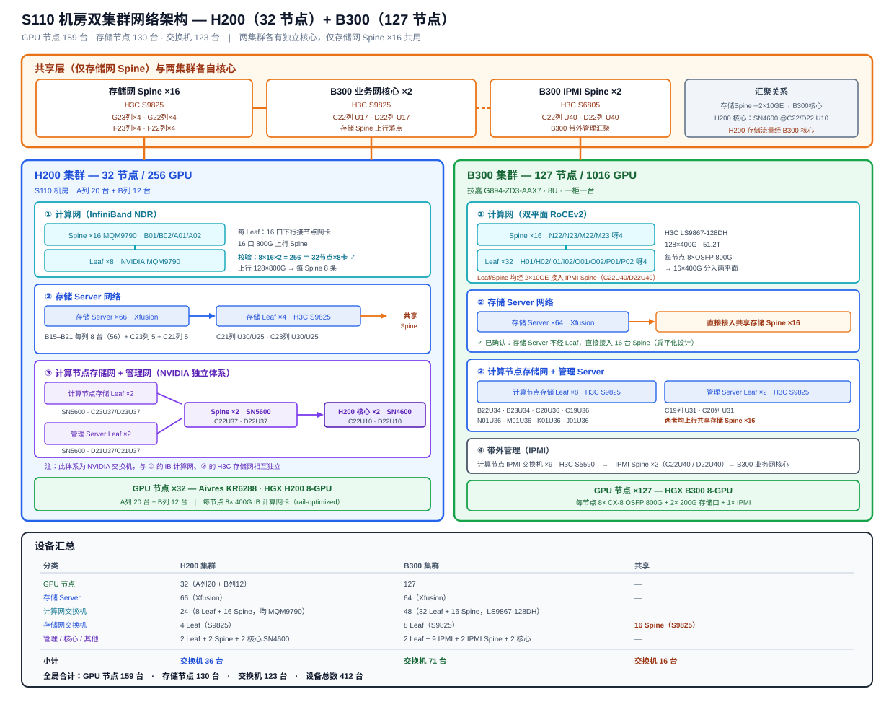

# S110 机房双集群架构说明书

> H200（32 节点）与 B300（127 节点）两套 GPU 训练集群的合并架构文档：机柜分布、网络分层、设备台账与共享基础设施。
>
> 撰写人：孟希東 · 版本：v1.0 · 日期：2026-10
>
> **文档性质**：设备均已上线，数量为实际台账。可作为运维交接与容量规划依据。

---

## 1. 总览

S110 机房内并行运行两套 GPU 训练集群，**共用存储网 Spine、业务网核心与 IPMI Spine** 三层基础设施。

| 项 | H200 集群 | B300 集群 | 合计 |
|------|-----------|-----------|------|
| GPU 节点 | **32** | **127** | **159** |
| GPU 数量 | 256 | 1016 | 1272 |
| 存储 Server | 66（Xfusion） | 64（Xfusion） | 130 |
| 专属交换机 | 36 | 67 | 103 |
| 共享交换机 | — | — | 20 |
| **交换机合计** | | | **123** |
| **设备总数** | | | **412** |



### 1.1 两集群的关键差异

| 维度 | H200 集群 | B300 集群 |
|------|-----------|-----------|
| 计算网协议 | **InfiniBand NDR** | **RoCEv2（以太网）** |
| 计算网设备 | NVIDIA MQM9790 | H3C LS9867-128DH |
| 计算网规模 | 8 Leaf + 16 Spine | 32 Leaf + 16 Spine |
| 计算节点存储网 | NVIDIA SN5600/SN4600 独立体系 | H3C S9825，并入共享 Spine |
| 带外管理 | 并入 NVIDIA 管理体系 | 独立 IPMI 网（S5590 + S6805） |

> **值得注意**：H200 的计算节点存储网与管理网走的是一套**独立的 NVIDIA 交换机体系**（SN5600 Leaf/Spine + SN4600 Core），不并入共享存储 Spine；而 B300 的对应网络则统一并入共享 H3C 体系。这是两集群在建设时序上的差异留下的结构分叉。

---

## 2. 共享基础设施

这三层是两个集群的交汇点，**任何变更都会同时影响两套集群**，变更窗口需合并评估。

### 2.1 存储网 Spine ×16（H3C S9825）

| 位置 | 数量 |
|------|------|
| G23 列 | 4 |
| G22 列 | 4 |
| F23 列 | 4 |
| F22 列 | 4 |

**承接的下游**：

- H200 存储 Leaf ×4
- B300 存储 Server ×64（直连）
- B300 计算节点存储 Leaf ×8
- B300 管理 Server Leaf ×2

**上行**：通过 2× 10GE 接入业务网核心。

### 2.2 业务网核心 ×2（H3C S9825）

| 位置 | 作用 |
|------|------|
| C22 列 U17 | 全局业务网汇聚 |
| D22 列 U17 | 同上，互为冗余 |

汇聚存储网 Spine 与 IPMI Spine 的 10GE 上行。

### 2.3 IPMI 网 Spine ×2（H3C S6805）

| 位置 | 作用 |
|------|------|
| C22 列 U40 | B300 带外管理汇聚 |
| D22 列 U40 | 同上，互为冗余 |

**承接**：B300 计算网 Leaf/Spine 的 2×10GE 管理口、B300 计算节点 IPMI 交换机 ×9。
**上行**：业务网核心。

---

## 3. H200 集群

### 3.1 节点分布

| 位置 | 数量 |
|------|------|
| S110 机房 A 列 | 20 台 |
| S110 机房 B 列 | 12 台 |
| **合计** | **32 台**（256 GPU） |

### 3.2 计算网（InfiniBand NDR）

| 层 | 设备 | 数量 | 位置 |
|------|------|------|------|
| Leaf | NVIDIA MQM9790 | 8 | — |
| Spine | — | 16 | B01/B02/A01/A02 列各 4 台 |

**单台 Leaf 端口分配**：16 口下行接计算节点网卡，16 口 800G 上行 Spine。

**容量校验**：

```
下行能力 = 8 台 × 16 口 × 2（800G 拆 2×400G）= 256 条 400G
节点需求 = 32 节点 × 8 张网卡              = 256 条
→ 完全匹配，无冗余端口
```

**上行**：8 × 16 = 128 条 800G，分摊到 16 台 Spine，**每台 Spine 承接 8 条**。

### 3.3 存储 Server 网络

| 项 | 内容 |
|------|------|
| 存储 Server | **66 台** Xfusion |
| 分布 | B15–B21 每列 8 台（56）+ C23 列 5 台 + C21 列 5 台 |
| 存储 Leaf | **4 台** H3C S9825 |
| Leaf 位置 | C21 列 U30、C21 列 U25、C23 列 U30、C23 列 U25 |
| 上行 | 共享存储 Spine ×16（G23/G22/F23/F22） |

### 3.4 计算节点存储网 + 管理网（NVIDIA 独立体系）

这套体系与 §3.2 的 IB 计算网、§3.3 的 H3C 存储网**三者相互独立**。

| 层 | 设备 | 数量 | 位置 |
|------|------|------|------|
| 计算节点存储 Leaf | NVIDIA SN5600 | 2 | C23 列 U37、D23 列 U37 |
| 管理 Server Leaf | NVIDIA SN5600 | 2 | D21 列 U37、C21 列 U37 |
| Spine | NVIDIA SN5600 | 2 | C22 列 U37、D22 列 U37 |
| Core | NVIDIA SN4600 | 2 | C22 列 U10、D22 列 U10 |

两组 Leaf（计算节点存储、管理 Server）**共用同一对 Spine**，再上行至 Core。

### 3.5 H200 交换机台账

| 用途 | 型号 | 数量 |
|------|------|------|
| 计算网 Leaf | NVIDIA MQM9790 | 8 |
| 计算网 Spine | — | 16 |
| 存储 Leaf | H3C S9825 | 4 |
| 计算节点存储 Leaf | NVIDIA SN5600 | 2 |
| 管理 Server Leaf | NVIDIA SN5600 | 2 |
| 存储/管理 Spine | NVIDIA SN5600 | 2 |
| Core | NVIDIA SN4600 | 2 |
| **小计** | | **36 台** |

---

## 4. B300 集群

### 4.1 节点

**127 台** 技嘉 G894-ZD3-AAX7（8U，HGX B300 8-GPU），一柜一台，共 1016 GPU。

单节点网络接口：8× ConnectX-8 OSFP 800G（计算网）+ 2× 200G（存储网）+ 1× IPMI。

### 4.2 计算网（双平面 RoCEv2）

| 层 | 设备 | 数量 | 位置 |
|------|------|------|------|
| Leaf | H3C LS9867-128DH | **32** | H01/H02/I01/I02/O01/O02/P01/P02 列各 4 台 |
| Spine | H3C LS9867-128DH | **16** | N22/N23/M22/M23 列各 4 台 |

每节点 8 个 OSFP 800G 口各拆为 2×400G，分入两个通信平面（rail-optimized）。

**管理接入**：计算网 Leaf 与 Spine 均通过 2× 10GE 接入 IPMI Spine（C22U40 / D22U40）。

### 4.3 存储 Server 网络

| 项 | 内容 |
|------|------|
| 存储 Server | **64 台** Xfusion |
| 接入方式 | **直接接入共享存储 Spine ×16**（G23/G22/F23/F22 各 4 台） |
| Spine 上行 | 业务网核心（C22U17 / D22U17） |

> ⚠️ **结构疑点**：存储 Server 不经 Leaf 而直接上 Spine，与常规两层 leaf-spine 架构不同。若为实际接线请在台账中明确标注，以免后续扩容时误判可用端口；若为描述简写（实际经 §4.4 的 Leaf），需要更正。

### 4.4 计算节点存储网 + 管理 Server

| 用途 | 设备 | 数量 | 位置 |
|------|------|------|------|
| 计算节点存储 Leaf | H3C S9825 | **8** | B22U34、B23U34、C20U36、C19U36、N01U36、M01U36、K01U36、J01U36 |
| 管理 Server Leaf | H3C S9825 | 2 | C19 列 U31、**C30 列 U31** |

两者均上行至共享存储 Spine ×16，Spine 再上行业务网核心。

> ⚠️ **待核**：管理 Server Leaf 的「C30 列」与机房其余 C 列编号（C19–C23）不连续，疑为笔误，需现场核对。

### 4.5 带外管理（IPMI）

| 层 | 设备 | 数量 | 位置 |
|------|------|------|------|
| 计算节点 IPMI 交换机 | H3C S5590 | **9** | — |
| IPMI Spine | H3C S6805 | 2 | C22 列 U40、D22 列 U40（共享） |

上行至业务网核心。

### 4.6 B300 交换机台账

| 用途 | 型号 | 数量 |
|------|------|------|
| 计算网 Leaf | H3C LS9867-128DH | 32 |
| 计算网 Spine | H3C LS9867-128DH | 16 |
| 计算节点存储 Leaf | H3C S9825 | 8 |
| 管理 Server Leaf | H3C S9825 | 2 |
| 计算节点 IPMI | H3C S5590 | 9 |
| **小计** | | **67 台** |

---

## 5. 全局交换机台账

| 归属 | 用途 | 型号 | 数量 |
|------|------|------|------|
| **H200** | 计算网 Leaf | NVIDIA MQM9790 | 8 |
| H200 | 计算网 Spine | — | 16 |
| H200 | 存储 Leaf | H3C S9825 | 4 |
| H200 | 计算节点存储 / 管理 Leaf | NVIDIA SN5600 | 4 |
| H200 | 存储/管理 Spine | NVIDIA SN5600 | 2 |
| H200 | Core | NVIDIA SN4600 | 2 |
| **B300** | 计算网 Leaf | H3C LS9867-128DH | 32 |
| B300 | 计算网 Spine | H3C LS9867-128DH | 16 |
| B300 | 计算节点存储 Leaf | H3C S9825 | 8 |
| B300 | 管理 Server Leaf | H3C S9825 | 2 |
| B300 | 计算节点 IPMI | H3C S5590 | 9 |
| **共享** | 存储网 Spine | H3C S9825 | 16 |
| 共享 | 业务网核心 | H3C S9825 | 2 |
| 共享 | IPMI Spine | H3C S6805 | 2 |
| | | **合计** | **123 台** |

**按型号统计**：

| 型号 | 数量 |
|------|------|
| H3C LS9867-128DH | 48 |
| H3C S9825 | 40 |
| H200 计算网 Spine（型号待补） | 16 |
| H3C S5590 | 9 |
| NVIDIA MQM9790 | 8 |
| NVIDIA SN5600 | 6 |
| NVIDIA SN4600 | 2 |
| H3C S6805 | 2 |

---

## 6. 机柜列索引

按列快速定位设备，用于现场巡检与布线排查。

| 列 | 设备 |
|------|------|
| A 列 | H200 GPU 节点 ×20 |
| A01 / A02 | H200 计算网 Spine 各 4 |
| B 列 | H200 GPU 节点 ×12 |
| B01 / B02 | H200 计算网 Spine 各 4 |
| B15–B21 | H200 存储 Server 每列 8 台 |
| B22 U34 / B23 U34 | B300 计算节点存储 Leaf |
| C19 U31 | B300 管理 Server Leaf |
| C19 U36 / C20 U36 | B300 计算节点存储 Leaf |
| C21 U25 / U30 | H200 存储 Leaf |
| C21 列 | H200 存储 Server ×5 |
| C21 U37 | H200 管理 Server Leaf（SN5600） |
| C22 U10 / D22 U10 | H200 Core（SN4600） |
| **C22 U17 / D22 U17** | **业务网核心（共享）** |
| C22 U37 / D22 U37 | H200 存储/管理 Spine（SN5600） |
| **C22 U40 / D22 U40** | **IPMI Spine（共享）** |
| C23 U25 / U30 | H200 存储 Leaf |
| C23 列 | H200 存储 Server ×5 |
| C23 U37 / D23 U37 | H200 计算节点存储 Leaf（SN5600） |
| D21 U37 | H200 管理 Server Leaf（SN5600） |
| **F22 / F23 / G22 / G23** | **存储网 Spine 各 4 台（共享）** |
| H01 / H02 / I01 / I02 | B300 计算网 Leaf 各 4 |
| J01 U36 / K01 U36 | B300 计算节点存储 Leaf |
| M01 U36 / N01 U36 | B300 计算节点存储 Leaf |
| M22 / M23 / N22 / N23 | B300 计算网 Spine 各 4 |
| O01 / O02 / P01 / P02 | B300 计算网 Leaf 各 4 |

---

## 7. 运维关注点

### 7.1 共享层是单一故障域

存储网 Spine、业务网核心、IPMI Spine 三层**同时服务两个集群**。任一层故障会双集群同时受影响，因此：

- 变更窗口需两集群业务方共同确认
- 备件优先级应高于单集群设备
- 监控告警需明确标注「影响范围：双集群」

### 7.2 H200 计算网无端口冗余

8 台 Leaf × 16 口 = 256 条，与 32 节点 × 8 卡的需求**完全相等**，没有任何余量。**新增 H200 节点必须先扩 Leaf**。

### 7.3 两套体系并存的运维成本

H200 用 NVIDIA（IB + SN 系列），B300 用 H3C（RoCEv2 + S98 系列），意味着：

- 两套命令行与配置范式
- 两套备件库
- 两套厂商支持通道
- 故障排查需区分体系，不可套用经验

建议在监控与 CMDB 中对设备明确打上体系标签。

---

## 8. 待核实事项

| # | 事项 | 影响 |
|---|------|------|
| 1 | B300 存储 Server 是否真的直连 Spine（不经 Leaf） | 影响架构图准确性与扩容判断 |
| 2 | B300 管理 Server Leaf 的「C30 列」编号 | 疑为笔误，影响现场定位 |
| 3 | H200 计算网 Spine 的具体型号 | 台账完整性（Leaf 为 MQM9790，Spine 未注明） |
| 4 | H200 计算网 Spine 的机柜 U 位 | 现场定位 |
| 5 | B300 计算节点 IPMI 交换机 ×9 的机柜位置 | 现场定位 |
| 6 | 各列机柜的供电与制冷归属 | 容量规划 |

---

## 变更记录

| 版本 | 日期 | 变更 |
|------|------|------|
| v1.0 | 2026-10 | 初版：合并 H200 与 B300 两集群架构，补充共享基础设施、机柜列索引与全局台账 |

---

← [返回 README](../README.md) · 相关：[HGX B300 训练集群现网架构文档](HGX_B300训练集群设计方案_1024GPU.md) · [s110 集群网络架构（交换机与 CPU 服务器）](s110集群网络架构_交换机与CPU服务器.md) · [GPU 集群掉卡故障处理手册](GPU集群掉卡故障处理手册.md)
