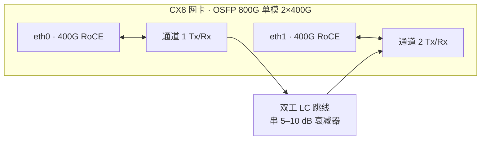
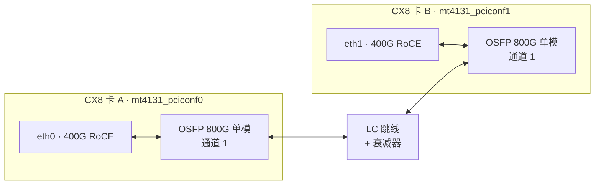
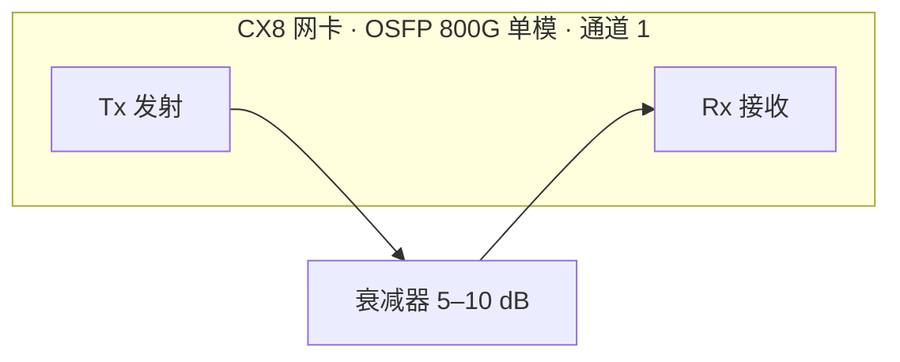

# CX8 单机自环测试手册

没有对端设备时，用一台 B300 服务器验证全部 CX8 端口与光模块。

> 设备标识统一使用 `/dev/mst/mt4131_pciconf0`，请先用 `mst status -v` 确认实际编号后替换。
> 适用场景：模块为 800G 单模、2×400G 拆分、RoCE 组网。

## 测试边界

开始之前先明确哪些结论能下、哪些不能。

**能验证**

- 光模块本身：激光器输出、接收灵敏度、DSP、I2C 通路、温度表现
- NIC 侧 SerDes 信号质量、眼图张开度、FEC 纠错能力
- 笼体触点与端口映射关系
- 完整数据面：链路建立、RoCE 收发、实际带宽与时延
- PCIe 协商宽度与速率、NUMA 亲和性

**不能验证**

- 真实链路距离下的光功率预算
- 对端交换机的兼容性与 FEC 协商行为
- 机房布线质量、熔接损耗、配线架插损
- 多打一场景下的拥塞控制与 PFC 行为

## 物料准备

| 物料 | 规格 | 说明 |
|---|---|---|
| 双工 LC 跳线 | 单模，接头研磨与模块一致 | 数量按「待测通道数 ÷ 2」准备。绿色接头为 APC，蓝色为 UPC，不可混插 |
| 单芯 LC 跳线 | 单模 | 仅单通道自环用，备 1~2 根即可 |
| 光衰减器 | 5~10 dB，LC 母对公 | 必备，数量与跳线相同 |
| MPO 跳线 | Type-B 交叉型 | 仅当模块是 2×DR4 等 MPO 接口时需要。Type-A 直通线接上不通 |
| 端面清洁笔 | LC / MPO 对应型号 | 自环误码偏高，一半以上是端面脏污 |

> **衰减器不能省。** 800G 单模模块单通道发射功率典型在 -2 ~ +4 dBm，接收过载点也就 +3 ~ +4 dBm。短跳线直连几乎没有衰减，很容易把接收端打饱和，测出来的误码率不可信，长期还可能损伤接收机。

## 自环拓扑

800G OSFP 模块跑 2×400G 拆分后，在系统里是两个独立的 400G 网口。三种接法覆盖范围和适用场景不同。

### 方式一：同模块双通道互环

一根双工 LC 跳线接在同一个模块的两个光口之间，通道 1 与通道 2 互为对端。一根线覆盖模块光路、两路 DSP、SerDes 和完整数据面，还能跑 RoCE 压带宽，性价比最高。



双工 LC 跳线本身是 A-B 交叉极性，两端分别插入通道 1 和通道 2，Tx→Rx 对接自动成立，不需手动调换。

### 方式二：跨卡互环

两块 CX8 各取通道 1 对接。相比方式一，额外覆盖了两个笼体、两块卡的 SerDes 和各自的 PCIe 路径。八块卡两两配对，四根跳线一轮跑完。



两个口分属不同卡、不同 PCI 插槽。内核仍可能本地路由短路，稳妥起见还是隔离一个口。

### 方式三：单通道 Tx 回接 Rx

一根单芯跳线把同一通道的 Tx 直接接回自己的 Rx，光信号原路返回。端口在跟自己通信，MAC 和 GID 相同，链路协商与 FEC 无法正常建立，因此**不能跑 RoCE**，也做不了带宽测试。



需要单芯（simplex）跳线，不是双工的。只在怀疑某个具体通道的光收发有问题、又想排除对端干扰时使用。

### 三者对比

| 接法 | 测试覆盖 | 能否跑 RoCE | 适用 |
|---|---|---|---|
| 同模块双通道 | 模块光路、两路 DSP、SerDes、完整数据面 | 能 | 首选，一根线搞定 |
| 跨卡互环 | 上述全部，外加两个笼体与两条 PCIe 路径 | 能 | 批量验证多块卡 |
| 单通道回接 | 仅物理层 | 不能 | 定位单个通道的光收发问题 |

## 测试流程

四个阶段按顺序推进，每一步都在缩小故障范围。一天时间足够跑完一台 B300 的全部端口。

### 阶段一　静态盘点（约 1 小时，不动任何线）

不需要跳线，却能筛掉大部分明显故障。先建立设备映射关系：

```bash
mst start
mst status -v
ibdev2netdev -v
lspci -d 15b3: -vvv | grep -E "LnkCap|LnkSta"
```

再逐块卡取模块信息，写成循环更省事：

```bash
for d in /dev/mst/mt4131_pciconf*; do
  echo "=== $d ==="
  mlxlink -d $d -p 1 -m
  mget_temp -d $d
done
```

**判读要点**

- `mlxlink -m` 读不出模块 → I2C 通路问题或模块未插到位，先解决这个再往下
- Tx 功率偏低或为 0 → 激光器故障，模块直接判废
- Rx 功率为 0 → 正常，此时还没有对端
- 模块温度已接近 70°C 以上 → 风道或模块本身有问题，后续结果都不可信

同时核对固件与驱动版本，不一致是隐蔽的故障源：

```bash
mlxfwmanager --query
ofed_info -s
```

### 阶段二　内部环回（约 1 小时）

不插跳线，用 PHY 本地环回测 NIC 的 SerDes。这一步不经过光模块，用来区分「卡有问题」还是「光路有问题」。

```bash
D=/dev/mst/mt4131_pciconf0
mlxlink -d $D -p 1 --port_state DN
mlxlink -d $D -p 1 --link_mode_force
mlxlink -d $D -p 1 --loopback PH
mlxlink -d $D -p 1 --port_state UP
mlxlink -d $D -p 1 -c -e
```

测完务必清除环回配置：

```bash
mlxlink -d $D -p 1 --port_state DN
mlxlink -d $D -p 1 --loopback NO
mlxlink -d $D -p 1 --port_state UP
```

> **别关错端口。** ConnectX-7 及之后的卡，环回配置只能在链路完全 down 的状态下施加。另外不要用 mlxlink 关闭主机与非管理型交换机之间的端口，B300 上的 BlueField 管理口和存储口尤其要认清楚。

### 阶段三　外部光环回与 PRBS（约 3 小时，核心环节）

按前面任一拓扑接好跳线与衰减器，先确认功率落在规格内：

```bash
mlxlink -d /dev/mst/mt4131_pciconf0 -p 1 -m | grep -i -E "power|rx|tx"
```

Rx 功率顶到上限或报 high alarm 就加大衰减，低于接收灵敏度则减小衰减。功率正常后确认链路起来：

```bash
mlxlink -d /dev/mst/mt4131_pciconf0 -p 1
mlxlink -d /dev/mst/mt4131_pciconf1 -p 1
```

**PRBS 误码测试**

两端都要配，先调谐再启用。速率字符串按实际链路调整，先跑 `mlxlink --help` 确认你这版 MFT 支持哪些值。

```bash
mlxlink -d /dev/mst/mt4131_pciconf0 -p 1 --test_mode TU
mlxlink -d /dev/mst/mt4131_pciconf1 -p 1 --test_mode TU

mlxlink -d /dev/mst/mt4131_pciconf0 -p 1 --test_mode EN \
        --tx_prbs PRBSQ --rx_prbs PRBSQ --tx_rate 100G_2X --rx_rate 100G_2X
mlxlink -d /dev/mst/mt4131_pciconf1 -p 1 --test_mode EN \
        --tx_prbs PRBSQ --rx_prbs PRBSQ --tx_rate 100G_2X --rx_rate 100G_2X

sleep 900
mlxlink -d /dev/mst/mt4131_pciconf0 -p 1 -c

mlxlink -d /dev/mst/mt4131_pciconf0 -p 1 --test_mode DS
mlxlink -d /dev/mst/mt4131_pciconf1 -p 1 --test_mode DS
```

**模块级 PRBS**

进一步分离「模块 DSP 问题」和「NIC 问题」。`--prbs_select` 选择测试模块的 HOST 侧还是 MEDIA 侧，哪一侧出错故障就定位在哪一段。HOST 侧是模块与 NIC 之间的电接口，MEDIA 侧是模块的光发射接收。

```bash
mlxlink -d $D -p 1 --cable --prbs_select HOST --prbs_mode EN \
        --tx_prbs PRBS31 --rx_prbs PRBS31

mlxlink -d $D -p 1 --cable --prbs_select HOST --prbs_mode DS
```

### 阶段四　业务层验证（约 2 小时）

PRBS 测的是物理层，还要验证真实数据能跑通。配置见下一节。

## RoCE 验证

两个网口在同一台机器上，内核会直接走本地回环把包短路掉，根本不出网卡。必须把其中一个口连同它的 RDMA 设备一起丢进独立 namespace。

```bash
rdma system set netns exclusive

ip netns add ns1
ip link set eth1 netns ns1
rdma dev set mlx5_1 netns ns1

ip addr add 192.168.100.1/24 dev eth0
ip link set eth0 up

ip netns exec ns1 ip addr add 192.168.100.2/24 dev eth1
ip netns exec ns1 ip link set eth1 up
ip netns exec ns1 ping -c 3 192.168.100.1
```

> **`rdma system set netns exclusive` 是全局开关**，会影响这台机器上所有 RDMA 设备的可见性。生产环境执行前确认没有别的业务在跑，测完用 `rdma system set netns shared` 恢复。

ping 通了再压 RDMA 带宽。RoCE 要带 `-R` 走 rdma_cm：

```bash
# 终端 1（默认 namespace）
ib_write_bw -d mlx5_0 -i 1 -R -a -F

# 终端 2
ip netns exec ns1 ib_write_bw -d mlx5_1 -i 1 -R -a -F 192.168.100.1
```

GID 索引选错是 RoCE 最常见的坑，先确认用的是 RoCEv2 那条：

```bash
show_gids | grep -i v2
```

带宽明显偏低，先查 PCIe 协商宽度和 NUMA 绑定：

```bash
mlnx_tune -r
lspci -d 15b3: -vvv | grep -E "LnkCap|LnkSta"
```

## 判读标准

| 指标 | 合格线 | 不合格时的方向 |
|---|---|---|
| 纠错前 BER | 优于 1e-6（PAM4 + RS-FEC） | 端面清洁后重测；仍偏高则查眼图与衰减量 |
| 纠错后 BER | 必须为 0 | 出现任何非零值，该链路不能上生产 |
| 单向带宽 | 线速的 90% 以上，400G 约 45 GB/s | 查 PCIe 协商宽度、NUMA 亲和、节能模式 |
| Rx 光功率 | 模块规格书的接收范围内 | 调整衰减器阻值 |
| 模块温度 | 低于告警阈值且稳定 | 检查风道，确认机箱盖好 |
| 眼图张开度 | 各通道均衡，无明显劣化通道 | 单通道偏低通常是该路光纤或模块问题 |

### 故障归属判定

某个端口测出问题时，用轮换法定位：把可疑模块换到一个已验证正常的端口上重测。故障跟着模块走就是模块坏，留在原端口就是 NIC 或笼体的问题。这比反复猜测快得多。

另一个快速判据：`mlxlink -m` 和 `ethtool -m` 走的是不同代码路径，一个能读一个不能，指向 I2C 通路问题；两个都读不出，优先怀疑模块未插到位或已损坏。

## 收尾

测试结束后逐项确认，漏掉任何一条都可能把卡留在异常状态下交付。

- [ ] 退出所有端口的 PRBS 测试模式
- [ ] 清除所有环回配置
- [ ] 所有端口状态恢复为 UP
- [ ] 确认 `LINK_TYPE` 等 mlxconfig 配置未被改动
- [ ] 关闭临时启动的进程，恢复 RDMA namespace 模式
- [ ] 删除测试用的 network namespace 与 IP 配置
- [ ] 重跑阶段一的盘点命令，与测试前基线逐项对比
- [ ] 拔除所有跳线与衰减器，模块回插到位并确认卡扣锁死

```bash
mlxlink -d $D -p 1 --test_mode DS
mlxlink -d $D -p 1 --loopback NO
mlxlink -d $D -p 1 --port_state UP
mlxconfig -d $D query | grep LINK_TYPE

rdma system set netns shared
ip netns del ns1
```

## 容易踩的坑

**机箱必须盖着测。** B300 的风道设计依赖机箱密闭，开盖跑 800G 模块很快就会过热降速，测出来的 BER 不能用。

**先清洁再测。** 自环出现高误码，先怀疑端面脏污而不是模块坏。清洁后重测一遍再下结论。反过来做会浪费大量时间在错误方向上。

**接头类型不能混。** 绿色接头是 APC 斜面研磨，蓝色是 UPC 平面研磨。混插会有明显的回损劣化，表现为误码升高，很容易误判成模块故障。

**MPO 跳线要用交叉型。** 2×DR4 等 MPO 接口的模块，自环需要 Type-B 交叉型跳线或专用 MPO 自环头。Type-A 直通线接上去 Tx 对 Tx，完全不通。

**记录基线。** 阶段一的输出全部存档。上架后如果出问题，可以回头对比出厂前的状态，判断是运输损伤还是现场环境导致。

---

mlxlink 参数以所用 MFT 版本的 `--help` 输出为准，不同版本速率字符串与可选项存在差异。相关命令的完整说明见 [cx8-diagnostics.md](./cx8-diagnostics.md)。
