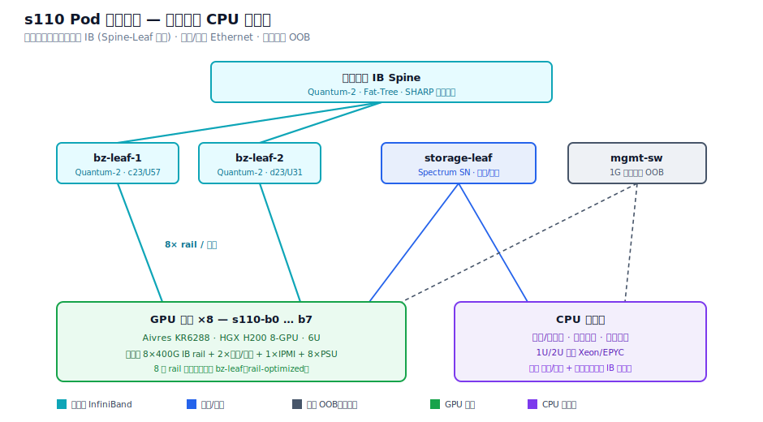

# s110 集群网络架构 — 交换机与 CPU 服务器

> 承接 s110-b7 节点解析，把视角从单节点拉到整个 s110 pod：三张网的交换机分层，以及 GPU 节点之外的 CPU 服务器角色。
>
> 撰写人：孟希東

> **说明**：标注 **【实拍确认】** 为照片 / 标签可见信息；**【典型配置】** 为该级别 H200 / NDR 集群的常见做法，具体型号请以现场为准。发我交换机 / CPU 服务器的照片或型号，可把【典型配置】替换为实际值。

---

## 1. 网络分层总览

延续节点侧的 8︰8︰2，pod 级同样是三张物理隔离的网 + 带外：

- **计算后端网（InfiniBand）**：GPU 之间的 East-West All-Reduce 平面，Spine-Leaf 胖树。
- **存储 / 前端网（Ethernet）**：读写存储、in-band 管理、对外访问。
- **带外管理网（OOB）**：BMC/IPMI，1G 铜缆，独立平面。

---

## 2. 交换机

### 2.1 计算后端 InfiniBand（bz-leaf + spine）

| 项 | 内容 |
|------|------|
| Leaf【实拍确认】 | `bz-leaf-1` @ c23/U57、`bz-leaf-2` @ d23/U31（接本 rack GPU 节点的同号 rail） |
| Leaf 型号【典型配置】 | NVIDIA Quantum-2 QM9700（风冷）/ QM9790，32× OSFP = 64×400G NDR，51.2 Tb/s |
| Spine【典型配置】 | 同为 Quantum-2，组成两层胖树；跨 rack/pod 的 GPU 流量经 spine |
| 在网计算 | SHARP：AllReduce/Broadcast 在交换机内聚合，降低集合通信延迟 |
| 拓扑 | rail-optimized：每节点第 i 号 GPU 的网卡都接到「第 i 条 rail」对应的 leaf |

说明：rail-optimized 胖树下，同号 GPU 跨节点通信只走自己那条 rail 平面，互不争抢；理想无阻塞时 leaf 上行 = 下行带宽 1:1。

### 2.2 存储 / 前端 Ethernet（storage-leaf）

| 项 | 内容 |
|------|------|
| 名称【实拍确认】 | `storage-leaf`（节点侧 2× 网卡上行） |
| 型号【典型配置】 | NVIDIA Spectrum SN 系列（如 SN5600 800GbE / SN4600 200GbE），配 BlueField-3 |
| 协议 | RoCEv2（若走以太），或独立 IB 存储网（视集群而定） |
| 用途 | 并行文件系统读写、Checkpoint、in-band 管理、对外访问 |

> 待你把节点右侧蓝色 LC 那两路拍清楚，可确认这张网是 IB 还是以太（RoCE/Spectrum-X）。

### 2.3 带外管理（mgmt-sw）

| 项 | 内容 |
|------|------|
| 名称【实拍确认】 | `mgmt-sw`（节点侧 `s110-b7-IPMI`，黑色 RJ45） |
| 型号【典型配置】 | 1G 管理交换机（如 NVIDIA SN2201：48×1GbE + 4×SFP28） |
| 用途 | BMC/IPMI 带外：远程开关机、KVM、传感器、PXE 装机 |

---

## 3. CPU 服务器

GPU 节点之外，pod 里通常还有一批纯 CPU 服务器，不参与 GPU 计算、一般也不上 IB 计算网，只接存储/前端 + 管理网：

| 角色 | 作用 | 接入网络 |
|------|------|---------|
| 管理 / 头节点 | 集群管理（Base Command / BCM）、调度控制面（Slurm/K8s master）、PXE 装机 | 存储/前端 + 管理网 |
| 登录节点 | 用户 SSH、作业提交、代码编译 | 存储/前端 + 管理网 |
| 存储节点 | 并行文件系统服务端（Lustre/GPFS/WEKA/Ceph）；大集群多为独立存储集群 | 存储/前端（高带宽）+ 管理网 |

【典型配置】：Aivres 1U/2U 通用双路服务器（Intel Xeon / AMD EPYC），型号待补充。

与 GPU 节点的关键区别：

- 不插 8× IB 计算网卡（无 `IBBZ` rail）；
- 网络需求集中在存储/前端与管理面；
- 数量少、功耗低，通常不需要 8× PSU 的重载供电。

命名【推测】：GPU 节点为 `s110-b*`；CPU 服务器可能是 `s110-mgmt-*` / `s110-login-*` / `s110-stor-*` 一类，需以现场标签为准。

---

## 4. 与 GPU 节点的关系

单个 GPU 节点的接线细节见 [Aivres KR6288 (HGX H200) 训练节点网络结构 — s110-b7](HGX_H200训练节点网络结构_s110-b7.md)。本文是它的上层：节点的 8 条 IB rail 上行到 §2.1 的 bz-leaf；2 条存储/前端上行到 §2.2 的 storage-leaf；1 条 IPMI 上行到 §2.3 的 mgmt-sw。

---

## 5. pod 命名规则汇总

| 片段 | 含义 |
|------|------|
| `s110` | pod / SU 编号 |
| `b*` | GPU 节点序号（b7 = 本例节点） |
| `IBBZ` | InfiniBand 后端计算网 |
| `bz-leaf-*` | 后端 IB Leaf 交换机 |
| `storage-leaf` | 存储/前端 Leaf |
| `mgmt-sw` | 带外管理交换机 |
| `c23u57 / d23u31` | 交换机机柜列 / U 位 |

---

← [返回 README](../README.md) · 相关：[s110-b7 节点网络结构](HGX_H200训练节点网络结构_s110-b7.md)
