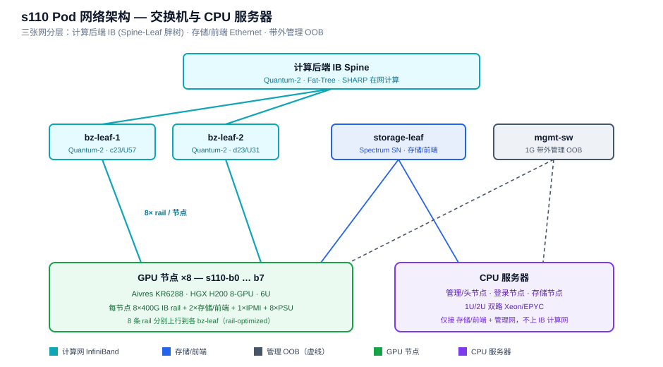

# s110 集群网络架构 — 交换机与 CPU 服务器

> 承接 s110-b7 节点解析，把视角从单节点拉到整个 s110 pod：三张网的交换机分层，以及 GPU 节点之外的 CPU 服务器角色。
>
> 撰写人：孟希東

> **说明**：标注 **【实拍确认】** 为照片 / 标签可见信息；**【典型配置】** 为该级别 H200 / NDR 集群的常见做法，具体型号请以现场为准。

---

## 1. 网络分层总览



延续节点侧的 8︰8︰2，pod 级同样是三张物理隔离的网 + 带外：

- **计算网**：GPU 之间 East-West AllReduce 平面，Rail-optimized 胖树。【实拍确认】本集群的计算网走 **RoCEv2 以太网**（非 InfiniBand），由 H3C S9827-128DH 承载（详见 [800G光模块与Leaf交换机连接方式详解.md](800G光模块与Leaf交换机连接方式详解.md)）。
- **存储 / CPU 网（Ethernet）**：读写存储、CPU/管理节点接入、in-band 管理。【实拍确认】由 H3C S9825 系列承载，本文重点更新此层。
- **带外管理网（OOB）**：BMC/IPMI，1G 铜缆，独立平面。

---

## 2. 交换机

### 2.1 计算网（RoCE compute-leaf + spine）

| 项 | 内容 |
|------|------|
| Leaf 型号【实拍确认】 | H3C Densivelo **S9827-128DH**，128×400G QSFP112，51.2Tbps，原生 RoCEv2 |
| Leaf 编号【实拍确认】 | `roce-leaf-3/7/8/9/11/17/18/20/24/25/27/31/32...`（十余台，按 rail 分散） |
| 模块 | 服务器侧 800G OSFP DR8 拆 2×400G，交换机侧 400G QSFP DR4 原生直插 |
| 拓扑 | Rail-optimized：每节点第 i 号 GPU 网卡接到"第 i 条 rail"对应的 leaf，故障隔离、降低 AllReduce 跳数 |
| 详细分析 | 见 [800G光模块与Leaf交换机连接方式详解.md](800G光模块与Leaf交换机连接方式详解.md) |

### 2.2 存储 / CPU 网（Ethernet，本次实拍确认更新）

| 项 | 内容 |
|------|------|
| 型号【实拍确认】 | **H3C S9825 Series**（S9825-64D/64C），64×400G QSFP-DD 或 128×200GE QSFP56，51.2Tbps，原生支持 RoCEv2（PFC+ETS） |
| 命名【实拍确认】 | 不叫笼统的 `storage-leaf`，而是与计算网同一套编号体系下的独立分支：**`leaf-3`（J01 机柜）、`leaf-4`（K01 机柜）** |
| 线缆【实拍确认】 | 品红色（Magenta）**OM4 多模光纤**，LC 带拉环连接器 —— 与计算网的黄色单模 DR4 光纤明显区分，物理上完全隔离两张网 |
| S/N（K01/leaf-4） | 210235a53m5263l100...，RS S/N RS81-2000-00BE |
| S/N（J01/leaf-3） | 210235a53m5265l1004...，RS S/N RS81-2000-00BD |
| 承载流量 | 服务器 **ST-2 存储端口**下联 + Leaf 间互联 + 上联 Spine |

> 修正：此前文档【典型配置】猜测存储网走 NVIDIA Spectrum SN 系列，实拍确认为 **H3C S9825 系列**，且协议同样是 RoCEv2（不是 IB），线缆是多模光纤而非之前设想的铜缆或蓝色 LC。

#### 2.2.1 leaf-3 / leaf-4 端口标签实例（对可追溯性有帮助）

| 标签 | 拆解 |
|------|------|
| `C-359// s110-i9-u15-ST-2` | 目标：机柜 i9，U15，**ST-2 存储端口 2** |
| `C-371// s110-j7-u15-ST-2` | 目标：机柜 j7，U15，ST-2 |
| `C-348// s110-h11...` | 目标：机柜 h11 |
| `C-295// s110-h6-u15-ST-1` | 目标：机柜 h6，U15，**ST-1**（存储端口 1，与 ST-2 成对，双网卡冗余） |
| `C-314// s110-j16-u15-ST-1` | 目标：机柜 j16，U15，ST-1 |
| `osadrt-s110-k1u36-leaf-4-21/41` | leaf-4 自身的第 21/41 条链路（互联或上联） |
| `osadrt-s110-j1u36-leaf-3-21/41` | leaf-3 自身的第 21/41 条链路 |
| `D-193// osadrt-s110-j1u36-leaf-3-37` | D 前缀，leaf-3 互联链路 |
| `...spine-10-7`、`...spine-12-7`、`...g23u10-spine-16-8` | 上联 Spine 层，端口编号体系与计算网 spine 独立 |

> 服务器侧标签用 **ST-1 / ST-2** 区分双网卡冗余上联（类似计算网的双 leaf 冗余设计），两条存储网卡分别接到不同的 leaf（如 leaf-3 和 leaf-4），任一台存储 leaf 故障不影响存储 I/O 完全中断。

### 2.3 带外管理（mgmt-sw）

| 项 | 内容 |
|------|------|
| 名称【实拍确认】 | `mgmt-sw`（节点侧 `s110-b7-IPMI`，黑色 RJ45） |
| 型号【典型配置】 | 1G 管理交换机（如 NVIDIA SN2201：48×1GbE + 4×SFP28） |
| 用途 | BMC/IPMI 带外：远程开关机、KVM、传感器、PXE 装机 |

---

## 3. 服务器如何接入存储/CPU 网

存储/CPU 网（leaf-3/leaf-4）承载两类不同角色的服务器接入，接入方式和目的不同：

### 3.1 GPU 服务器的存储网卡接入（ST-1/ST-2 口）

GPU 训练节点（如 [s110-b7](HGX_H200训练节点网络结构_s110-b7.md)）除了 8 条计算网 rail，还各带 **2 条独立的存储网卡**上行到 leaf-3/leaf-4：

```
GPU 训练节点
  ├── 8× 计算网卡 → 8 条 rail → roce-leaf-3/7/8/9/11/17/18/20/24/25/27/31/32...（S9827-128DH）
  ├── 1× ST-1 存储网卡 → leaf-3（如 J01）
  ├── 1× ST-2 存储网卡 → leaf-4（如 K01）
  └── 1× IPMI 带外网口 → mgmt-sw
```

- **用途**：读取训练数据集、写入 Checkpoint 到并行文件系统，属于"计算之外"的 I/O，与训练用的 AllReduce 通信完全隔离，避免数据 I/O 突发流量冲击低延迟的计算网
- **双网卡冗余**：ST-1/ST-2 分别接到不同物理 leaf（leaf-3/leaf-4），单台 leaf 故障时存储 I/O 降级但不中断
- **带宽**相对计算网低一档（存储访问模式是顺序/批量读写为主，不需要 800G 级别的通信密度）

### 3.2 CPU/存储专用服务器的接入（非 GPU 节点，本次实拍确认更新）

pod 内的纯 CPU 服务器不参与 GPU 计算、不接计算网，只接存储/CPU 网 + 管理网。实拍确认了一台具体的 CPU/存储服务器背板与接线：

| 项 | 内容 |
|------|------|
| 服务器类型 | 通用 1U/2U 机架服务器（`Mgmt`/`FLEXIO 2`/`SLOT 4-6 HDD40-43` 命名风格，典型 Dell PowerEdge 或同类 OEM 设计） |
| 管理口 | `Mgmt`（BMC/iDRAC 专用口，独立于数据面） |
| 数据管理口 | `IOIOI`（板载 RJ45） |
| 本地调试 | VGA + 2×USB 3.0 |
| 存储/管理网卡 | FlexIO 插槽，2 个光模块，各接一根品红色 OM4 多模光纤 |
| 上联标签 1 | `osadrt-s110-c19u31-mgt-leaf-1-28-56` → **mgt-leaf-1**（机柜 C19，U31） |
| 上联标签 2 | `osadrt-s110-c20u31-mgt-leaf-2-28-56` → **mgt-leaf-2**（机柜 C20，U31） |

```
CPU/存储服务器
  ├── Mgmt 口（BMC/iDRAC）→ 独立带外管理
  ├── IOIOI 口 → 带内管理/数据
  ├── 网卡 1 → mgt-leaf-1（C19）
  └── 网卡 2 → mgt-leaf-2（C20）
```

- **双上联冗余**：与 GPU 服务器的 ST-1/ST-2 设计逻辑一致，两个网卡分别接到不同物理 leaf（mgt-leaf-1/mgt-leaf-2），单台 leaf 故障不中断服务
- **mgt-leaf 与 leaf-3/leaf-4 的关系**：命名不同但属同一逻辑层——存储/CPU 网并非只有一对 leaf，而是**按机柜分组分布式部署**多对 leaf，就近接入减少布线距离，最终汇聚到共同 Spine 层（详见下方分布式部署说明）

| 角色 | 作用 | 接入方式 |
|------|------|---------|
| 管理 / 头节点 | 集群管理（Base Command / BCM）、调度控制面（Slurm/K8s master）、PXE 装机 | 存储/CPU 网（就近 leaf 对双上联）+ 管理网 |
| 登录节点 | 用户 SSH、作业提交、代码编译 | 同上 |
| 存储节点 | 并行文件系统服务端（Lustre/GPFS/WEKA/Ceph）；大集群多为独立存储集群 | 存储/CPU 网（高带宽，可能多网卡绑定）+ 管理网 |

与 GPU 节点的关键区别：

- 不插 8× 计算网卡（无 rail 上联），只接存储/CPU 网的双上联口
- 网络需求集中在存储/前端与管理面，无需超低延迟计算网
- 数量少、功耗低，通常不需要 8× PSU 的重载供电

命名【实拍确认】：机柜/节点用 `s110-c19u31` / `s110-c20u31` 这类 `c<列>u<U位>` 格式；连接目标用 `mgt-leaf-N` 命名（区别于 GPU 侧的 `leaf-N`），提示这批 leaf 交换机专门服务管理/存储类服务器所在的机柜群。

### 3.2.1 存储/CPU 网的分布式 leaf 部署

实拍确认该层至少存在两组独立部署、物理位置不同的 leaf 对，各自就近服务不同机柜群：

| leaf 对 | 部署机柜 | 命名 | 主要服务对象 |
|---------|----------|------|--------------|
| leaf-3 / leaf-4 | J01 / K01 | `leaf-3`、`leaf-4` | 附近 GPU 训练机柜的 ST-1/ST-2 存储网卡（§3.1） |
| mgt-leaf-1 / mgt-leaf-2 | C19 / C20 | `mgt-leaf-1`、`mgt-leaf-2` | 附近 CPU/存储专用机柜的管理+存储网卡（§3.2） |

两组均为 H3C S9825 系列、品红色多模光纤、原生 RoCEv2，属于同一张逻辑网络（存储/CPU 网），只是物理上按机柜就近分布式部署——这是典型的大规模集群布线策略，避免远端机柜的存储流量长距离绕线，也便于按机柜群独立扩容和故障隔离。

### 3.3 两类服务器接入对比

| 维度 | GPU 训练节点 | CPU/存储专用服务器 |
|------|-------------|---------------------|
| 计算网（RoCE-leaf） | 8 条 rail 全接 | 不接 |
| 存储/CPU 网 | ST-1 + ST-2 双上联（接 leaf-3/leaf-4） | 双网卡上联（接 mgt-leaf-1/mgt-leaf-2，或其他就近 leaf 对） |
| 管理网 | 1 条 IPMI | 1 条独立 Mgmt(BMC) + 1 条 IOIOI 带内管理 |
| 供电 | 8× PSU 重载 | 通常 2× PSU 标准冗余 |

---

## 4. 与 GPU 节点侧文档的关系

单个 GPU 节点的接线细节见 [Aivres KR6288 (HGX H200) 训练节点网络结构 — s110-b7](HGX_H200训练节点网络结构_s110-b7.md)。本文是它的上层：节点的 8 条计算网 rail 上行到 §2.1 的 roce-leaf；2 条存储网卡（ST-1/ST-2）上行到 §2.2 的 leaf-3/leaf-4；1 条 IPMI 上行到 §2.3 的 mgmt-sw。CPU/存储服务器则接入就近的 mgt-leaf 对（§3.2）。

---

## 5. pod 命名规则汇总

| 片段 | 含义 |
|------|------|
| `s110` | pod / SU 编号（机房/site 110） |
| `b*` | GPU 节点序号（b7 = 本例节点） |
| `h*/i*/j*/k*` | 机柜列编号（h11、i9、j7、k23 等，多为 GPU 训练机柜） |
| `c*` | 机柜列编号（c19、c20 等，多为 CPU/存储专用机柜） |
| `u15/u31/u36` | 机柜内 U 位 |
| `ST-1 / ST-2` | GPU 服务器存储网卡端口 1/2（双网卡冗余，分别接不同 leaf） |
| `roce-leaf-N` | 计算网 RoCE Leaf 交换机编号（H3C S9827-128DH，如 leaf-8/11/31...） |
| `leaf-3 / leaf-4` | 存储/CPU 网 Leaf 交换机编号（H3C S9825 系列，部署于 J01/K01，服务 GPU 机柜群） |
| `mgt-leaf-1 / mgt-leaf-2` | 存储/CPU 网 Leaf 交换机编号（H3C S9825 系列，部署于 C19/C20，服务 CPU/存储机柜群） |
| `spine-N-M` | 上联 Spine 层，N=spine 编号，M=端口 |
| `C-XXX / D-XXX / A-XXX` | 布线工单/跳线批次编号前缀 |
| `mgmt-sw` | 带外管理交换机（区别于 `mgt-leaf`，后者是存储/CPU 数据网 leaf，命名相近但层级不同，需留意区分） |

---

← [返回 README](../README.md) · 相关：[s110-b7 节点网络结构](HGX_H200训练节点网络结构_s110-b7.md) · [800G光模块与Leaf交换机连接方式详解](800G光模块与Leaf交换机连接方式详解.md)
